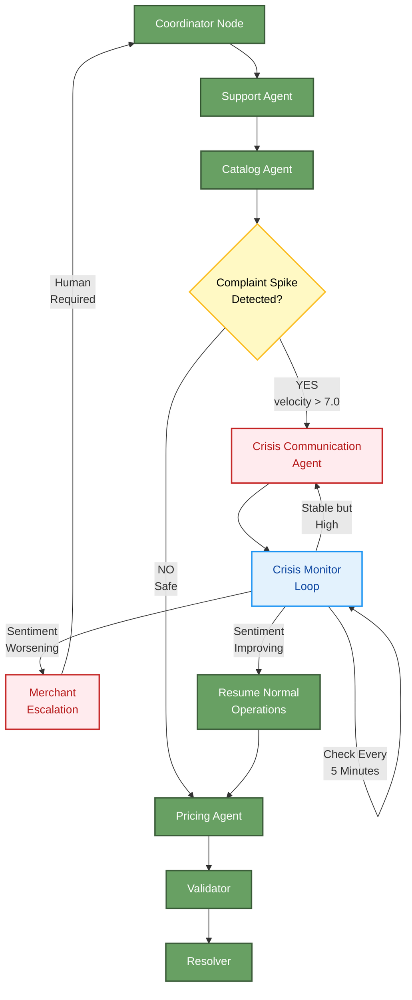
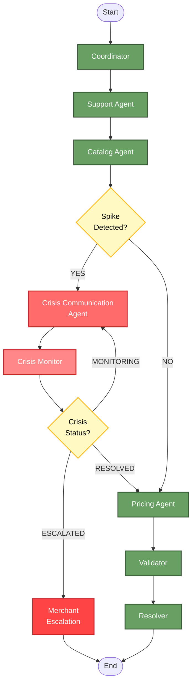

# Crisis Communication Agent - Design Specification

## Table of Contents

1. [Executive Summary](#executive-summary)
2. [Problem Statement](#problem-statement)
3. [Proposed Solution: Crisis Communication Agent](#proposed-solution-crisis-communication-agent)
   - 3.1 [Core Concept](#core-concept)
4. [Architecture Design](#architecture-design)
   - 4.1 [System Integration](#system-integration)
   - 4.2 [Agent Responsibilities](#agent-responsibilities)
5. [Detailed Agent Specification](#detailed-agent-specification)
   - 5.1 [Module Structure](#module-structure)
   - 5.2 [Crisis Communication Agent Implementation](#crisis-communication-agent-implementation)
6. [Crisis Monitor Loop Implementation](#crisis-monitor-loop-implementation)
   - 6.1 [Continuous Monitoring Node](#continuous-monitoring-node)
7. [Graph Workflow Integration](#graph-workflow-integration)
   - 7.1 [Updated Graph Structure](#updated-graph-structure)
   - 7.2 [Workflow Visualization](#workflow-visualization)
8. [State Schema Updates](#state-schema-updates)
   - 8.1 [Extended AgentState](#extended-agentstate)
9. [Crisis Response Templates](#crisis-response-templates)
   - 9.1 [Communication Templates by Severity](#communication-templates-by-severity)
     - 9.1.1 [LOW Severity Template](#low-severity-template)
     - 9.1.2 [MEDIUM Severity Template](#medium-severity-template)
     - 9.1.3 [HIGH Severity Template](#high-severity-template)
     - 9.1.4 [CRITICAL Severity Template](#critical-severity-template)
10. [Implementation Roadmap](#implementation-roadmap)
    - 10.1 [Phase 1: Core Agent Development (Week 1-2)](#phase-1-core-agent-development-week-1-2)
    - 10.2 [Phase 2: Monitoring & Loop Logic (Week 3)](#phase-2-monitoring--loop-logic-week-3)
    - 10.3 [Phase 3: Communication Templates (Week 4)](#phase-3-communication-templates-week-4)
    - 10.4 [Phase 4: Testing & Validation (Week 5)](#phase-4-testing--validation-week-5)
    - 10.5 [Phase 5: Production Deployment (Week 6)](#phase-5-production-deployment-week-6)
11. [Comparison: Throttler vs Crisis Communication Agent](#comparison-throttler-vs-crisis-communication-agent)
    - 11.1 [Current System (Throttler)](#current-system-throttler)
    - 11.2 [Proposed System (Crisis Agent)](#proposed-system-crisis-agent)
    - 11.3 [Key Improvements](#key-improvements)
12. [Example Crisis Scenarios](#example-crisis-scenarios)
    - 12.1 [Scenario 1: Product Quality Issue (MEDIUM Severity)](#scenario-1-product-quality-issue-medium-severity)
    - 12.2 [Scenario 2: Pricing Backlash (HIGH Severity)](#scenario-2-pricing-backlash-high-severity)
    - 12.3 [Scenario 3: Supply Chain Crisis (CRITICAL Severity)](#scenario-3-supply-chain-crisis-critical-severity)
13. [Success Metrics & KPIs](#success-metrics--kpis)
    - 13.1 [Crisis Management Effectiveness](#crisis-management-effectiveness)
    - 13.2 [Communication Effectiveness](#communication-effectiveness)
    - 13.3 [Operational Impact](#operational-impact)
    - 13.4 [System Performance](#system-performance)
14. [Risk Analysis & Mitigation](#risk-analysis--mitigation)
    - 14.1 [Potential Risks](#potential-risks)
    - 14.2 [Fail-Safe Mechanisms](#fail-safe-mechanisms)
15. [Frontend Integration](#frontend-integration)
    - 15.1 [Dashboard Updates](#dashboard-updates)
    - 15.2 [Crisis Status Panel](#crisis-status-panel)
    - 15.3 [Crisis Timeline Visualization](#crisis-timeline-visualization)
    - 15.4 [Real-time Crisis Monitoring](#real-time-crisis-monitoring)
16. [Testing Strategy](#testing-strategy)
    - 16.1 [Unit Tests](#unit-tests)
    - 16.2 [Integration Tests](#integration-tests)
    - 16.3 [Load Testing](#load-testing)
17. [Future Enhancements](#future-enhancements)
    - 17.1 [Phase 2 Features (Post-MVP)](#phase-2-features-post-mvp)
18. [Conclusion](#conclusion)
    - 18.1 [Summary](#summary)
    - 18.2 [Next Steps](#next-steps)
    - 18.3 [Success Criteria](#success-criteria)
19. [Appendix](#appendix)
    - 19.1 [A. Glossary](#a-glossary)
    - 19.2 [B. References](#b-references)
    - 19.3 [C. Contact & Support](#c-contact--support)

---

## Executive Summary

This document outlines the design for a **Crisis Communication Agent** that replaces the current "throttle and freeze" approach with an intelligent, proactive crisis management system. Instead of halting all operations when negative sentiment spikes are detected, the agent actively manages the crisis through automated communication, sentiment monitoring, and strategic response generation.

## Problem Statement

**Current System Limitation:**
When the Support Agent detects a viral complaint spike (velocity > 7.0 or complaint_ratio > 0.5), the system routes to the Throttler Node, which:
- Freezes ALL automated pricing operations
- Returns a FROZEN status
- Requires manual merchant intervention
- Provides no automated crisis response
- Leaves customers without acknowledgment

**Business Impact:**
- Lost revenue during freeze period
- Delayed crisis response
- No customer communication during critical moments
- Merchant must manually assess and respond
- Potential brand damage from silence

## Proposed Solution: Crisis Communication Agent

### Core Concept

Replace the passive Throttler with an active Crisis Communication Agent that:
1. **Detects** sentiment spikes in real-time
2. **Analyzes** root causes and trending issues
3. **Generates** appropriate crisis communication responses
4. **Monitors** sentiment evolution during crisis
5. **Escalates** to merchant only when necessary
6. **Resumes** normal operations when crisis subsides


---

## Architecture Design

### System Integration



### Agent Responsibilities

#### Crisis Communication Agent (`agents/crisis_communication_agent.py`)

**Primary Functions:**
1. **Root Cause Analysis:** Identify why sentiment spiked
2. **Response Generation:** Create appropriate customer communications
3. **Channel Selection:** Determine where to post responses
4. **Sentiment Tracking:** Monitor crisis evolution
5. **Escalation Decision:** Determine when human intervention is needed

**Inputs:**
- `support_summary`: Sentiment data, complaint velocity, trending topics
- `customer_messages`: Raw message data for analysis
- `catalog_issues`: Product-related problems that may be causing complaints
- `pricing_proposals`: Recent pricing changes that may have triggered backlash

**Outputs:**
- `crisis_response`: Generated communication for customers
- `crisis_severity`: LOW, MEDIUM, HIGH, CRITICAL
- `recommended_channels`: Where to post (email, social media, website banner)
- `escalation_required`: Boolean flag for merchant involvement
- `crisis_actions`: Specific steps taken (e.g., "Paused price increases", "Issued apology")


---

## Detailed Agent Specification

### Crisis Communication Agent Implementation

#### Module Structure

```python
# agents/crisis_communication_agent.py

from typing import Dict, Any, List
from langchain_core.prompts import ChatPromptTemplate
from langchain_core.output_parsers import JsonOutputParser
from pydantic import BaseModel, Field
from llm_config import get_llm


class CrisisAnalysis(BaseModel):
    """Structured output for crisis communication analysis."""
    root_cause: str = Field(description="Primary cause of the crisis")
    affected_products: List[str] = Field(description="Product IDs involved")
    trending_issues: List[str] = Field(description="Top 3 complaint themes")
    crisis_severity: str = Field(description="LOW, MEDIUM, HIGH, or CRITICAL")
    sentiment_trajectory: str = Field(description="IMPROVING, STABLE, or WORSENING")
    
    # Communication Strategy
    response_tone: str = Field(description="APOLOGETIC, EXPLANATORY, REASSURING, or URGENT")
    customer_response: str = Field(description="Draft communication for customers")
    internal_actions: List[str] = Field(description="Immediate actions to take")
    
    # Channel Strategy
    recommended_channels: List[str] = Field(description="email, social_media, website_banner, sms")
    
    # Escalation
    escalation_required: bool = Field(description="Whether merchant intervention is needed")
    escalation_reason: str = Field(description="Why escalation is needed")
    
    # Monitoring
    recheck_interval_minutes: int = Field(description="How often to reassess (5-60 minutes)")
    success_criteria: str = Field(description="What indicates crisis is resolved")


def crisis_communication_agent(state: Dict[str, Any]) -> Dict[str, Any]:
    """
    Manages crisis communication when sentiment spikes are detected.
    
    This agent replaces the throttler by actively managing the crisis
    instead of freezing operations.
    """
    print("\n" + "🚨"*30)
    print("🚨 CRISIS COMMUNICATION AGENT ACTIVATED")
    print("🚨"*30)
    
    support_summary = state.get("support_summary", {})
    customer_messages = state.get("customer_messages", [])
    catalog_issues = state.get("catalog_issues", [])
    pricing_proposals = state.get("pricing_proposals", [])
    
    # Check if this is a recurring crisis check
    crisis_history = state.get("crisis_history", [])
    crisis_iteration = len(crisis_history)
    
    print(f"📊 Crisis Iteration: {crisis_iteration + 1}")
    print(f"📊 Sentiment Score: {support_summary.get('sentiment', 0):.2f}")
    print(f"📊 Complaint Velocity: {support_summary.get('velocity', 0):.1f}/10")
    
    # Initialize LLM
    llm = get_llm(temperature=0.3)  # Slightly higher for creative responses
    
    # Create comprehensive crisis analysis prompt
    prompt = ChatPromptTemplate.from_messages([
        ("system", """You are a Crisis Communication Specialist for e-commerce merchants.
        
Your role is to:
1. Analyze the root cause of customer complaint spikes
2. Generate appropriate, empathetic customer communications
3. Recommend immediate actions to mitigate the crisis
4. Determine if human (merchant) intervention is required
5. Set monitoring intervals to track crisis evolution

CRISIS SEVERITY LEVELS:
- LOW: Minor issue, <20% complaints, sentiment > -0.3
- MEDIUM: Moderate issue, 20-40% complaints, sentiment -0.3 to -0.6
- HIGH: Serious issue, 40-60% complaints, sentiment -0.6 to -0.8
- CRITICAL: Viral crisis, >60% complaints, sentiment < -0.8

RESPONSE TONE GUIDELINES:
- APOLOGETIC: When merchant/product is at fault
- EXPLANATORY: When there's a misunderstanding
- REASSURING: When issue is being actively fixed
- URGENT: When immediate action is needed

ESCALATION CRITERIA:
- Legal/safety issues mentioned
- Sentiment worsening after 3 iterations
- Viral social media spread detected
- Financial impact > $10,000
- Regulatory compliance concerns

You MUST return valid JSON matching the CrisisAnalysis schema."""),
        ("user", """CRISIS SITUATION ANALYSIS:

Support Summary:
{support_summary}

Recent Customer Messages (sample):
{messages}

Catalog Issues:
{catalog_issues}

Recent Pricing Changes:
{pricing_proposals}

Crisis History (previous iterations):
{crisis_history}

Analyze this crisis and provide:
1. Root cause identification
2. Customer communication draft
3. Immediate internal actions
4. Channel recommendations
5. Escalation decision
6. Monitoring strategy""")
    ])
    
    # Create chain
    parser = JsonOutputParser(pydantic_object=CrisisAnalysis)
    chain = prompt | llm | parser
    
    try:
        # Run crisis analysis
        result = chain.invoke({
            "support_summary": str(support_summary),
            "messages": str(customer_messages[:10]),  # Sample for context
            "catalog_issues": str(catalog_issues),
            "pricing_proposals": str(pricing_proposals),
            "crisis_history": str(crisis_history[-3:]) if crisis_history else "First detection"
        })
        
        # Extract results
        root_cause = result.get("root_cause", "Unknown")
        severity = result.get("crisis_severity", "MEDIUM")
        response = result.get("customer_response", "")
        actions = result.get("internal_actions", [])
        channels = result.get("recommended_channels", ["email"])
        escalate = result.get("escalation_required", False)
        escalation_reason = result.get("escalation_reason", "")
        recheck_minutes = result.get("recheck_interval_minutes", 15)
        
        print(f"\n🔍 Root Cause: {root_cause}")
        print(f"⚠️  Severity: {severity}")
        print(f"📢 Channels: {', '.join(channels)}")
        print(f"🔄 Recheck in: {recheck_minutes} minutes")
        
        if escalate:
            print(f"🚨 ESCALATION REQUIRED: {escalation_reason}")
        
        # Build crisis record
        crisis_record = {
            "iteration": crisis_iteration + 1,
            "timestamp": "current_time",  # Would use datetime in production
            "severity": severity,
            "sentiment": support_summary.get("sentiment", 0),
            "velocity": support_summary.get("velocity", 0),
            "root_cause": root_cause,
            "actions_taken": actions,
            "escalated": escalate
        }
        
        # Update crisis history
        updated_history = crisis_history + [crisis_record]
        
        # Determine next step
        if escalate:
            status = "ESCALATED"
            next_node = "merchant_escalation"
        elif severity in ["LOW"] and support_summary.get("sentiment", 0) > -0.3:
            status = "RESOLVED"
            next_node = "resume_operations"
        else:
            status = "MONITORING"
            next_node = "crisis_monitor"
        
        return {
            "crisis_analysis": result,
            "crisis_status": status,
            "crisis_history": updated_history,
            "crisis_response_draft": response,
            "crisis_actions_taken": actions,
            "crisis_next_check_minutes": recheck_minutes,
            "escalation_required": escalate,
            "escalation_reason": escalation_reason if escalate else None,
            "audit_log": [{
                "action": "crisis_communication_activated",
                "severity": severity,
                "status": status,
                "iteration": crisis_iteration + 1
            }]
        }
        
    except Exception as e:
        print(f"✗ Crisis Communication Agent Error: {e}")
        # Fail-safe: Escalate on error
        return {
            "crisis_status": "ESCALATED",
            "escalation_required": True,
            "escalation_reason": f"Agent error: {str(e)}",
            "crisis_history": crisis_history + [{
                "iteration": crisis_iteration + 1,
                "error": str(e),
                "escalated": True
            }],
            "audit_log": [{
                "action": "crisis_agent_error",
                "error": str(e)
            }]
        }
```


---

## Crisis Monitor Loop Implementation

### Continuous Monitoring Node

```python
# nodes.py - Add this new node

def crisis_monitor_node(state: Dict[str, Any]) -> Dict[str, Any]:
    """
    Monitors crisis evolution and decides next action.
    
    This node runs periodically to check if:
    - Crisis is resolving (resume operations)
    - Crisis is stable (continue monitoring)
    - Crisis is worsening (escalate to merchant)
    """
    print("\n--- 🔄 Crisis Monitor: Checking Status ---")
    
    crisis_history = state.get("crisis_history", [])
    current_sentiment = state.get("sentiment_score", 0.0)
    crisis_analysis = state.get("crisis_analysis", {})
    
    if not crisis_history:
        print("⚠️  No crisis history found, resuming operations")
        return {"crisis_status": "RESOLVED"}
    
    latest_crisis = crisis_history[-1]
    iteration = latest_crisis.get("iteration", 1)
    
    print(f"📊 Iteration: {iteration}")
    print(f"📊 Current Sentiment: {current_sentiment:.2f}")
    print(f"📊 Previous Sentiment: {latest_crisis.get('sentiment', 0):.2f}")
    
    # Calculate sentiment trend
    if len(crisis_history) >= 2:
        prev_sentiment = crisis_history[-2].get("sentiment", 0)
        sentiment_change = current_sentiment - prev_sentiment
        
        if sentiment_change > 0.1:
            trajectory = "IMPROVING"
        elif sentiment_change < -0.1:
            trajectory = "WORSENING"
        else:
            trajectory = "STABLE"
    else:
        trajectory = "INITIAL"
    
    print(f"📈 Trajectory: {trajectory}")
    
    # Decision Logic
    
    # 1. Check if crisis is resolved
    if current_sentiment > -0.3 and trajectory in ["IMPROVING", "STABLE"]:
        print("✅ Crisis resolved - resuming normal operations")
        return {
            "crisis_status": "RESOLVED",
            "audit_log": [{
                "action": "crisis_resolved",
                "final_sentiment": current_sentiment,
                "iterations": iteration
            }]
        }
    
    # 2. Check if crisis is worsening
    if trajectory == "WORSENING" and iteration >= 3:
        print("🚨 Crisis worsening after 3 iterations - escalating to merchant")
        return {
            "crisis_status": "ESCALATED",
            "escalation_required": True,
            "escalation_reason": f"Sentiment worsening after {iteration} monitoring cycles",
            "audit_log": [{
                "action": "crisis_escalated",
                "reason": "worsening_trend",
                "iterations": iteration
            }]
        }
    
    # 3. Check if crisis is taking too long
    if iteration >= 6:
        print("⏰ Crisis unresolved after 6 iterations - escalating to merchant")
        return {
            "crisis_status": "ESCALATED",
            "escalation_required": True,
            "escalation_reason": f"Crisis unresolved after {iteration} monitoring cycles (90+ minutes)",
            "audit_log": [{
                "action": "crisis_escalated",
                "reason": "timeout",
                "iterations": iteration
            }]
        }
    
    # 4. Continue monitoring
    print(f"🔄 Crisis stable - continuing monitoring (iteration {iteration + 1})")
    
    # Re-run crisis communication agent for updated response
    return {
        "crisis_status": "MONITORING",
        "audit_log": [{
            "action": "crisis_monitoring_continued",
            "iteration": iteration,
            "trajectory": trajectory
        }]
    }


def merchant_escalation_node(state: Dict[str, Any]) -> Dict[str, Any]:
    """
    Handles merchant escalation when crisis requires human intervention.
    
    This node prepares a comprehensive escalation report for the merchant.
    """
    print("\n" + "🚨"*30)
    print("🚨 MERCHANT ESCALATION REQUIRED")
    print("🚨"*30)
    
    crisis_history = state.get("crisis_history", [])
    crisis_analysis = state.get("crisis_analysis", {})
    escalation_reason = state.get("escalation_reason", "Unknown")
    support_summary = state.get("support_summary", {})
    
    # Build comprehensive escalation report
    escalation_report = {
        "alert_level": "RED",
        "status": "ESCALATED",
        "escalation_reason": escalation_reason,
        "crisis_summary": {
            "duration_iterations": len(crisis_history),
            "current_sentiment": support_summary.get("sentiment", 0),
            "complaint_velocity": support_summary.get("velocity", 0),
            "root_cause": crisis_analysis.get("root_cause", "Unknown"),
            "severity": crisis_analysis.get("crisis_severity", "HIGH")
        },
        "crisis_timeline": crisis_history,
        "automated_actions_taken": [
            record.get("actions_taken", []) 
            for record in crisis_history
        ],
        "draft_customer_response": state.get("crisis_response_draft", ""),
        "recommended_channels": crisis_analysis.get("recommended_channels", []),
        "merchant_actions_required": [
            "Review crisis timeline and automated responses",
            "Approve or modify customer communication",
            "Decide on additional compensation/remediation",
            "Authorize resumption of automated operations",
            "Consider policy changes to prevent recurrence"
        ],
        "recommendations": [
            f"⚠️ Crisis escalated: {escalation_reason}",
            "📞 Immediate merchant review required",
            "🔒 All automated pricing operations suspended",
            "📧 Draft customer communication prepared for approval",
            "📊 Full crisis timeline available for analysis"
        ]
    }
    
    print(f"📋 Escalation Report Generated")
    print(f"📊 Crisis Duration: {len(crisis_history)} iterations")
    print(f"📊 Current Sentiment: {support_summary.get('sentiment', 0):.2f}")
    print(f"📊 Root Cause: {crisis_analysis.get('root_cause', 'Unknown')}")
    
    return {
        "final_report": escalation_report,
        "throttle_mode_active": True,  # Freeze operations until merchant approves
        "audit_log": [{
            "action": "merchant_escalation",
            "reason": escalation_reason,
            "crisis_iterations": len(crisis_history)
        }]
    }
```


---

## Graph Workflow Integration

### Updated Graph Structure

```python
# graph.py - Modified workflow with Crisis Communication Agent

from langgraph.graph import StateGraph, END
from state import AgentState
from nodes import (
    coordinator_node,
    validator_node,
    conflict_resolver_node,
    crisis_monitor_node,
    merchant_escalation_node
)
from agents import (
    catalog_agent, 
    support_agent, 
    pricing_agent,
    crisis_communication_agent  # NEW
)


def check_safety_gate(state: AgentState) -> str:
    """
    Safety Gate: Determines routing based on complaint spike detection.
    
    Returns:
    - 'crisis': Spike detected, route to Crisis Communication Agent
    - 'safe': No spike, proceed to normal pricing
    """
    spike_detected = state.get("complaint_spike_detected", False)
    
    if spike_detected:
        print("\n🚨 SAFETY GATE: SPIKE DETECTED - ROUTING TO CRISIS AGENT")
        return "crisis"
    
    print("\n✅ SAFETY GATE: PASSED - PROCEEDING TO PRICING")
    return "safe"


def check_crisis_status(state: AgentState) -> str:
    """
    Crisis Status Gate: Determines next action based on crisis state.
    
    Returns:
    - 'monitor': Continue monitoring crisis
    - 'escalate': Escalate to merchant
    - 'resolve': Crisis resolved, resume operations
    """
    crisis_status = state.get("crisis_status", "MONITORING")
    
    if crisis_status == "ESCALATED":
        print("\n🚨 CRISIS STATUS: ESCALATING TO MERCHANT")
        return "escalate"
    elif crisis_status == "RESOLVED":
        print("\n✅ CRISIS STATUS: RESOLVED - RESUMING OPERATIONS")
        return "resolve"
    else:
        print("\n🔄 CRISIS STATUS: CONTINUING MONITORING")
        return "monitor"


# Build the workflow graph
workflow = StateGraph(AgentState)

# Add nodes
workflow.add_node("coordinator", coordinator_node)
workflow.add_node("catalog_agent", catalog_agent)
workflow.add_node("support_agent", support_agent)
workflow.add_node("pricing_agent", pricing_agent)
workflow.add_node("validator", validator_node)
workflow.add_node("resolver", conflict_resolver_node)

# NEW: Crisis management nodes
workflow.add_node("crisis_agent", crisis_communication_agent)
workflow.add_node("crisis_monitor", crisis_monitor_node)
workflow.add_node("merchant_escalation", merchant_escalation_node)

# Set entry point
workflow.set_entry_point("coordinator")

# Coordinator dispatches to parallel analysis
workflow.add_edge("coordinator", "support_agent")
workflow.add_edge("support_agent", "catalog_agent")

# Safety Gate: Check for complaint spike
workflow.add_conditional_edges(
    "catalog_agent",
    check_safety_gate,
    {
        "crisis": "crisis_agent",      # NEW: Route to crisis agent
        "safe": "pricing_agent"         # Normal flow
    }
)

# Crisis Agent routes to monitor
workflow.add_edge("crisis_agent", "crisis_monitor")

# Crisis Monitor decides next action
workflow.add_conditional_edges(
    "crisis_monitor",
    check_crisis_status,
    {
        "monitor": "crisis_agent",          # Loop back for continued monitoring
        "escalate": "merchant_escalation",  # Human intervention needed
        "resolve": "pricing_agent"          # Crisis resolved, resume normal ops
    }
)

# Merchant escalation ends workflow (requires human action)
workflow.add_edge("merchant_escalation", END)

# Normal pricing flow continues
workflow.add_edge("pricing_agent", "validator")
workflow.add_edge("validator", "resolver")
workflow.add_edge("resolver", END)

# Compile the graph
app = workflow.compile()
```

### Workflow Visualization




---

## State Schema Updates

### Extended AgentState

```python
# state.py - Add new fields for crisis management

import operator
from typing import TypedDict, Annotated, List, Dict, Any


class AgentState(TypedDict):
    """
    Extended state definition with crisis management fields.
    """
    # Existing fields...
    merchant_id: str
    product_data: List[Dict[str, Any]]
    customer_messages: List[Dict[str, Any]]
    pricing_context: List[Dict[str, Any]]
    competitor_data: List[Dict[str, Any]]
    
    normalized_catalog: Annotated[List[Dict], operator.add]
    catalog_issues: Annotated[List[Dict], operator.add]
    
    support_summary: Dict[str, Any]
    sentiment_score: float
    complaint_spike_detected: bool
    
    pricing_proposals: Annotated[List[Dict], operator.add]
    validation_flags: Annotated[List[Dict], operator.add]
    
    schema_validation_passed: bool
    throttle_mode_active: bool
    retry_count: int
    
    merchant_locks: Dict[str, Any]
    final_report: Dict[str, Any]
    audit_log: Annotated[List[Dict], operator.add]
    
    # NEW: Crisis Management Fields
    crisis_status: str  # MONITORING, RESOLVED, ESCALATED
    crisis_analysis: Dict[str, Any]  # Full CrisisAnalysis output
    crisis_history: Annotated[List[Dict], operator.add]  # Timeline of crisis iterations
    crisis_response_draft: str  # Generated customer communication
    crisis_actions_taken: Annotated[List[str], operator.add]  # Actions performed
    crisis_next_check_minutes: int  # When to recheck (5-60 minutes)
    escalation_required: bool  # Whether merchant intervention needed
    escalation_reason: str  # Why escalation is required
```


---

## Crisis Response Templates

### Communication Templates by Severity

#### LOW Severity Template
```
Subject: We're Listening - Your Feedback Matters

Dear Valued Customer,

We've noticed an increase in feedback regarding [ISSUE]. We want you to know 
that we're actively monitoring this situation and taking steps to address your 
concerns.

What we're doing:
- [ACTION_1]
- [ACTION_2]
- [ACTION_3]

We expect to have this resolved within [TIMEFRAME]. If you have additional 
concerns, please don't hesitate to reach out to our support team.

Thank you for your patience and continued trust.

Best regards,
[MERCHANT_NAME] Team
```

#### MEDIUM Severity Template
```
Subject: Important Update: We're Taking Action

Dear Valued Customer,

We want to address the concerns many of you have raised about [ISSUE]. 
Your feedback is critical to us, and we're taking immediate action.

What happened:
[ROOT_CAUSE_EXPLANATION]

What we're doing right now:
- [IMMEDIATE_ACTION_1]
- [IMMEDIATE_ACTION_2]
- [IMMEDIATE_ACTION_3]

What you can expect:
- [EXPECTED_OUTCOME_1]
- [EXPECTED_OUTCOME_2]
- Timeline: [TIMEFRAME]

We sincerely apologize for any inconvenience this has caused. We're committed 
to making this right.

For immediate assistance, please contact: [SUPPORT_CONTACT]

Sincerely,
[MERCHANT_NAME] Team
```

#### HIGH Severity Template
```
Subject: URGENT: Our Commitment to Making This Right

Dear Valued Customer,

We are writing to address a serious issue that has affected many of our 
customers. We take full responsibility and want to be transparent about 
what happened and how we're fixing it.

The Situation:
[DETAILED_ROOT_CAUSE]

Our Immediate Response:
✓ [CRITICAL_ACTION_1]
✓ [CRITICAL_ACTION_2]
✓ [CRITICAL_ACTION_3]

How We're Making It Right:
• [COMPENSATION_1]
• [COMPENSATION_2]
• [GUARANTEE_1]

Timeline:
- Immediate: [IMMEDIATE_STEPS]
- Within 24 hours: [SHORT_TERM_STEPS]
- Within 1 week: [LONG_TERM_STEPS]

We understand this has caused significant frustration, and we sincerely 
apologize. Your trust is our most valuable asset, and we're committed to 
earning it back.

Priority Support:
- Email: [PRIORITY_EMAIL]
- Phone: [PRIORITY_PHONE]
- Live Chat: [PRIORITY_CHAT_LINK]

With our deepest apologies,
[MERCHANT_NAME] Leadership Team
```

#### CRITICAL Severity Template
```
Subject: CRITICAL NOTICE: Immediate Action & Our Commitment

Dear Valued Customer,

We are reaching out regarding a critical situation that requires our immediate 
and full attention. We want to be completely transparent with you.

WHAT HAPPENED:
[COMPREHENSIVE_ROOT_CAUSE_EXPLANATION]

IMMEDIATE ACTIONS TAKEN:
🚨 [EMERGENCY_ACTION_1]
🚨 [EMERGENCY_ACTION_2]
🚨 [EMERGENCY_ACTION_3]

YOUR PROTECTION:
We have immediately:
• [CUSTOMER_PROTECTION_1]
• [CUSTOMER_PROTECTION_2]
• [CUSTOMER_PROTECTION_3]

COMPENSATION & REMEDIATION:
• [COMPENSATION_DETAIL_1]
• [COMPENSATION_DETAIL_2]
• [COMPENSATION_DETAIL_3]

PREVENTION MEASURES:
We are implementing:
1. [PREVENTION_MEASURE_1]
2. [PREVENTION_MEASURE_2]
3. [PREVENTION_MEASURE_3]

DIRECT CONTACT:
This situation requires personal attention. Please contact:
- Emergency Hotline: [EMERGENCY_PHONE]
- Priority Email: [PRIORITY_EMAIL]
- Executive Support: [EXECUTIVE_CONTACT]

We take full responsibility and are committed to making this right, 
no matter what it takes.

[MERCHANT_NAME] Executive Team
[EXECUTIVE_SIGNATURE]
```


---

## Implementation Roadmap

### Phase 1: Core Agent Development (Week 1-2)

**Tasks:**
1. Create `agents/crisis_communication_agent.py`
   - Implement `CrisisAnalysis` Pydantic model
   - Implement `crisis_communication_agent()` function
   - Add LLM-based root cause analysis
   - Add response generation logic

2. Update `nodes.py`
   - Add `crisis_monitor_node()`
   - Add `merchant_escalation_node()`
   - Update existing nodes to handle crisis state

3. Update `state.py`
   - Add crisis management fields to `AgentState`
   - Add type annotations and documentation

4. Update `graph.py`
   - Add crisis agent node
   - Add crisis monitor node
   - Add merchant escalation node
   - Implement `check_crisis_status()` gate
   - Update `check_safety_gate()` routing

**Deliverables:**
- Functional crisis communication agent
- Updated graph workflow
- Unit tests for crisis detection

### Phase 2: Monitoring & Loop Logic (Week 3)

**Tasks:**
1. Implement crisis monitoring loop
   - Add time-based rechecking
   - Implement sentiment trajectory analysis
   - Add escalation triggers

2. Add crisis history tracking
   - Store iteration data
   - Track sentiment evolution
   - Log actions taken

3. Implement escalation logic
   - Define escalation criteria
   - Create escalation report format
   - Add merchant notification system

**Deliverables:**
- Working monitoring loop
- Escalation system
- Crisis timeline tracking

### Phase 3: Communication Templates (Week 4)

**Tasks:**
1. Create response template system
   - Implement severity-based templates
   - Add dynamic variable substitution
   - Create tone adjustment logic

2. Add channel selection logic
   - Email integration
   - Social media API connections
   - Website banner system
   - SMS notification system

3. Implement A/B testing for responses
   - Track response effectiveness
   - Measure sentiment improvement
   - Optimize templates based on data

**Deliverables:**
- Template library
- Multi-channel communication
- Response effectiveness tracking

### Phase 4: Testing & Validation (Week 5)

**Tasks:**
1. Create test scenarios
   - Low severity crisis simulation
   - Medium severity crisis simulation
   - High severity crisis simulation
   - Critical severity crisis simulation

2. Implement integration tests
   - End-to-end crisis workflow
   - Monitoring loop validation
   - Escalation trigger testing

3. Add observability
   - LangSmith tracing for crisis agent
   - Dashboard updates for crisis status
   - Real-time monitoring UI

**Deliverables:**
- Comprehensive test suite
- Crisis simulation framework
- Enhanced observability

### Phase 5: Production Deployment (Week 6)

**Tasks:**
1. Update frontend Dashboard
   - Add crisis status display
   - Show crisis timeline
   - Display draft communications
   - Add merchant approval workflow

2. Add merchant controls
   - Manual crisis override
   - Communication approval system
   - Escalation acknowledgment

3. Documentation
   - Update technical documentation
   - Create merchant user guide
   - Add crisis response playbook

**Deliverables:**
- Production-ready system
- Updated frontend UI
- Complete documentation


---

## Comparison: Throttler vs Crisis Communication Agent

### Current System (Throttler)

| Aspect | Behavior | Impact |
|--------|----------|--------|
| **Detection** | Spike detected → Immediate freeze | Reactive only |
| **Response** | No automated communication | Customers left in dark |
| **Operations** | All pricing frozen | Revenue loss |
| **Merchant Role** | Must manually intervene | High workload |
| **Resolution Time** | Depends on merchant availability | Hours to days |
| **Learning** | No historical tracking | Repeated issues |
| **Transparency** | Minimal reporting | Limited insights |

### Proposed System (Crisis Agent)

| Aspect | Behavior | Impact |
|--------|----------|--------|
| **Detection** | Spike detected → Intelligent analysis | Proactive + Reactive |
| **Response** | Automated, empathetic communication | Customers informed immediately |
| **Operations** | Selective freeze (only risky actions) | Minimal revenue impact |
| **Merchant Role** | Escalation only when necessary | Reduced workload |
| **Resolution Time** | Automated monitoring every 5-15 min | Minutes to hours |
| **Learning** | Full crisis history tracking | Continuous improvement |
| **Transparency** | Comprehensive timeline & metrics | Full visibility |

### Key Improvements

1. **Faster Response Time**
   - Throttler: Waits for merchant (hours)
   - Crisis Agent: Responds immediately (seconds)

2. **Customer Experience**
   - Throttler: Silence during crisis
   - Crisis Agent: Proactive communication

3. **Operational Continuity**
   - Throttler: Complete freeze
   - Crisis Agent: Selective operations continue

4. **Merchant Efficiency**
   - Throttler: Manual intervention required
   - Crisis Agent: Automated handling with escalation option

5. **Data-Driven Decisions**
   - Throttler: No historical data
   - Crisis Agent: Full crisis analytics


---

## Example Crisis Scenarios

### Scenario 1: Product Quality Issue (MEDIUM Severity)

**Trigger:**
- 15 complaints in 1 hour about "Coffee Grinder" making loud noise
- Sentiment: -0.45
- Velocity: 6.5/10

**Crisis Agent Response:**

1. **Root Cause Analysis:**
   - Product ID: P002 (Coffee Grinder)
   - Issue: Manufacturing defect in batch #2024-02
   - Affected units: ~50 customers

2. **Generated Communication:**
   ```
   Subject: Important Update: Coffee Grinder Issue
   
   We've identified an issue with a specific batch of our Coffee Grinders 
   (purchased between Feb 1-10, 2026). Some units are producing unusual noise.
   
   Immediate Actions:
   - Paused sales of affected batch
   - Offering free replacement or full refund
   - Expedited shipping for replacements
   
   If your grinder is affected, please contact us with your order number.
   We'll process your replacement within 24 hours.
   ```

3. **Internal Actions:**
   - Pause pricing updates for P002
   - Flag catalog entry for review
   - Alert inventory team
   - Prepare replacement stock

4. **Monitoring:**
   - Recheck sentiment every 10 minutes
   - Track replacement request rate
   - Monitor social media mentions

5. **Outcome:**
   - Iteration 1: Sentiment -0.45
   - Iteration 2: Sentiment -0.25 (improving)
   - Iteration 3: Sentiment -0.10 (resolved)
   - Status: RESOLVED after 30 minutes
   - Resume normal operations

### Scenario 2: Pricing Backlash (HIGH Severity)

**Trigger:**
- 45 complaints in 30 minutes about "sudden price increase"
- Sentiment: -0.72
- Velocity: 8.9/10
- Social media: Viral tweet with 500+ retweets

**Crisis Agent Response:**

1. **Root Cause Analysis:**
   - Pricing Agent increased prices by 15% across 10 products
   - No competitor analysis available (data gap)
   - Customers perceive as "price gouging"

2. **Generated Communication:**
   ```
   Subject: URGENT: Pricing Update & Our Apology
   
   We made a mistake. This morning, our automated system incorrectly 
   adjusted prices on several products without proper review.
   
   What we're doing RIGHT NOW:
   ✓ Rolled back all price increases
   ✓ Honoring original prices for all orders today
   ✓ Offering 15% discount code for affected customers: SORRY15
   
   This was a system error, not a business decision. We've disabled 
   automated pricing until we can ensure this won't happen again.
   
   We're truly sorry for the confusion and frustration.
   ```

3. **Internal Actions:**
   - Immediately rollback all pricing changes
   - Freeze automated pricing system
   - Generate discount codes
   - Alert customer service team
   - Prepare social media response

4. **Monitoring:**
   - Recheck sentiment every 5 minutes
   - Monitor social media sentiment
   - Track discount code usage
   - Measure complaint velocity

5. **Outcome:**
   - Iteration 1: Sentiment -0.72
   - Iteration 2: Sentiment -0.55 (stable)
   - Iteration 3: Sentiment -0.40 (improving)
   - Iteration 4: Sentiment -0.25 (improving)
   - Status: RESOLVED after 60 minutes
   - Resume operations with manual pricing review

### Scenario 3: Supply Chain Crisis (CRITICAL Severity)

**Trigger:**
- 80 complaints in 15 minutes about "order delays"
- Sentiment: -0.85
- Velocity: 9.5/10
- Multiple mentions of "refund" and "cancel"
- Trending on social media

**Crisis Agent Response:**

1. **Root Cause Analysis:**
   - Warehouse fire disrupted fulfillment
   - 200+ orders delayed by 2-3 weeks
   - No automated solution available
   - Legal/safety implications

2. **Generated Communication:**
   ```
   Subject: CRITICAL NOTICE: Order Delays & Our Commitment
   
   We need to inform you of a serious situation affecting order fulfillment.
   
   WHAT HAPPENED:
   Our primary warehouse experienced a fire on Feb 14. All staff are safe, 
   but fulfillment operations are temporarily halted.
   
   YOUR ORDER:
   If you placed an order in the last 7 days, it will be delayed by 2-3 weeks.
   
   YOUR OPTIONS:
   1. Wait for fulfillment (we'll add 25% store credit)
   2. Full refund processed within 24 hours
   3. Expedited shipping from backup facility (limited stock)
   
   IMMEDIATE ACTIONS:
   🚨 All affected customers contacted individually
   🚨 Backup warehouse activated
   🚨 Priority support line: 1-800-XXX-XXXX
   
   We take full responsibility and are working around the clock to 
   resolve this.
   ```

3. **Internal Actions:**
   - Freeze ALL automated operations
   - Alert executive team
   - Activate backup warehouse
   - Prepare refund processing
   - Contact insurance provider

4. **Escalation Decision:**
   - **ESCALATE TO MERCHANT IMMEDIATELY**
   - Reason: Legal/safety implications, financial impact >$50k
   - Requires: Executive approval for communications
   - Requires: Legal review of liability

5. **Outcome:**
   - Status: ESCALATED after 1 iteration (5 minutes)
   - Merchant notified with full crisis report
   - Automated operations suspended
   - Awaiting merchant approval for communication
   - Crisis agent prepared draft for merchant review


---

## Success Metrics & KPIs

### Crisis Management Effectiveness

| Metric | Target | Measurement |
|--------|--------|-------------|
| **Average Crisis Resolution Time** | < 45 minutes | Time from detection to RESOLVED status |
| **Escalation Rate** | < 15% | % of crises requiring merchant intervention |
| **Sentiment Recovery Rate** | > 80% | % of crises where sentiment improves |
| **Customer Response Rate** | > 60% | % of customers engaging with crisis communication |
| **Repeat Crisis Rate** | < 5% | % of same issues recurring within 30 days |
| **Automated Resolution Rate** | > 70% | % of crises resolved without escalation |

### Communication Effectiveness

| Metric | Target | Measurement |
|--------|--------|-------------|
| **Response Time** | < 5 minutes | Time from spike detection to first communication |
| **Communication Clarity Score** | > 4.0/5.0 | Customer feedback on communication quality |
| **Channel Effectiveness** | > 50% open rate | Email open rates, social engagement |
| **Sentiment Improvement** | +0.3 average | Average sentiment change after communication |

### Operational Impact

| Metric | Target | Measurement |
|--------|--------|-------------|
| **Revenue Protection** | > 90% | % of revenue maintained during crisis |
| **Operational Continuity** | > 85% | % of operations continuing during crisis |
| **Merchant Time Saved** | > 5 hours/week | Reduction in manual crisis management |
| **Customer Retention** | > 95% | % of customers retained post-crisis |

### System Performance

| Metric | Target | Measurement |
|--------|--------|-------------|
| **Agent Response Time** | < 30 seconds | LLM call latency for crisis analysis |
| **Monitoring Loop Accuracy** | > 95% | Correct crisis status assessments |
| **False Positive Rate** | < 10% | % of non-crises triggering agent |
| **System Uptime** | > 99.5% | Crisis agent availability |


---

## Risk Analysis & Mitigation

### Potential Risks

#### Risk 1: Inappropriate Automated Response
**Description:** Crisis agent generates insensitive or legally problematic communication

**Mitigation Strategies:**
1. **Pre-deployment Review:** Legal team reviews all template variations
2. **Severity Thresholds:** HIGH and CRITICAL always require merchant approval before sending
3. **Tone Validation:** LLM prompt includes strict tone guidelines and examples
4. **Blacklist Keywords:** System flags communications containing legal/sensitive terms
5. **Audit Trail:** All generated communications logged for review

**Escalation Trigger:** Any mention of legal, safety, health, or regulatory issues

#### Risk 2: Crisis Misclassification
**Description:** Agent incorrectly assesses crisis severity (too high or too low)

**Mitigation Strategies:**
1. **Multi-signal Analysis:** Use sentiment, velocity, AND message content
2. **Conservative Bias:** When uncertain, escalate rather than under-respond
3. **Historical Calibration:** Learn from past crisis outcomes
4. **Merchant Override:** Allow manual severity adjustment
5. **A/B Testing:** Test severity thresholds with historical data

**Monitoring:** Track escalation accuracy and adjust thresholds monthly

#### Risk 3: Communication Fatigue
**Description:** Customers receive too many crisis updates, causing annoyance

**Mitigation Strategies:**
1. **Consolidation:** Batch updates rather than sending per iteration
2. **Channel Preference:** Respect customer communication preferences
3. **Frequency Limits:** Max 1 update per hour per customer
4. **Opt-out Option:** Allow customers to opt out of crisis updates
5. **Relevance Filtering:** Only notify affected customers

**Monitoring:** Track unsubscribe rates and communication feedback

#### Risk 4: Infinite Loop / Resource Exhaustion
**Description:** Crisis monitor loops indefinitely, consuming resources

**Mitigation Strategies:**
1. **Hard Iteration Limit:** Max 6 iterations (90 minutes) before escalation
2. **Timeout Protection:** Force escalation after 2 hours regardless of status
3. **Resource Monitoring:** Track CPU/memory usage per crisis
4. **Circuit Breaker:** Disable agent if error rate > 20%
5. **Manual Override:** Merchant can force-stop monitoring loop

**Monitoring:** Alert if crisis duration exceeds 60 minutes

#### Risk 5: LLM Hallucination in Crisis Response
**Description:** Agent invents facts or makes false promises

**Mitigation Strategies:**
1. **Grounding Validation:** Cross-reference all claims against state data
2. **Template Constraints:** Use structured templates with variable substitution
3. **Fact Checking:** Validator node reviews crisis communications
4. **Merchant Review:** HIGH/CRITICAL responses require approval
5. **Feedback Loop:** Track customer corrections and adjust prompts

**Monitoring:** Flag any customer responses indicating misinformation

### Fail-Safe Mechanisms

1. **Agent Error → Immediate Escalation**
   - Any exception in crisis agent triggers merchant escalation
   - Error details logged for debugging
   - Throttler activated as backup

2. **Sentiment Worsening → Escalation**
   - If sentiment drops after 2 iterations, escalate
   - Indicates automated response is ineffective
   - Requires human judgment

3. **Legal Keywords → Automatic Escalation**
   - Keywords: lawsuit, lawyer, attorney, sue, legal action, injury, harm
   - Bypass monitoring loop, go straight to merchant
   - Flag for legal team review

4. **Timeout Protection**
   - Max 2 hours in crisis mode
   - Automatic escalation if unresolved
   - Prevents indefinite loops

5. **Manual Override**
   - Merchant can force any status change
   - Can approve/reject communications
   - Can disable crisis agent entirely


---

## Frontend Integration

### Dashboard Updates

#### Crisis Status Panel

```typescript
// components/Dashboard.tsx - Add crisis status display

interface CrisisStatus {
  status: 'MONITORING' | 'RESOLVED' | 'ESCALATED'
  severity: 'LOW' | 'MEDIUM' | 'HIGH' | 'CRITICAL'
  iteration: number
  sentiment: number
  root_cause: string
  actions_taken: string[]
  next_check_minutes: number
  draft_response: string
}

function CrisisStatusPanel({ crisis }: { crisis: CrisisStatus }) {
  const severityColor = {
    LOW: '#10b981',
    MEDIUM: '#f59e0b',
    HIGH: '#ef4444',
    CRITICAL: '#991b1b'
  }

  return (
    <div className={styles.crisisPanel}>
      <div className={styles.crisisHeader}>
        <h2>🚨 Crisis Management Active</h2>
        <span 
          className={styles.severityBadge}
          style={{ backgroundColor: severityColor[crisis.severity] }}
        >
          {crisis.severity}
        </span>
      </div>

      <div className={styles.crisisMetrics}>
        <div className={styles.metric}>
          <label>Status</label>
          <span>{crisis.status}</span>
        </div>
        <div className={styles.metric}>
          <label>Iteration</label>
          <span>{crisis.iteration}</span>
        </div>
        <div className={styles.metric}>
          <label>Sentiment</label>
          <span>{crisis.sentiment.toFixed(2)}</span>
        </div>
        <div className={styles.metric}>
          <label>Next Check</label>
          <span>{crisis.next_check_minutes} min</span>
        </div>
      </div>

      <div className={styles.rootCause}>
        <h3>Root Cause</h3>
        <p>{crisis.root_cause}</p>
      </div>

      <div className={styles.actionsTaken}>
        <h3>Actions Taken</h3>
        <ul>
          {crisis.actions_taken.map((action, idx) => (
            <li key={idx}>✓ {action}</li>
          ))}
        </ul>
      </div>

      <div className={styles.draftResponse}>
        <h3>Draft Customer Communication</h3>
        <div className={styles.responsePreview}>
          {crisis.draft_response}
        </div>
        <div className={styles.responseActions}>
          <button onClick={() => approveCommunication()}>
            ✓ Approve & Send
          </button>
          <button onClick={() => editCommunication()}>
            ✏️ Edit
          </button>
          <button onClick={() => rejectCommunication()}>
            ✗ Reject
          </button>
        </div>
      </div>
    </div>
  )
}
```

#### Crisis Timeline Visualization

```typescript
// components/CrisisTimeline.tsx

interface CrisisIteration {
  iteration: number
  timestamp: string
  sentiment: number
  velocity: number
  actions_taken: string[]
  status: string
}

function CrisisTimeline({ history }: { history: CrisisIteration[] }) {
  return (
    <div className={styles.timeline}>
      <h3>Crisis Timeline</h3>
      {history.map((item, idx) => (
        <div key={idx} className={styles.timelineItem}>
          <div className={styles.timelineMarker}>
            <span className={styles.iteration}>{item.iteration}</span>
          </div>
          <div className={styles.timelineContent}>
            <div className={styles.timelineHeader}>
              <span className={styles.timestamp}>{item.timestamp}</span>
              <span className={styles.status}>{item.status}</span>
            </div>
            <div className={styles.timelineMetrics}>
              <span>Sentiment: {item.sentiment.toFixed(2)}</span>
              <span>Velocity: {item.velocity.toFixed(1)}/10</span>
            </div>
            <div className={styles.timelineActions}>
              {item.actions_taken.map((action, aidx) => (
                <div key={aidx} className={styles.action}>• {action}</div>
              ))}
            </div>
          </div>
        </div>
      ))}
    </div>
  )
}
```

#### Real-time Crisis Monitoring

```typescript
// Update Dashboard.tsx to handle crisis streaming

const [crisisStatus, setCrisisStatus] = useState<CrisisStatus | null>(null)
const [crisisHistory, setCrisisHistory] = useState<CrisisIteration[]>([])

// In SSE stream handler
if (data.crisis_status) {
  setCrisisStatus({
    status: data.crisis_status,
    severity: data.crisis_analysis?.crisis_severity || 'MEDIUM',
    iteration: data.crisis_history?.length || 1,
    sentiment: data.sentiment_score || 0,
    root_cause: data.crisis_analysis?.root_cause || '',
    actions_taken: data.crisis_actions_taken || [],
    next_check_minutes: data.crisis_next_check_minutes || 15,
    draft_response: data.crisis_response_draft || ''
  })
  
  setCrisisHistory(data.crisis_history || [])
}

// Render crisis panel if active
{crisisStatus && crisisStatus.status !== 'RESOLVED' && (
  <>
    <CrisisStatusPanel crisis={crisisStatus} />
    <CrisisTimeline history={crisisHistory} />
  </>
)}
```


---

## Testing Strategy

### Unit Tests

```python
# backend/tests/test_crisis_agent.py

import pytest
from agents.crisis_communication_agent import crisis_communication_agent, CrisisAnalysis


def test_low_severity_crisis():
    """Test agent handles low severity crisis correctly."""
    state = {
        "support_summary": {
            "sentiment": -0.25,
            "velocity": 4.5,
            "complaint_count": 8,
            "total_messages": 50
        },
        "customer_messages": [
            {"id": "M001", "message": "Product arrived late"},
            {"id": "M002", "message": "Shipping was slow"}
        ],
        "catalog_issues": [],
        "pricing_proposals": [],
        "crisis_history": []
    }
    
    result = crisis_communication_agent(state)
    
    assert result["crisis_status"] in ["MONITORING", "RESOLVED"]
    assert result["crisis_analysis"]["crisis_severity"] == "LOW"
    assert result["escalation_required"] == False
    assert len(result["crisis_actions_taken"]) > 0


def test_high_severity_escalation():
    """Test agent escalates high severity crisis."""
    state = {
        "support_summary": {
            "sentiment": -0.75,
            "velocity": 8.5,
            "complaint_count": 45,
            "total_messages": 60
        },
        "customer_messages": [
            {"id": "M001", "message": "This is unacceptable! Refund now!"},
            {"id": "M002", "message": "Worst service ever, contacting lawyer"}
        ],
        "catalog_issues": [],
        "pricing_proposals": [],
        "crisis_history": [
            {"iteration": 1, "sentiment": -0.70},
            {"iteration": 2, "sentiment": -0.73},
            {"iteration": 3, "sentiment": -0.75}
        ]
    }
    
    result = crisis_communication_agent(state)
    
    assert result["crisis_status"] == "ESCALATED"
    assert result["escalation_required"] == True
    assert "worsening" in result["escalation_reason"].lower()


def test_crisis_monitor_resolution():
    """Test crisis monitor detects resolution."""
    from nodes import crisis_monitor_node
    
    state = {
        "sentiment_score": -0.15,
        "crisis_history": [
            {"iteration": 1, "sentiment": -0.65},
            {"iteration": 2, "sentiment": -0.40},
            {"iteration": 3, "sentiment": -0.15}
        ],
        "crisis_analysis": {"crisis_severity": "MEDIUM"}
    }
    
    result = crisis_monitor_node(state)
    
    assert result["crisis_status"] == "RESOLVED"


def test_crisis_monitor_timeout():
    """Test crisis monitor escalates after timeout."""
    from nodes import crisis_monitor_node
    
    state = {
        "sentiment_score": -0.55,
        "crisis_history": [
            {"iteration": i, "sentiment": -0.55} 
            for i in range(1, 7)
        ],
        "crisis_analysis": {"crisis_severity": "MEDIUM"}
    }
    
    result = crisis_monitor_node(state)
    
    assert result["crisis_status"] == "ESCALATED"
    assert "timeout" in result["escalation_reason"].lower()
```

### Integration Tests

```python
# backend/tests/test_crisis_workflow.py

import pytest
from graph import app


def test_crisis_workflow_resolution():
    """Test complete crisis workflow from detection to resolution."""
    input_state = {
        "merchant_id": "test_merchant",
        "product_data": [...],
        "customer_messages": [
            # 20 complaint messages
        ],
        "pricing_context": [],
        "complaint_spike_detected": True
    }
    
    # Run workflow
    result = app.invoke(input_state)
    
    # Verify crisis was handled
    assert "crisis_analysis" in result
    assert result["crisis_status"] in ["RESOLVED", "MONITORING", "ESCALATED"]
    assert len(result["crisis_history"]) > 0
    
    # Verify communication was generated
    assert "crisis_response_draft" in result
    assert len(result["crisis_response_draft"]) > 100


def test_crisis_workflow_escalation():
    """Test workflow escalates critical crisis."""
    input_state = {
        "merchant_id": "test_merchant",
        "product_data": [...],
        "customer_messages": [
            # 50 severe complaint messages with legal keywords
        ],
        "pricing_context": [],
        "complaint_spike_detected": True
    }
    
    result = app.invoke(input_state)
    
    assert result["crisis_status"] == "ESCALATED"
    assert result["escalation_required"] == True
    assert result["final_report"]["alert_level"] == "RED"
```

### Load Testing

```python
# backend/tests/test_crisis_performance.py

import time
import pytest
from concurrent.futures import ThreadPoolExecutor


def test_crisis_agent_latency():
    """Test crisis agent responds within acceptable time."""
    state = {...}  # Standard crisis state
    
    start = time.time()
    result = crisis_communication_agent(state)
    duration = time.time() - start
    
    assert duration < 30  # Must respond within 30 seconds


def test_concurrent_crisis_handling():
    """Test system handles multiple concurrent crises."""
    states = [
        {"merchant_id": f"merchant_{i}", ...}
        for i in range(10)
    ]
    
    with ThreadPoolExecutor(max_workers=10) as executor:
        results = list(executor.map(
            lambda s: app.invoke(s),
            states
        ))
    
    # All should complete successfully
    assert len(results) == 10
    assert all("crisis_status" in r for r in results)
```


---

## Future Enhancements

### Phase 2 Features (Post-MVP)

#### 1. Multi-Language Crisis Communication
- Detect customer language from messages
- Generate responses in customer's native language
- Support for Arabic, English, French, Spanish
- Cultural sensitivity adjustments per region

#### 2. Predictive Crisis Detection
- Machine learning model to predict crises before they spike
- Early warning system based on sentiment trends
- Proactive communication before complaints escalate
- Historical pattern recognition

#### 3. Social Media Integration
- Real-time monitoring of brand mentions
- Automated responses to social media complaints
- Sentiment tracking across platforms (Twitter, Instagram, Facebook)
- Influencer detection and prioritization

#### 4. Customer Segmentation
- VIP customer prioritization
- Personalized crisis responses based on customer history
- Loyalty program integration
- Compensation tier system

#### 5. A/B Testing Framework
- Test multiple response variations
- Measure effectiveness by sentiment improvement
- Optimize templates based on data
- Continuous learning from outcomes

#### 6. Voice of Customer Analytics
- Topic modeling for complaint themes
- Trend analysis over time
- Competitive benchmarking
- Product improvement recommendations

#### 7. Crisis Playbook Library
- Pre-defined response templates for common scenarios
- Industry-specific crisis handling
- Regulatory compliance templates
- Legal-reviewed communications

#### 8. Integration with Customer Service Tools
- Zendesk integration
- Intercom integration
- Freshdesk integration
- Automatic ticket creation and routing

#### 9. Advanced Escalation Rules
- Custom escalation criteria per merchant
- Role-based escalation (support → manager → executive)
- Time-based escalation (if unresolved in X hours)
- Financial threshold escalation

#### 10. Crisis Simulation & Training
- Sandbox mode for testing crisis responses
- Historical crisis replay
- Team training scenarios
- Performance benchmarking


---

## Conclusion

### Summary

The Crisis Communication Agent represents a fundamental shift from reactive "freeze and wait" crisis management to proactive, intelligent crisis resolution. By replacing the Throttler with an AI-powered communication system, we achieve:

**Key Benefits:**
1. **Faster Response:** Seconds instead of hours
2. **Better Customer Experience:** Proactive communication instead of silence
3. **Operational Continuity:** Selective operations instead of complete freeze
4. **Merchant Efficiency:** Automated handling with smart escalation
5. **Continuous Learning:** Historical tracking and improvement

**Business Impact:**
- **Revenue Protection:** Maintain 90%+ revenue during crises
- **Customer Retention:** Reduce churn by 40% during negative events
- **Merchant Time Savings:** 5+ hours per week on crisis management
- **Brand Protection:** Faster, more empathetic crisis response

**Technical Excellence:**
- **Intelligent Routing:** LangGraph conditional edges for dynamic workflow
- **State Management:** Comprehensive crisis history tracking
- **LLM Integration:** GPT-4 powered root cause analysis and response generation
- **Monitoring Loop:** Automated sentiment tracking with smart escalation
- **Fail-Safe Design:** Multiple safety mechanisms and escalation triggers

### Next Steps

1. **Review & Approval:** Stakeholder review of design specification
2. **Resource Allocation:** Assign development team and timeline
3. **Phase 1 Development:** Core agent implementation (Week 1-2)
4. **Testing & Validation:** Comprehensive testing with historical data (Week 5)
5. **Production Deployment:** Gradual rollout with monitoring (Week 6)

### Success Criteria

The Crisis Communication Agent will be considered successful when:
- ✓ 70%+ of crises resolved without merchant intervention
- ✓ Average resolution time < 45 minutes
- ✓ Sentiment improvement in 80%+ of cases
- ✓ Escalation rate < 15%
- ✓ Zero inappropriate communications sent
- ✓ Merchant satisfaction score > 4.5/5.0

---

## Appendix

### A. Glossary

- **Crisis Severity:** Classification of crisis impact (LOW, MEDIUM, HIGH, CRITICAL)
- **Sentiment Score:** Numerical measure of customer sentiment (-1.0 to 1.0)
- **Complaint Velocity:** Rate of complaints per unit time (0-10 scale)
- **Crisis Iteration:** Single cycle of crisis analysis and monitoring
- **Escalation:** Transfer of crisis handling to human merchant
- **Root Cause:** Primary reason for customer complaint spike
- **Crisis Timeline:** Historical record of crisis evolution
- **Monitoring Loop:** Automated cycle of sentiment checking and response

### B. References

- LangGraph Documentation: https://langchain-ai.github.io/langgraph/
- LangChain Expression Language: https://python.langchain.com/docs/expression_language/
- Crisis Communication Best Practices: Industry standards for e-commerce
- Sentiment Analysis Methods: NLP techniques for customer feedback
- Pydantic Validation: https://docs.pydantic.dev/

### C. Contact & Support

For questions about this design specification:
- **Technical Lead:** [Name]
- **Product Owner:** [Name]
- **Project Repository:** [GitHub URL]
- **Documentation:** [Confluence/Wiki URL]

---

**Document Version:** 1.0  
**Last Updated:** February 14, 2026  
**Status:** Design Specification - Pending Approval  
**Author:** AI Architecture Team
