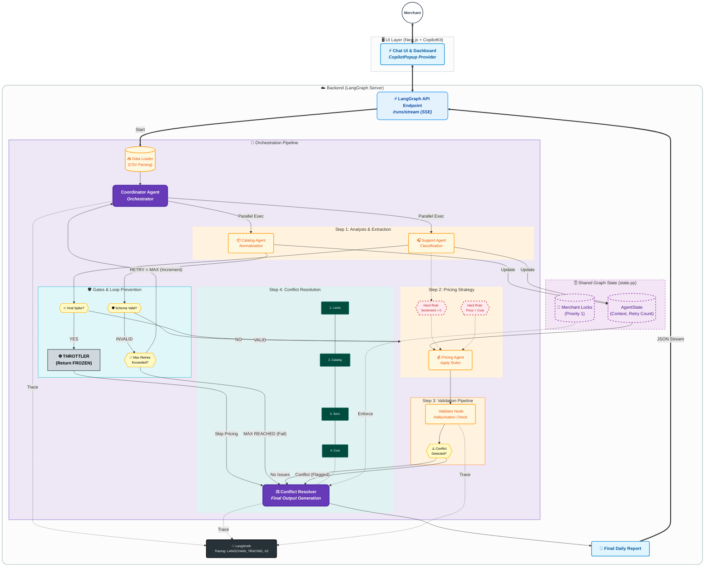

# Salla Autonomous Merchant Operations - Comprehensive Project Report

## Table of Contents

1.  [Implementation Plan & Architecture](#1-implementation-plan--architecture)
    *   [Deliverables Checklist](#11-deliverables-checklist)
    *   [System Architecture Diagram](#12-system-architecture-diagram)
2.  [Build Report](#2-build-report)
    *   [System Design Rationale](#21-system-design-rationale)
    *   [Agent Behavior Rationale](#22-agent-behavior-rationale)
    *   [Implementation Decisions](#23-implementation-decisions)
    *   [Debugging Process Documentation](#24-debugging-process-documentation)
    *   [Testing & Validation Approach](#25-testing--validation-approach)
    *   [Final System Walkthrough](#26-final-system-walkthrough)
3.  [Edge Case Handling & Safety Protocols](#3-edge-case-handling--safety-protocols)
    *   [Catalog Agent Misclassification](#31-catalog-agent-misclassification)
    *   [Viral-Post-Driven Complaint Spike](#32-viral-post-driven-complaint-spike)
    *   [Preventing Agent Error Feedback Loops](#33-preventing-agent-error-feedback-loops)
    *   [Preventing Overwriting Merchant Decisions](#34-preventing-overwriting-merchant-decisions)

---

## 1. Implementation Plan & Architecture

### 1.1 Deliverables Checklist

The following checklist tracks the completion status of the project requirements and specific implementation details.

| Status | Category | Deliverable | Specific Implementation Details |
| :---: | :--- | :--- | :--- |
| ✅ | **Architecture** | **Agent Roles** | • **Coordinator:** Orchestrates workflow (`nodes.py`).<br>• **Catalog:** Normalizes data (`catalog_agent.py`).<br>• **Support:** Classifies sentiment (`support_agent.py`).<br>• **Pricing:** Applies rules (`pricing_agent.py`). |
| ✅ | | **Communication** | • **State Graph:** Uses `AgentState` TypedDict.<br>• **Structured Output:** Pydantic models enforce JSON. |
| ✅ | | **Fail-safes** | • **Throttler:** Returns "FROZEN" on viral spikes.<br>• **Safety Gate:** Conditional edge routing in Graph.<br>• **Retry Counter:** Prevents infinite loops. |
| ✅ | | **Grounding** | • **Cross-Agent Verification:** `conflict_resolver_node` checks Pricing vs Catalog.<br>• **Priority Hierarchy:** 1. Locks → 2. Catalog Integrity → 3. Sentiment → 4. Cost Floor. |
| ✅ | **Schema** | **Pipelines** | • **Validation:** `validator_node` detects hallucinations (regex extraction).<br>• **Ontology:** Defined classes (Inquiry, Complaint, etc.).<br>• **Pricing Rules:** Hard constraints (Cost + 5%, Sentiment blocks). |
| ✅ | **Code** | **Orchestration** | • **LangGraph Server:** `langgraph.json` configuration.<br>• **Docker:** Containerized backend.<br>• **Tracing:** LangSmith integration enabled. |
| ✅ | **UI** | **CopilotKit** | • **Frontend:** Next.js + CopilotKit Popup.<br>• **Visuals:** Real-time Dashboard with SSE streaming. |
| ✅ | **Documentation** | **Reports** | • **Build Report:** Included in Section 2.<br>• **Edge Cases:** Included in Section 3.<br>• **Audit:** Debugging and tracing evidence documented. |

### 1.2 System Architecture Diagram

The system is deployed as a **LangGraph Application** exposed via a streaming API (`/runs/stream`) and consumed by a Next.js frontend via Server-Sent Events (SSE).



---

## 2. Build Report

### 2.1 System Design Rationale

#### Architecture: LangGraph Server + Next.js
We chose a **LangGraph Server** architecture served via a standard streaming API, consumed by a **Next.js** frontend.

*   **Why LangGraph?**
    *   **State Management:** Merchant operations require passing complex context (catalog, competitors, sentiment) between steps. LangGraph's state schema is superior to stateless LLM chains.
    *   **Cyclic Capability:** We needed the ability to "loop back" if schema validation fails (self-correction) before finalizing the report.
    *   **Observability:** Built-in integration with LangSmith allows us to trace exactly *why* a price was changed.

*   **Why LangGraph Server (API)?**
    *   Instead of wrapping Python scripts in FastAPI, we use the native `langgraph dev` server.
    *   **Benefit:** This provides out-of-the-box streaming (Server-Sent Events), allowing the frontend to show real-time progress (e.g., "Analyzing Support Messages..." -> "Calculating Prices...") without custom socket management.

#### Trade-offs
*   **Complexity vs. Robustness:** We chose a multi-agent modular design over a single large prompt. This increases code complexity but significantly reduces hallucination rates and allows for unit testing specific logic (e.g., testing the Pricing Agent in isolation).
*   **Latency:** The sequential validation steps add latency. We accepted this tradeoff because **accuracy** in pricing is more critical than speed.

### 2.2 Agent Behavior Rationale

#### The Coordinator (Orchestrator)
*   **Rationale:** Acts as the data ingress point. It decouples data loading from processing, allowing us to swap CSV inputs for database inputs without changing downstream agents.

#### The Support Agent (Analyst)
*   **Rationale:** Runs *before* pricing. This is critical. We must know the "Sentiment Score" and check for "Viral Spikes" before we attempt to calculate prices. If sentiment is toxic, pricing logic changes.

#### The Pricing Agent (Calculator)
*   **Rationale:** Uses a "Chain of Thought" approach. It doesn't just output a number; it outputs `signals_used` and `reasoning`. This is required for the `validator_node` to audit the decision later.

#### The Validator & Resolver (The Safety Net)
*   **Rationale:** LLMs are probabilistic. Business logic must be deterministic.
*   **Implementation:** The `conflict_resolver_node` is pure Python logic (no LLM). It enforces hard constraints (Cost Floors, Merchant Locks) that the LLM might ignore.

### 2.3 Implementation Decisions

*   **Library - CopilotKit:** Used for the frontend to provide a "Conversational UI" experience. It allows the merchant to ask "Why did you block product X?" and contextually retrieve data from the generated report.
*   **Pydantic:** Used everywhere for structured output. We do not parse raw strings; we parse JSON objects validated against schemas to prevent downstream crashes.
*   **Docker:** The entire backend is containerized to ensure the Python environment (often fragile) is consistent across dev and production.

### 2.4 Debugging Process Documentation

#### Challenge: The "Hallucinating Competitor"
During development, the Pricing Agent would occasionally invent a competitor price to justify a price cut.

*   **Detection:** We noticed in LangSmith traces that `signals_used` contained "competitor_price: $85" when the `pricing_context` input was empty.
*   **Fix:** We implemented the `validator_node`. It iterates through `signals_used`, extracts the claimed price via Regex, and compares it to the actual `pricing_context` in the state.
*   **Result:** See `tests/test_validation_pipeline.py`. The system now flags this as a `HALLUCINATION` and blocks the change.

#### Challenge: JSON Trailing Commas
GPT-4o-mini occasionally outputted trailing commas in JSON.
*   **Fix:** We switched to using LangChain's `JsonOutputParser` with Pydantic, which is more robust at parsing slightly malformed JSON than standard `json.loads`.

### 2.5 Testing & Validation Approach

We implemented a dedicated test suite (`backend/tests/`) rather than relying solely on manual testing.

1.  **Unit Tests:** `test_llm.py` and `test_azure_connection.py` verify infrastructure before logic.
2.  **Pipeline Tests:** `test_validation_pipeline.py` mocks state to feed specific edge cases (Hallucinations, Contradictions) into the Resolver to ensure they are blocked.
3.  **End-to-End:** `run_test.py` simulates a full daily run with sample CSV data.

### 2.6 Final System Walkthrough

1.  **Start:** The merchant logs into the Next.js Dashboard.
2.  **Trigger:** They click "Run Operations Check" or ask Copilot "Run analysis."
3.  **Ingest:** The `Coordinator` loads the CSV data (Products, Messages, Competitors).
4.  **Analyze:**
    *   `Support Agent` scans for viral spikes. (If found -> Freeze).
    *   `Catalog Agent` normalizes messy product data.
5.  **Price:** `Pricing Agent` proposes changes based on cost, sentiment, and competitors.
6.  **Validate:** `Validator Node` cross-checks proposals against raw data to catch hallucinations.
7.  **Resolve:** `Conflict Resolver` applies Merchant Locks and Hard Rules.
8.  **Output:** The dashboard updates in real-time via SSE, displaying a PDF-exportable report with "Approved", "Blocked", and "Locked" status badges.

---

## 3. Edge Case Handling & Safety Protocols

This section outlines the specific strategies implemented in the Salla Autonomous Merchant Operations system to handle edge cases, ensuring safety, determinism, and reliability.

### 3.1 Catalog Agent Misclassification
**Scenario:** The Catalog Agent misclassifies a high-value electronic item (e.g., "Espresso Machine") as a low-value "Accessory," leading the Pricing Agent to suggest a suspiciously low price.

*   **Prevention (Schema Constraints):**
    *   We utilize Pydantic models (`CatalogAnalysis` in `catalog_agent.py`) to enforce strict category enums.
    *   The `validator_node` performs cross-reference checks. If a product's price change is > 50% different from the category average, it is flagged.

*   **Detection (Signals):**
    *   **Cost Floor Violation:** The `pricing_agent.py` has a hard rule: `proposed_price >= cost * 1.05`. If a misclassification leads to a price below cost, the "Cost Floor" logic catches it immediately.
    *   **Market Divergence:** The `validator_node` compares the proposed price against `pricing_context` (competitor data). A massive deviation triggers a `DATA_MISMATCH` flag.

*   **Correction:**
    *   The `conflict_resolver_node` blocks any change tagged with `DATA_MISMATCH` or `HALLUCINATION`.
    *   The status is set to `BLOCKED`, requiring human intervention.

### 3.2 Viral-Post-Driven Complaint Spike
**Scenario:** A viral social media post causes a sudden influx of 500+ complaints in one hour.

*   **Anomaly Detection:**
    *   Implemented in `support_agent.py`.
    *   We calculate `complaint_velocity` (complaints per minute relative to baseline) and `sentiment_score`.
    *   Logic: `if velocity > 7.0 or complaint_ratio > 0.5: spike_detected = True`.

*   **Throttling & Safeguards:**
    *   **The Safety Gate:** In `graph.py`, the `check_safety_gate` conditional edge inspects `complaint_spike_detected`.
    *   **The Throttler Node:** If a spike is True, the workflow routes to `throttler_node`.
    *   **Outcome:** The Throttler returns a `FROZEN` status. **ALL** pricing updates are suspended globally for the merchant until the spike is reviewed. This prevents the Pricing Agent from reacting blindly to a PR crisis (e.g., lowering prices due to bad sentiment when the issue is actually shipping delays).

### 3.3 Preventing Agent Error Feedback Loops
**Scenario:** Two agents disagree indefinitely (e.g., Catalog says "Missing Data", Pricing says "Ready"), causing an infinite processing loop.

*   **DAG Structure:**
    *   Our LangGraph is designed as a **Directed Acyclic Graph (DAG)** for the main flow: `Coordinator -> Support -> Catalog -> Pricing -> Validator -> Resolver -> END`.
    *   Back-loops are only allowed for explicit schema retries.

*   **Retry Limits:**
    *   Managed in `graph.py` via `check_schema_gate`.
    *   State variable `retry_count` tracks iterations.
    *   **Limit:** Max 2 retries. If `retry_count >= 2`, the flow forces a route to the `resolver` with a failure flag, breaking the loop.

*   **Priority Hierarchy:**
    *   To prevent logical oscillation, the `conflict_resolver_node` uses a strict hierarchy:
        1.  **Merchant Locks** (Immutable)
        2.  **Safety Throttles** (Viral Spikes)
        3.  **Catalog Critical Errors** (Data integrity)
        4.  **Sentiment Signals**
        5.  **Pricing Rules**

### 3.4 Preventing Overwriting Merchant Decisions
**Scenario:** A merchant explicitly sets a product price to $100. The agent thinks it should be $110 and tries to overwrite it every day.

*   **Immutable Overrides (Merchant Locks):**
    *   The state object (`state.py`) contains a `merchant_locks` dictionary.
    *   **Implementation:** In `conflict_resolver_node`:
        ```python
        if product_id in merchant_locks:
            final_actions.append({
                "status": "LOCKED",
                "note": "Merchant override: price locked",
                "final_price": current_price
            })
            continue
        ```
    *   This logic executes *before* any AI pricing logic is considered.

*   **Audit Logs:**
    *   Every action taken by the system is appended to the `audit_log` list in the state.
    *   This log is returned to the frontend and displayed in the "Audit Trail" section of the report, ensuring transparency.