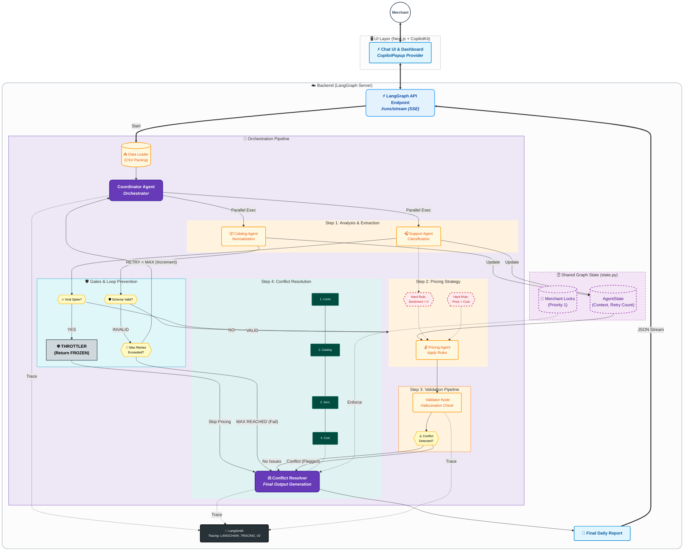
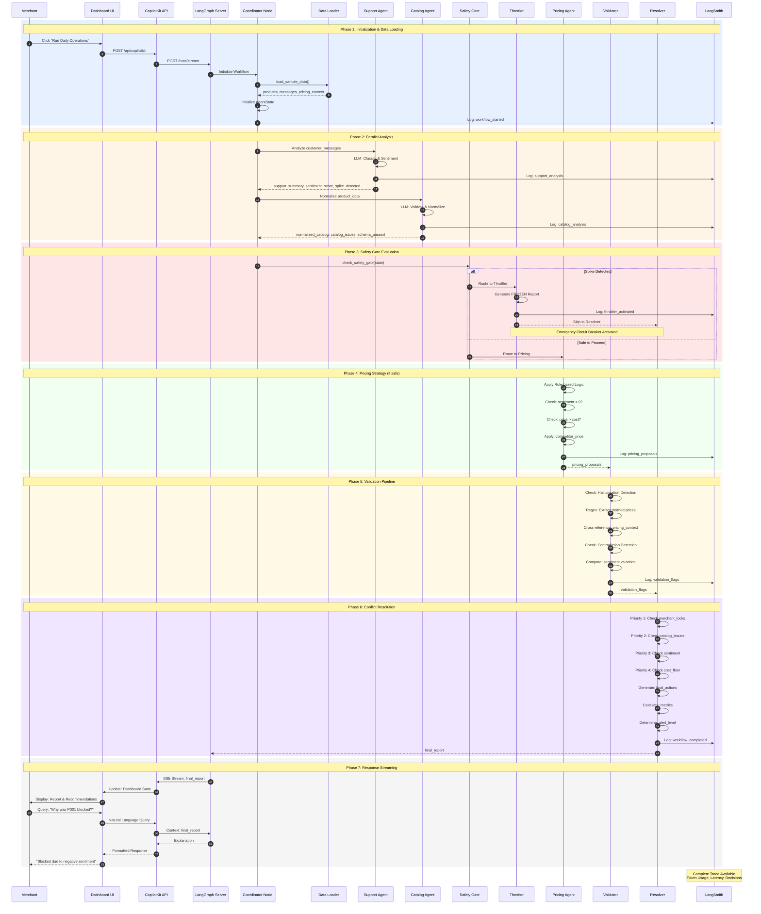
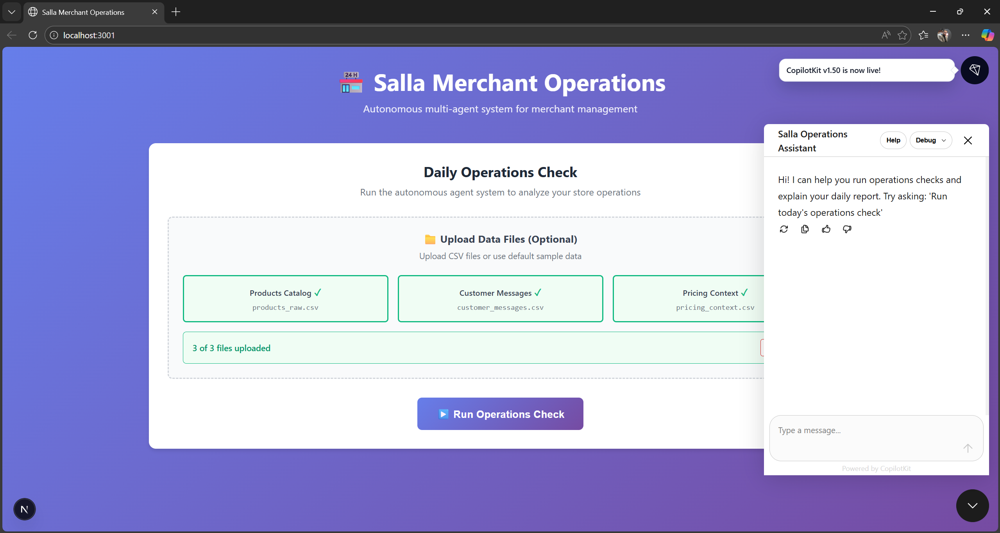
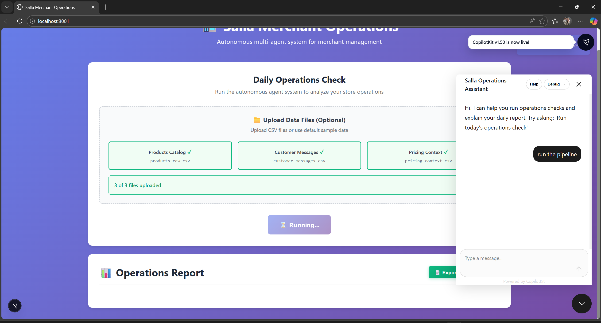
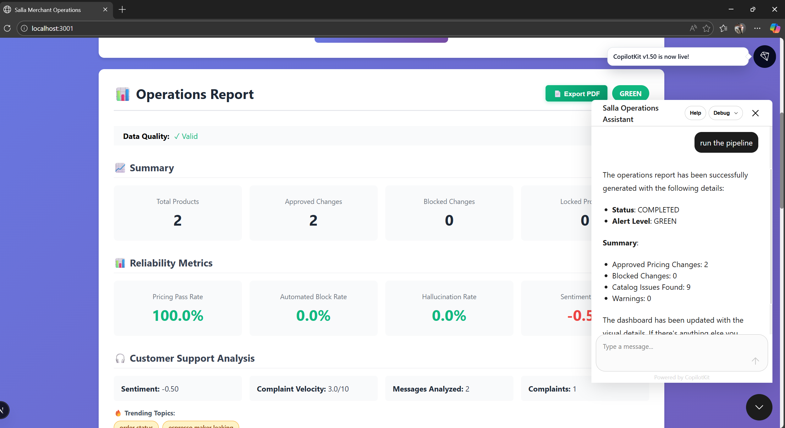
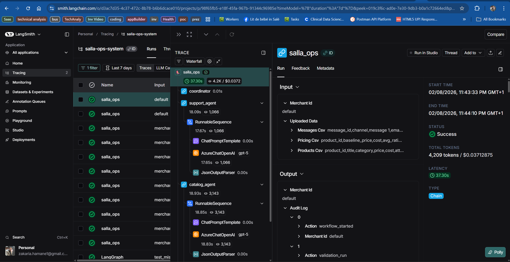

# Technical Architecture & Implementation Report: Salla Autonomous Operations

## Table of Contents

1. [Implementation Status & Architecture Overview](#1-implementation-status--architecture-overview)
   - 1.1 [Deliverables Status](#11-deliverables-status)
   - 1.2 [Functional System Architecture Diagram](#12-functional-system-architecture-diagram)
   - 1.3 [Technical System Architecture Diagram](#13-technical-system-architecture-diagram)
   - 1.4 [Flow Diagram](#14-flow-diagram)

2. [Technical Build Report](#2-technical-build-report)
   - 2.1 [System Design Rationale](#21-system-design-rationale)
   - 2.2 [Agent Behavior & Responsibilities](#22-agent-behavior--responsibilities)
   - 2.3 [Implementation Decisions](#23-implementation-decisions)
   - 2.4 [Debugging Log: The "Hallucinating Competitor" Incident](#24-debugging-log-the-hallucinating-competitor-incident)
   - 2.5 [Testing Strategy](#25-testing-strategy)
   - 2.6 [Final System Walkthrough](#26-final-system-walkthrough)

3. [Edge Case Handling & Safety Protocols](#3-edge-case-handling--safety-protocols)
   - 3.1 [Mitigation: Catalog Misclassification](#31-mitigation-catalog-misclassification)
   - 3.2 [Mitigation: Viral-Post-Driven Spikes](#32-mitigation-viral-post-driven-spikes)
   - 3.3 [Mitigation: Feedback Loops](#33-mitigation-feedback-loops)
   - 3.4 [Mitigation: Merchant Override Integrity](#34-mitigation-merchant-override-integrity)

4. [Live System Demonstration & Observability](#4-live-system-demonstration--observability)
   - 4.1 [CopilotKit Frontend Integration](#41-copilotkit-frontend-integration)
   - 4.2 [LangSmith Tracing & Production Evidence](#42-langsmith-tracing--production-evidence)

---

## 1. Implementation Status & Architecture Overview

> **Addresses Assignment Requirement 1:** System Architecture - Agent roles, communication model, fail-safes, and grounding mechanisms

### 1.1 Deliverables Status
The system has been implemented as a graph-based multi-agent application. The core logic is fully operational, with a focus on deterministic safeguards for pricing and rigorous schema validation for catalog data.

| Component | Status | Implementation Notes |
| :--- | :---: | :--- |
| **Agent Core** | ✅ | **Coordinator** (`nodes.py::coordinator_node`), **Catalog** (`agents/catalog_agent.py::catalog_agent`), **Support** (`agents/support_agent.py::support_agent`), **Pricing** (`agents/pricing_agent.py::pricing_agent`). |
| **State Management** | ✅ | Utilized `AgentState` (`state.py`) with Pydantic typing to enforce strict data contracts between nodes. |
| **Safety Systems** | ✅ | Implemented a **Throttler** (`nodes.py::throttler_node`) for viral spikes and a **Validator Node** (`nodes.py::validator_node`) to catch LLM hallucinations. |
| **Grounding** | ✅ | **Priority Hierarchy** enforced in `nodes.py::conflict_resolver_node`: Merchant Locks > Catalog Integrity > Sentiment > Cost Floor. |
| **Infrastructure** | ✅ | Containerized via Docker (`backend/Dockerfile`). Deployed as a `langgraph` server (`langgraph.json`) exposing SSE endpoints. |
| **Frontend** | ✅ | Next.js dashboard (`frontend/app/page.tsx`, `frontend/components/Dashboard.tsx`) integrated with **CopilotKit** (`frontend/app/api/copilotkit/route.ts`). |
| **Observability** | ✅ | Full LangSmith integration (`llm_config.py`) for trace analysis and latency monitoring. |

### 1.2 Functional System Architecture Diagram
We adopted a **LangGraph Application** architecture. Unlike a standard linear chain, this allows for cyclic behavior (retries) and conditional branching (circuit breakers). The system is exposed via a streaming API to ensure the frontend reflects the internal reasoning steps in real-time.



### 1.3 Technical System Architecture Diagram

This section provides an exhaustive technical view of the system's implementation, including specific technologies, versions, protocols, data flows, infrastructure components, and deployment configurations.

```mermaid
graph TB
    %% ============================================================================
    %% COMPREHENSIVE TECHNICAL ARCHITECTURE DIAGRAM
    %% ============================================================================
    
    %% Style Definitions
    classDef frontend fill:#61dafb,stroke:#20232a,stroke-width:2px,color:#20232a,font-size:11px
    classDef backend fill:#68a063,stroke:#3c5d3a,stroke-width:2px,color:#fff,font-size:11px
    classDef database fill:#336791,stroke:#1a3a52,stroke-width:2px,color:#fff,font-size:11px
    classDef llm fill:#ff6b6b,stroke:#c92a2a,stroke-width:2px,color:#fff,font-size:11px
    classDef infra fill:#868e96,stroke:#495057,stroke-width:2px,color:#fff,font-size:11px
    classDef protocol fill:#ffd43b,stroke:#fab005,stroke-width:2px,color:#000,font-size:10px
    classDef env fill:#e9ecef,stroke:#adb5bd,stroke-width:1px,color:#495057,font-size:9px
    classDef pkg fill:#d0ebff,stroke:#339af0,stroke-width:1px,color:#1864ab,font-size:9px
    
    %% ============================================================================
    %% LAYER 1: CLIENT & BROWSER
    %% ============================================================================
    subgraph Client["🌐 CLIENT LAYER (Browser)"]
        Browser["Web Browser<br/>Chrome/Firefox/Safari<br/>JavaScript Runtime"]:::frontend
        
        subgraph FrontendApp["Next.js 15.5.12 Application"]
            direction TB
            
            subgraph Pages["App Router Pages"]
                HomePage["app/page.tsx<br/>Main Entry Point<br/>CopilotKit Provider"]:::frontend
                Layout["app/layout.tsx<br/>Root Layout<br/>Global Styles"]:::frontend
            end
            
            subgraph Components["React 19.2.1 Components"]
                Dashboard["components/Dashboard.tsx<br/>1500 lines<br/>State Management<br/>useCopilotAction<br/>useCopilotReadable"]:::frontend
                DashCSS["Dashboard.module.css<br/>Component Styles"]:::frontend
            end
            
            subgraph CopilotSDK["CopilotKit SDK v1.51.3"]
                CKCore["@copilotkit/react-core<br/>useCopilotAction()<br/>useCopilotReadable()"]:::pkg
                CKUI["@copilotkit/react-ui<br/>CopilotPopup<br/>Chat Interface"]:::pkg
                CKRuntime["@copilotkit/runtime<br/>Runtime Adapter"]:::pkg
            end
            
            subgraph Utils["Utility Libraries"]
                JSPDF["jsPDF v2.5.2<br/>PDF Export<br/>Report Generation"]:::pkg
            end
        end
    end
    
    %% ============================================================================
    %% LAYER 2: API GATEWAY & MIDDLEWARE
    %% ============================================================================
    subgraph APILayer["⚡ API GATEWAY LAYER (Next.js API Routes)"]
        direction TB
        
        subgraph APIRoute["API Route Handler"]
            CKRoute["app/api/copilotkit/route.ts<br/>POST Handler<br/>OpenAI Adapter<br/>CopilotRuntime"]:::protocol
            
            subgraph CKConfig["CopilotKit Configuration"]
                OpenAIAdapter["OpenAIAdapter<br/>OpenAI Client v4.77.3<br/>Model: gpt-4o-mini"]:::pkg
                RuntimeConfig["CopilotRuntime<br/>Endpoint: /api/copilotkit<br/>Service Adapter"]:::pkg
            end
        end
        
        subgraph Protocols["Communication Protocols"]
            HTTP["HTTP/1.1 & HTTP/2<br/>POST /api/copilotkit<br/>Content-Type: application/json"]:::protocol
            SSE["Server-Sent Events (SSE)<br/>event: values/end/metadata<br/>data: JSON payload<br/>Streaming Response"]:::protocol
            WS["WebSocket (Fallback)<br/>Real-time Bidirectional"]:::protocol
        end
    end
    
    %% ============================================================================
    %% LAYER 3: BACKEND ORCHESTRATION
    %% ============================================================================
    subgraph BackendLayer["🐍 BACKEND LAYER (Python 3.11-slim)"]
        direction TB
        
        subgraph LangGraphServer["LangGraph Server (Port 8000)"]
            ServerCmd["langgraph dev<br/>--host 0.0.0.0<br/>--port 8000<br/>Uvicorn ASGI Server"]:::backend
            
            LGConfig["langgraph.json<br/>assistant_id: salla_ops<br/>graph: ./graph.py:app<br/>env: .env"]:::env
            
            subgraph Endpoints["API Endpoints"]
                RunsStream["/runs/stream<br/>POST<br/>stream_mode: values<br/>SSE Response"]:::protocol
                Health["/health<br/>GET<br/>Health Check"]:::protocol
            end
        end
        
        subgraph CoreModules["Core Orchestration Modules"]
            direction LR
            
            GraphPy["graph.py<br/>StateGraph Definition<br/>Workflow Compilation<br/>check_safety_gate()<br/>check_schema_gate()"]:::backend
            
            NodesPy["nodes.py<br/>coordinator_node()<br/>throttler_node()<br/>validator_node()<br/>conflict_resolver_node()<br/>generate_recommendations()"]:::backend
            
            StatePy["state.py<br/>AgentState TypedDict<br/>Pydantic v2.12.5<br/>operator.add annotations"]:::backend
        end
        
        subgraph AgentModules["Specialized Agent Modules"]
            direction LR
            
            CatalogAgent["agents/catalog_agent.py<br/>catalog_agent()<br/>CatalogAnalysis Model<br/>JsonOutputParser<br/>Schema Validation"]:::backend
            
            SupportAgent["agents/support_agent.py<br/>support_agent()<br/>SupportAnalysis Model<br/>Sentiment Scoring<br/>Spike Detection"]:::backend
            
            PricingAgent["agents/pricing_agent.py<br/>pricing_agent()<br/>Rule-based Logic<br/>Cost Floor Enforcement<br/>Competitor Analysis"]:::backend
        end
        
        subgraph UtilityModules["Utility & Configuration Modules"]
            DataLoader["data_loader.py<br/>load_sample_data()<br/>pandas 3.0.0<br/>CSV to Dict Conversion<br/>Salla/Green Data Priority"]:::backend
            
            LLMConfig["llm_config.py<br/>get_llm()<br/>get_openai_llm()<br/>get_azure_llm()<br/>get_provider_info()<br/>Temperature Auto-adjust"]:::backend
        end
        
        subgraph Dependencies["Python Dependencies (requirements.txt)"]
            LG["langgraph==1.0.8<br/>langgraph-cli[inmem]==0.4.12"]:::pkg
            LC["langchain==1.2.9<br/>langchain-openai==1.1.7<br/>langchain-anthropic==1.3.2"]:::pkg
            LS["langsmith==0.6.9<br/>LANGCHAIN_TRACING_V2"]:::pkg
            Data["pandas==3.0.0<br/>numpy==2.4.2"]:::pkg
            API["fastapi==0.128.3<br/>uvicorn==0.40.0<br/>python-multipart==0.0.22"]:::pkg
            Utils["python-dotenv==1.2.1<br/>httpx==0.28.1<br/>openai==2.17.0"]:::pkg
        end
    end
    
    %% ============================================================================
    %% LAYER 4: LLM PROVIDERS
    %% ============================================================================
    subgraph LLMProviders["🤖 LLM PROVIDER LAYER"]
        direction LR
        
        subgraph OpenAIProvider["OpenAI Platform"]
            OpenAIAPI["OpenAI API<br/>api.openai.com<br/>Model: gpt-4o-mini<br/>Temperature: 0<br/>OPENAI_API_KEY"]:::llm
        end
        
        subgraph AzureProvider["Azure OpenAI Service"]
            AzureAPI["Azure OpenAI<br/>*.openai.azure.com<br/>Deployment: gpt-5/gpt-4o-mini<br/>API Version: 2025-04-01-preview<br/>AZURE_OPENAI_*"]:::llm
            AzureEmbed["Embeddings<br/>text-embedding-3-large<br/>Dimension: 3072"]:::llm
        end
        
        subgraph LangChainIntegration["LangChain Integration"]
            LCEL["LangChain Expression Language<br/>Prompt | LLM | Parser<br/>ChatPromptTemplate<br/>JsonOutputParser"]:::pkg
            Adapters["ChatOpenAI<br/>AzureChatOpenAI<br/>Dynamic Provider Selection"]:::pkg
        end
    end
    
    %% ============================================================================
    %% LAYER 5: DATA PERSISTENCE
    %% ============================================================================
    subgraph DataLayer["💾 DATA PERSISTENCE LAYER"]
        direction TB
        
        subgraph FileSystem["File System Storage"]
            CSVData["CSV Data Files<br/>data/salla_data/<br/>data/green_data/<br/>products_raw.csv<br/>customer_messages.csv<br/>pricing_context.csv"]:::database
            
            StateCheckpoints[".langgraph_api/<br/>.langgraph_checkpoint.*.pckl<br/>.langgraph_ops.pckl<br/>.langgraph_retry_counter.pckl<br/>store.pckl<br/>store.vectors.pckl"]:::database
        end
        
        subgraph DataProcessing["Data Processing Pipeline"]
            PandasDF["pandas DataFrames<br/>read_csv()<br/>to_dict('records')<br/>Data Normalization"]:::database
            
            PickleState["Pickle Serialization<br/>State Persistence<br/>Checkpoint Recovery<br/>Retry Tracking"]:::database
        end
    end
    
    %% ============================================================================
    %% LAYER 6: OBSERVABILITY & MONITORING
    %% ============================================================================
    subgraph ObservabilityLayer["🔍 OBSERVABILITY & MONITORING LAYER"]
        direction TB
        
        subgraph LangSmithTracing["LangSmith Tracing"]
            LSPlatform["LangSmith Platform<br/>smith.langchain.com<br/>Project: salla-ops-system<br/>LANGCHAIN_TRACING_V2=true<br/>LANGCHAIN_API_KEY"]:::infra
            
            TraceData["Trace Data<br/>Token Usage<br/>Latency Metrics<br/>Agent Decisions<br/>Error Logs"]:::infra
        end
        
        subgraph Logging["Application Logging"]
            PythonLogs["Python Logging<br/>LOG_LEVEL=INFO<br/>Console Output<br/>Debug Traces"]:::infra
            
            NextLogs["Next.js Logs<br/>Console.log()<br/>Error Boundaries<br/>SSE Event Logs"]:::infra
        end
    end
    
    %% ============================================================================
    %% LAYER 7: INFRASTRUCTURE & DEPLOYMENT
    %% ============================================================================
    subgraph InfraLayer["🐳 INFRASTRUCTURE & DEPLOYMENT LAYER"]
        direction TB
        
        subgraph DockerContainers["Docker Containers"]
            BackendContainer["salla-ops-backend<br/>FROM python:3.11-slim<br/>WORKDIR /app<br/>EXPOSE 8000<br/>CMD langgraph dev"]:::infra
            
            FrontendContainer["salla-ops-frontend<br/>FROM node:20-alpine<br/>WORKDIR /app<br/>EXPOSE 3000<br/>CMD npm start"]:::infra
        end
        
        subgraph Orchestration["Container Orchestration"]
            DockerCompose["docker-compose.local.yml<br/>version: 3.8<br/>services: backend, frontend<br/>networks: salla-network<br/>volumes: ./backend, ./data"]:::infra
            
            PortMapping["Port Mapping<br/>Backend: 8000:8000<br/>Frontend: 3001:3000<br/>Network: bridge"]:::infra
        end
        
        subgraph EnvConfig["Environment Configuration"]
            EnvFile[".env File<br/>LLM_PROVIDER<br/>OPENAI_API_KEY<br/>AZURE_OPENAI_*<br/>LANGCHAIN_*<br/>NEXT_PUBLIC_API_URL"]:::env
            
            EnvExample[".env.example<br/>Template Configuration<br/>Provider Selection<br/>API Endpoints"]:::env
        end
    end
    
    %% ============================================================================
    %% CONNECTIONS & DATA FLOW
    %% ============================================================================
    
    %% Browser to Frontend
    Browser --> HomePage
    Browser --> Dashboard
    HomePage --> CKCore
    HomePage --> CKUI
    Dashboard --> CKCore
    Dashboard --> JSPDF
    
    %% Frontend to API Gateway
    Dashboard -->|"HTTP POST<br/>runOperationsCheck()"| CKRoute
    CKCore -->|"Action Handler"| CKRoute
    CKRoute --> OpenAIAdapter
    CKRoute --> RuntimeConfig
    
    %% API Gateway to Backend
    CKRoute -->|"POST /runs/stream<br/>assistant_id: salla_ops<br/>input: {merchant_id, uploaded_data}<br/>stream_mode: values"| RunsStream
    RunsStream -->|"SSE Stream<br/>event: values<br/>data: {final_report, audit_log}"| CKRoute
    CKRoute -->|"SSE Response"| Dashboard
    
    %% Backend Internal Flow
    RunsStream --> ServerCmd
    ServerCmd --> LGConfig
    LGConfig --> GraphPy
    GraphPy --> NodesPy
    GraphPy --> StatePy
    NodesPy --> CatalogAgent
    NodesPy --> SupportAgent
    NodesPy --> PricingAgent
    NodesPy --> DataLoader
    
    %% Agent to LLM
    CatalogAgent -->|"LCEL Chain<br/>Prompt | LLM | Parser"| LLMConfig
    SupportAgent -->|"LCEL Chain<br/>Prompt | LLM | Parser"| LLMConfig
    LLMConfig -->|"LLM_PROVIDER=openai"| OpenAIAPI
    LLMConfig -->|"LLM_PROVIDER=azure"| AzureAPI
    LLMConfig --> LCEL
    LLMConfig --> Adapters
    
    %% Data Access
    DataLoader -->|"pandas.read_csv()"| CSVData
    DataLoader -->|"Priority: salla_data > green_data"| CSVData
    GraphPy -->|"State Persistence<br/>pickle.dump()"| StateCheckpoints
    StatePy -->|"Pydantic Validation"| PandasDF
    
    %% Observability
    CatalogAgent -.->|"Trace Events"| LSPlatform
    SupportAgent -.->|"Trace Events"| LSPlatform
    NodesPy -.->|"Trace Events"| LSPlatform
    GraphPy -.->|"Audit Log"| TraceData
    Dashboard -.->|"Console Logs"| NextLogs
    ServerCmd -.->|"Python Logs"| PythonLogs
    
    %% Infrastructure
    BackendContainer --> ServerCmd
    FrontendContainer --> HomePage
    DockerCompose --> BackendContainer
    DockerCompose --> FrontendContainer
    DockerCompose --> PortMapping
    EnvFile --> LGConfig
    EnvFile --> CKRoute
    EnvFile --> LLMConfig
```



**Comprehensive Technical Specifications:**

#### **Layer 1: Client & Browser**

**Frontend Technology Stack:**
- **Framework:** Next.js 15.5.12 with App Router architecture
- **React Version:** 19.2.1 with concurrent features
- **TypeScript:** 5.8.3 for type safety
- **Build Tool:** Next.js built-in compiler (SWC-based)
- **Package Manager:** npm (compatible with yarn/pnpm)

**Key Frontend Files:**
- `app/page.tsx` (42 lines): Main entry point, CopilotKit provider setup
- `app/layout.tsx`: Root layout with global styles
- `components/Dashboard.tsx` (1500 lines): Core UI component with state management
  - `useCopilotAction()`: Defines "runOperationsCheck" action
  - `useCopilotReadable()`: Exposes report data to AI
  - SSE stream parsing with buffer management
  - Real-time UI updates during workflow execution
  - PDF export functionality using jsPDF
- `components/Dashboard.module.css`: Component-scoped styles

**CopilotKit Integration:**
- **Version:** 1.51.3 across all packages
- **Core Package:** `@copilotkit/react-core` - Hooks and state management
- **UI Package:** `@copilotkit/react-ui` - Pre-built chat components
- **Runtime Package:** `@copilotkit/runtime` - Server-side runtime adapter
- **Features:**
  - Conversational UI with natural language queries
  - Action registration for backend operations
  - Readable state exposure for AI context
  - Streaming response handling

**Additional Libraries:**
- **jsPDF 2.5.2:** Client-side PDF generation with custom styling
- **CSS Modules:** Scoped styling to prevent conflicts

#### **Layer 2: API Gateway & Middleware**

**API Route Implementation:**
- **File:** `app/api/copilotkit/route.ts` (45 lines)
- **Handler:** Next.js API Route (POST method)
- **Runtime:** Node.js 20 (Alpine Linux in container)

**CopilotKit Runtime Configuration:**
```typescript
const openai = new OpenAI({ apiKey: process.env.OPENAI_API_KEY })
const serviceAdapter = new OpenAIAdapter({ openai })
const runtime = new CopilotRuntime()
const { handleRequest } = copilotRuntimeNextJSAppRouterEndpoint({
  runtime,
  serviceAdapter,
  endpoint: "/api/copilotkit"
})
```

**Communication Protocols:**

1. **HTTP/HTTPS:**
   - Method: POST
   - Endpoint: `/api/copilotkit`
   - Content-Type: `application/json`
   - Request Body: `{ messages, actions, state }`

2. **Server-Sent Events (SSE):**
   - Content-Type: `text/event-stream`
   - Event Types: `values`, `end`, `metadata`
   - Data Format: JSON strings
   - Keep-Alive: Automatic reconnection
   - Buffer Management: Line-by-line parsing with incomplete line handling

3. **WebSocket (Fallback):**
   - Used for bidirectional real-time communication
   - Automatic fallback if SSE unavailable

**Request Flow:**
```
Dashboard.runOperationsCheck()
  → fetch(NEXT_PUBLIC_API_URL/runs/stream)
  → POST { assistant_id: "salla_ops", input: {...}, stream_mode: "values" }
  → SSE Stream Response
  → Real-time UI Updates
```

#### **Layer 3: Backend Orchestration**

**LangGraph Server Configuration:**
- **Command:** `langgraph dev --host 0.0.0.0 --port 8000`
- **ASGI Server:** Uvicorn 0.40.0
- **Configuration File:** `langgraph.json`
```json
{
  "dependencies": ["."],
  "graphs": {
    "salla_ops": "./graph.py:app"
  },
  "env": ".env"
}
```

**Core Module Architecture:**

1. **graph.py (75 lines):**
   - `StateGraph(AgentState)`: Graph definition
   - `check_safety_gate()`: Conditional routing for spike detection
   - `check_schema_gate()`: Validation and retry logic
   - `workflow.compile()`: Graph compilation
   - Nodes: coordinator, catalog_agent, support_agent, pricing_agent, validator, throttler, resolver
   - Edges: Sequential and conditional routing

2. **nodes.py (350+ lines):**
   - `coordinator_node()`: Data loading, state initialization, CSV upload handling
   - `throttler_node()`: Emergency circuit breaker, FROZEN status generation
   - `validator_node()`: Hallucination detection via regex, contradiction checking
   - `conflict_resolver_node()`: Priority hierarchy enforcement, metrics calculation
   - `generate_recommendations()`: Actionable insights generation

3. **state.py (45 lines):**
   - `AgentState` TypedDict with Pydantic validation
   - Fields: merchant_id, product_data, customer_messages, pricing_context, etc.
   - Annotated fields with `operator.add` for list accumulation
   - Type safety for all state transitions

**Agent Module Specifications:**

1. **catalog_agent.py (85 lines):**
   - `CatalogAnalysis` Pydantic model
   - LLM-based normalization using LCEL
   - Schema validation with confidence scoring
   - Issue detection: missing attributes, duplicates, inconsistencies
   - Output: `normalized_catalog`, `catalog_issues`, `schema_validation_passed`

2. **support_agent.py (120 lines):**
   - `SupportAnalysis` Pydantic model
   - Message classification: Inquiry, Complaint, Suggestion, Transactional
   - Sentiment scoring: -1.0 (negative) to 1.0 (positive)
   - Complaint velocity calculation: 0-10 scale
   - Spike detection: velocity > 7.0 OR complaint_ratio > 0.5
   - Error handling with detailed logging

3. **pricing_agent.py (95 lines):**
   - Rule-based pricing engine (no LLM)
   - Constraints:
     - Cost floor: `price >= cost * 1.05`
     - Sentiment gate: No increases if `sentiment < 0`
     - Competitor pricing: Adjust to match or beat
   - Reasoning transparency: All signals logged
   - Output: `pricing_proposals` with full justification

**Utility Modules:**

1. **data_loader.py (75 lines):**
   - `load_sample_data()`: CSV loading with priority
   - Priority: `data/salla_data/` > `data/green_data/` > fallback
   - pandas DataFrame conversion to dict records
   - Graceful fallback to hardcoded sample data

2. **llm_config.py (150 lines):**
   - `get_llm()`: Dynamic provider selection
   - `get_openai_llm()`: OpenAI configuration
   - `get_azure_llm()`: Azure OpenAI configuration
   - `get_provider_info()`: Configuration introspection
   - GPT-5 temperature auto-adjustment (forces temperature=1)
   - Environment variable validation

**Python Dependencies:**
```
langgraph==1.0.8                  # Graph orchestration
langgraph-cli[inmem]==0.4.12      # CLI with in-memory storage
langchain==1.2.9                  # LLM framework
langchain-openai==1.1.7           # OpenAI integration
langchain-anthropic==1.3.2        # Anthropic integration
langsmith==0.6.9                  # Observability
pydantic==2.12.5                  # Data validation
fastapi==0.128.3                  # API framework
uvicorn==0.40.0                   # ASGI server
python-dotenv==1.2.1              # Environment management
pandas==3.0.0                     # Data processing
numpy==2.4.2                      # Numerical operations
python-multipart==0.0.22          # File upload support
openai==2.17.0                    # OpenAI SDK
httpx==0.28.1                     # HTTP client
```

#### **Layer 4: LLM Providers**

**OpenAI Configuration:**
- **Endpoint:** `https://api.openai.com/v1/chat/completions`
- **Model:** `gpt-4o-mini` (default)
- **Temperature:** 0 (deterministic)
- **Authentication:** `OPENAI_API_KEY` environment variable
- **SDK:** `openai==2.17.0`
- **LangChain Adapter:** `ChatOpenAI`

**Azure OpenAI Configuration:**
- **Endpoint:** `AZURE_OPENAI_ENDPOINT` (e.g., `https://resource.openai.azure.com`)
- **Deployment:** `AZURE_OPENAI_DEPLOYMENT_NAME` (e.g., `gpt-5`, `gpt-4o-mini`)
- **API Version:** `2025-04-01-preview` (supports GPT-5)
- **Authentication:** `AZURE_OPENAI_API_KEY`
- **Embeddings:** `text-embedding-3-large` (dimension: 3072)
- **LangChain Adapter:** `AzureChatOpenAI`
- **Special Handling:** GPT-5 temperature locked to 1.0

**LangChain Expression Language (LCEL):**
```python
chain = prompt | llm | parser
result = chain.invoke({"input": data})
```
- **Prompt:** `ChatPromptTemplate` with system and user messages
- **LLM:** Dynamic provider (OpenAI or Azure)
- **Parser:** `JsonOutputParser` with Pydantic schema validation

**LLM Call Pattern:**
1. Agent constructs prompt with system instructions
2. `llm_config.get_llm()` returns configured LLM instance
3. LCEL chain executes: Prompt → LLM → JSON Parser
4. Pydantic model validates output structure
5. Parsed result returned to agent
6. Trace sent to LangSmith

#### **Layer 5: Data Persistence**

**File System Structure:**
```
data/
├── salla_data/              # Primary dataset (priority)
│   ├── products_raw.csv
│   ├── customer_messages.csv
│   └── pricing_context.csv
└── green_data/              # Fallback dataset
    ├── products_raw.csv
    ├── customer_messages.csv
    └── pricing_context.csv

backend/.langgraph_api/      # State persistence
├── .langgraph_checkpoint.1.pckl
├── .langgraph_checkpoint.2.pckl
├── .langgraph_checkpoint.3.pckl
├── .langgraph_ops.pckl
├── .langgraph_retry_counter.pckl
├── store.pckl
└── store.vectors.pckl
```

**Data Processing Pipeline:**
1. **CSV Loading:** `pandas.read_csv()` with UTF-8 encoding
2. **DataFrame Conversion:** `.to_dict('records')` for JSON compatibility
3. **State Injection:** Data added to `AgentState` dictionary
4. **Validation:** Pydantic type checking on state updates
5. **Persistence:** Pickle serialization for checkpoints

**State Checkpoint System:**
- **Format:** Python pickle (`.pckl` files)
- **Frequency:** After each node execution
- **Recovery:** Automatic retry from last checkpoint
- **Retention:** Multiple checkpoints for rollback
- **Vector Store:** Embeddings cached for semantic search

#### **Layer 6: Observability & Monitoring**

**LangSmith Integration:**
- **Platform:** `https://smith.langchain.com`
- **Project:** `salla-ops-system`
- **Environment Variables:**
  ```
  LANGCHAIN_TRACING_V2=true
  LANGCHAIN_API_KEY=<key>
  LANGCHAIN_PROJECT=salla-ops-system
  LANGCHAIN_ENDPOINT=https://api.smith.langchain.com
  ```
- **Traced Components:**
  - All LLM calls (catalog_agent, support_agent)
  - Node executions (coordinator, validator, resolver)
  - State transitions
  - Error stack traces

**Trace Data Captured:**
- **Token Usage:** Input/output tokens per LLM call
- **Latency:** Execution time for each node
- **Agent Decisions:** Reasoning and signals used
- **Error Logs:** Full exception details
- **State Snapshots:** AgentState at each checkpoint

**Application Logging:**
- **Python:** Console output with emoji indicators (✓, ✗, ⚠️, 🚨)
- **Next.js:** Browser console logs for SSE events
- **Log Levels:** INFO (default), DEBUG, ERROR
- **Structured Logging:** JSON format for production

#### **Layer 7: Infrastructure & Deployment**

**Docker Configuration:**

1. **Backend Dockerfile:**
```dockerfile
FROM python:3.11-slim
WORKDIR /app
COPY requirements.txt .
RUN pip install --no-cache-dir -r requirements.txt
COPY . .
EXPOSE 8000
CMD ["langgraph", "dev", "--host", "0.0.0.0", "--port", "8000"]
```

2. **Frontend Dockerfile:**
```dockerfile
FROM node:20-alpine
WORKDIR /app
COPY package*.json ./
RUN npm install
COPY . .
RUN npm run build
EXPOSE 3000
CMD ["npm", "start"]
```

**Docker Compose Orchestration:**
```yaml
version: '3.8'
services:
  backend:
    build: ./backend
    container_name: salla-ops-backend
    ports: ["8000:8000"]
    env_file: ./.env
    volumes:
      - ./backend:/app
      - ./data:/app/data
    networks: [salla-network]
  
  frontend:
    build: ./frontend
    container_name: salla-ops-frontend
    ports: ["3001:3000"]
    env_file: ./.env
    depends_on: [backend]
    networks: [salla-network]
    command: npm run dev

networks:
  salla-network:
    driver: bridge
```

**Environment Configuration:**
```bash
# LLM Provider
LLM_PROVIDER=azure                                    # or "openai"

# OpenAI
OPENAI_API_KEY=sk-...

# Azure OpenAI
AZURE_OPENAI_API_KEY=...
AZURE_OPENAI_ENDPOINT=https://resource.openai.azure.com
AZURE_OPENAI_DEPLOYMENT_NAME=gpt-5
AZURE_OPENAI_API_VERSION=2025-04-01-preview
AZURE_OPENAI_EMBEDDINGS_DEPLOYMENT=text-embedding-3-large
EMBEDDING_MODEL_DIM=3072

# LangSmith
LANGCHAIN_TRACING_V2=true
LANGCHAIN_API_KEY=...
LANGCHAIN_PROJECT=salla-ops-system
LANGCHAIN_ENDPOINT=https://api.smith.langchain.com

# Frontend
NEXT_PUBLIC_API_URL=http://localhost:8000            # Browser-accessible URL

# Application
ENVIRONMENT=development
LOG_LEVEL=INFO
PORT=3000
```

**Port Mapping:**
- **Backend Container:** 8000 (internal) → 8000 (host)
- **Frontend Container:** 3000 (internal) → 3001 (host)
- **Production Frontend:** Port 3004 (as shown in live demo)

**Network Architecture:**
- **Bridge Network:** `salla-network` for inter-container communication
- **Service Discovery:** Containers resolve each other by service name
- **Volume Mounts:** Hot-reload for development
  - `./backend:/app` - Backend code changes
  - `./data:/app/data` - Shared data directory
  - `/app/node_modules` - Prevent overwrite of installed packages

**Deployment Workflow:**
1. Build Docker images: `docker-compose build`
2. Start services: `docker-compose up -d`
3. View logs: `docker-compose logs -f`
4. Stop services: `docker-compose down`
5. Production: Use `docker-compose.prod.yml` with optimized settings

**Security Considerations:**
- Environment variables never committed to git
- `.env.example` provides template without secrets
- API keys validated at startup
- CORS configured for frontend origin
- Rate limiting on LLM calls (handled by providers)

**Scalability Notes:**
- **Horizontal Scaling:** Multiple backend containers behind load balancer
- **State Management:** Migrate from pickle to Redis/PostgreSQL for distributed state
- **LLM Caching:** Implement semantic cache to reduce API costs
- **CDN:** Serve frontend static assets via CDN
- **Database:** Replace CSV files with PostgreSQL for production data
    
    %% Observability
    CatalogAgent -.->|"Trace Events"| LSPlatform
    SupportAgent -.->|"Trace Events"| LSPlatform
    NodesPy -.->|"Trace Events"| LSPlatform
    GraphPy -.->|"Audit Log"| TraceData
    Dashboard -.->|"Console Logs"| NextLogs
    ServerCmd -.->|"Python Logs"| PythonLogs
    
    %% Infrastructure
    BackendContainer --> ServerCmd
    FrontendContainer --> HomePage
    DockerCompose --> BackendContainer
    DockerCompose --> FrontendContainer
    DockerCompose --> PortMapping
    EnvFile --> LGConfig
    EnvFile --> CKRoute
    EnvFile --> LLMConfig
```
    
    %% Observability Layer
    subgraph Obs["Observability & Monitoring"]
        LS["LangSmith<br/>LANGCHAIN_TRACING_V2<br/>Trace Analysis"]:::infra
        Docker["Docker Containers<br/>backend/Dockerfile<br/>frontend/Dockerfile"]:::infra
        Compose["docker-compose.local.yml<br/>Service Orchestration"]:::infra
    end
    
    %% Connections with Technical Details
    UI -->|"HTTP POST<br/>JSON Payload"| CKAPI
    CK -->|"WebSocket/SSE<br/>Real-time Updates"| CKAPI
    
    CKAPI -->|"HTTP POST<br/>/runs/stream<br/>application/json"| LG
    LG -->|"SSE Stream<br/>event: data<br/>JSON chunks"| CKAPI
    
    LG --> Graph
    Graph --> Nodes
    Graph --> Agents
    Nodes --> State
    Agents --> State
    
    Cat -->|"LangChain LCEL<br/>Prompt | LLM | Parser"| LLMConf
    Supp -->|"LangChain LCEL<br/>Prompt | LLM | Parser"| LLMConf
    
    LLMConf -->|"REST API<br/>OPENAI_API_KEY"| OpenAI
    LLMConf -->|"REST API<br/>AZURE_OPENAI_*"| Azure
    
    DL -->|"pandas.read_csv()<br/>Dict[str, Any]"| CSV
    Graph -->|"State Persistence<br/>pickle.dump()"| StateStore
    
    Cat -.->|"Trace Events<br/>LANGCHAIN_ENDPOINT"| LS
    Supp -.->|"Trace Events<br/>LANGCHAIN_ENDPOINT"| LS
    Nodes -.->|"Trace Events<br/>LANGCHAIN_ENDPOINT"| LS
    
    Docker -->|"Container Runtime<br/>Port Mapping"| BE
    Docker -->|"Container Runtime<br/>Port Mapping"| FE
    Compose -->|"Service Definition<br/>Environment Variables"| Docker
    
    %% Technical Annotations
    Note1["Tech Stack:<br/>• Frontend: Next.js 14, React 18, TypeScript<br/>• Backend: Python 3.11, LangGraph 0.2+<br/>• LLM: LangChain 0.3+, OpenAI SDK<br/>• Data: pandas, Pydantic v2<br/>• Infra: Docker, Docker Compose"]
    
    style Note1 fill:#f8f9fa,stroke:#dee2e6,stroke-width:1px,color:#000
```

**Key Technical Components:**

**Frontend Stack:**
- Next.js 14 with App Router (`frontend/app/`)
- React 18 with TypeScript (`frontend/tsconfig.json`)
- CopilotKit SDK for conversational UI (`@copilotkit/react-core`, `@copilotkit/react-ui`)
- CSS Modules for component styling (`Dashboard.module.css`)

**Backend Stack:**
- Python 3.11+ with type hints
- LangGraph 0.2+ for graph-based orchestration (`backend/graph.py`)
- LangChain 0.3+ for LLM integration (`backend/llm_config.py`)
- Pydantic v2 for data validation (`backend/state.py`)
- pandas for CSV data processing (`backend/data_loader.py`)

**Communication Protocols:**
- Server-Sent Events (SSE) for real-time streaming from backend to frontend
- HTTP POST for triggering workflow runs
- JSON for data serialization
- WebSocket fallback for CopilotKit real-time features

**State Management:**
- LangGraph's built-in state persistence using pickle checkpoints (`.langgraph_api/`)
- Shared `AgentState` TypedDict passed between all nodes
- Annotated fields with `operator.add` for list accumulation

**LLM Integration:**
- Dual provider support: OpenAI and Azure OpenAI
- Environment-based configuration via `.env`
- LangChain Expression Language (LCEL) for chain composition
- JsonOutputParser for structured outputs with Pydantic models

**Data Flow:**
1. CSV files loaded via `data_loader.py` using pandas
2. Data normalized into `AgentState` dictionary
3. State passed through graph nodes sequentially
4. LLM calls made via `llm_config.get_llm()`
5. Results validated against Pydantic schemas
6. Final report streamed to frontend via SSE

**Infrastructure:**
- Docker containerization for both frontend and backend
- docker-compose for local development orchestration
- Port mapping: Frontend (3004), Backend (8123)
- Environment variable injection for configuration
- LangSmith integration for distributed tracing

### 1.4 Flow Diagram

This diagram illustrates the detailed execution flow of a single autonomous operations run, showing the sequence of operations, decision points, and data transformations.



**Flow Execution Details:**

**Phase 1: Initialization (Steps 1-7)**
- Merchant triggers workflow via UI button click
- Request flows through CopilotKit API to LangGraph server
- Coordinator node initializes and loads data from CSV files
- AgentState dictionary created with initial values
- Audit log begins tracking all operations

**Phase 2: Parallel Analysis (Steps 8-13)**
- Support Agent analyzes customer messages using LLM
  - Classifies message types (Inquiry, Complaint, etc.)
  - Calculates sentiment score (-1 to 1)
  - Detects complaint velocity and potential spikes
- Catalog Agent normalizes product data using LLM
  - Validates schema and data quality
  - Detects missing attributes and inconsistencies
  - Generates normalized catalog with confidence scores

**Phase 3: Safety Gate (Steps 14-17)**
- Conditional routing based on spike detection
- If spike detected: Emergency throttler activated, all pricing frozen
- If safe: Workflow continues to pricing phase
- This gate prevents automated actions during crisis situations

**Phase 4: Pricing Strategy (Steps 18-23)**
- Rule-based pricing engine applies business logic
- Checks sentiment constraints (no increases if negative)
- Applies cost floor constraints (minimum 5% margin)
- Considers competitor pricing from context data
- Generates pricing proposals with full reasoning

**Phase 5: Validation (Steps 24-29)**
- Validator node performs hallucination detection
  - Extracts claimed data sources from agent reasoning
  - Cross-references against actual state data
  - Flags any invented or mismatched data
- Contradiction detection checks for logic conflicts
  - Compares proposed actions against sentiment signals
  - Identifies risky decisions requiring review

**Phase 6: Resolution (Steps 30-37)**
- Conflict resolver applies priority hierarchy:
  1. Merchant locks (immutable overrides)
  2. Catalog integrity (blocks if data corrupted)
  3. Sentiment constraints (blocks increases if negative)
  4. Cost floor (ensures minimum margins)
- Generates final actions with status codes
- Calculates reliability metrics (pass rate, hallucination rate)
- Determines alert level (RED/YELLOW/GREEN)

**Phase 7: Response (Steps 38-45)**
- Final report streamed to frontend via SSE
- Dashboard updates in real-time with results
- Merchant can query system using natural language
- CopilotKit provides contextual explanations
- Full audit trail available for review

**Key Decision Points:**
- **Safety Gate:** Spike detected? → Throttle or Continue
- **Schema Gate:** Validation passed? → Proceed or Retry
- **Sentiment Check:** Negative sentiment? → Block increases
- **Cost Floor:** Below cost? → Adjust to minimum margin
- **Merchant Lock:** Product locked? → Force override

**Error Handling:**
- LLM failures trigger retry logic (max 2 attempts)
- Schema validation failures logged and reported
- Hallucinations automatically blocked by validator
- All errors captured in audit log for debugging

---

## 2. Technical Build Report

> **Addresses Assignment Requirement 6:** Build Report - System design rationale, agent behavior, implementation decisions, debugging process, testing approach, and final system walkthrough

### 2.1 System Design Rationale

**Architectural Choice: LangGraph Server over Stateless Chains**
We explicitly chose a graph-based architecture (**LangGraph**) over simple linear chains. Merchant operations are state-heavy; decisions made by the Catalog Agent regarding product validity must persist and influence the Pricing Agent steps later in the flow.

Standard stateless LLM calls would require re-injecting context at every step, inflating token costs and latency. By maintaining a shared `AgentState`, we can carry `merchant_locks` and `pricing_context` seamlessly across the lifecycle of the run.

**Decoupling via API**
Instead of wrapping Python scripts in a custom FastAPI route, we leveraged the native `langgraph dev` server. This gives us **Server-Sent Events (SSE)** out of the box. This was a strategic choice for the frontend experience: we can stream the "thought process" (e.g., "Analyzing Support Messages..." -> "Calculating Prices...") to the user, making the AI feel responsive even during complex calculations.

### 2.2 Agent Behavior & Responsibilities

*   **Coordinator (The Ingress) - `nodes.py::coordinator_node`:** We designed this not just to call agents, but to normalize data ingestion via `data_loader.py::load_sample_data`. It decouples the data source (CSV, Database, API) from the logic, allowing us to swap inputs without breaking downstream agents.
*   **Support Agent (The Sentinel) - `agents/support_agent.py::support_agent`:** This agent runs *before* pricing for a specific reason: **Safety.** If sentiment is toxic or a viral spike is detected, we need to know *now*, before we waste compute on pricing calculations that will inevitably be blocked.
*   **Validator & Resolver (The Auditors) - `nodes.py::validator_node` & `nodes.py::conflict_resolver_node`:** We treat LLMs as probabilistic engines, not deterministic ones. Therefore, we do not allow the Pricing Agent to finalize data. The **Validator** audits the LLM's work (checking for hallucinations), and the **Resolver** applies the final business logic (locks, cost floors).

### 2.3 Implementation Decisions

*   **CopilotKit:** Selected for the frontend (`frontend/app/api/copilotkit/route.ts`) to enable "Conversational UI." It allows the merchant to query the report naturally (e.g., "Why did you block the espresso machine price change?").
*   **Pydantic Enforcement:** We abandoned raw string parsing early in development. Every agent output is strictly validated against Pydantic models (`state.py::AgentState`). If an agent returns malformed JSON, the graph automatically triggers a retry loop (up to 2 attempts) to self-correct via `graph.py::check_schema_gate`.
*   **Dockerization:** Given the dependency on specific Python versions and LangGraph libraries, the backend is fully containerized (`backend/Dockerfile`) to ensure identical behavior in development and production environments.

### 2.4 Debugging Log: The "Hallucinating Competitor" Incident

During our alpha testing with the `pricing_agent.py::pricing_agent`, we encountered a critical failure mode where the LLM would "invent" competitor data to justify a price decrease.

*   **Observation:** LangSmith traces showed the agent outputting `signals_used: ["competitor_price: $85"]` even when the input `pricing_context` was empty.
*   **Root Cause:** The model was prioritizing the instruction "be competitive" over the constraint "only use provided data."
*   **The Fix:** We implemented a regex-based **Validator Node** (`nodes.py::validator_node`). It now scans the `signals_used` array, extracts any claimed prices, and cross-references them against the actual state.
*   **Verification:** See `backend/tests/test_validation_pipeline.py`. We now strictly flag these as `HALLUCINATION` errors and block the pricing action automatically.

### 2.5 Testing Strategy

We moved beyond "vibes-based" testing to a structured test suite located in `backend/tests/`:

1.  **Infrastructure Tests:** `test_azure_connection.py` and `test_azure_simple.py` ensure our compute backend is reachable.
2.  **Adversarial Pipeline Tests:** `test_validation_pipeline.py` injects specific edge cases (hallucinations, sentiment contradictions) directly into the Resolver to ensure our safety gates hold.
3.  **End-to-End Simulation:** `run_test.py` processes a full daily batch to verify state transitions.

### 2.6 Final System Walkthrough

1.  **Trigger:** The merchant initiates a "Daily Check" via the Dashboard (`frontend/components/Dashboard.tsx`).
2.  **Ingest:** The `coordinator_node` (`nodes.py`) loads raw CSVs via `data_loader.py::load_sample_data`, normalizing headers and formats.
3.  **Analysis (Parallel):**
    *   `support_agent` (`agents/support_agent.py`) acts as a circuit breaker. If it detects a **Viral Spike**, it triggers the `throttler_node` (`nodes.py`) immediately.
    *   `catalog_agent` (`agents/catalog_agent.py`) cleanses product attributes.
4.  **Pricing:** If safe, the `pricing_agent` (`agents/pricing_agent.py`) calculates proposals based on margin, sentiment, and competition.
5.  **Audit:** The `validator_node` (`nodes.py`) inspects the reasoning for hallucinations.
6.  **Resolution:** The `conflict_resolver_node` (`nodes.py`) applies the final hierarchy of truth: **Merchant Locks** override everything.
7.  **Delivery:** The Frontend receives the finalized report via SSE (`/runs/stream`), rendering a clean, actionable dashboard.

---

## 3. Edge Case Handling & Safety Protocols

> **Addresses Assignment Requirement 5:** Edge-Case Challenges - Catalog misclassification, viral-post spikes, agent feedback loops, and merchant override protection

A robust AI system is defined not by how it handles happy paths, but how it handles failure. Below are the specific protocols we implemented for the required edge cases.

### 3.1 Mitigation: Catalog Misclassification

> **Assignment Question 5.1:** "How do you prevent, detect, and correct Catalog Agent misclassification affecting Pricing Agent?"

**Risk:** The Catalog Agent misclassifies a high-value "Espresso Machine" as a low-value "Accessory," causing the Pricing Agent to undercut the price aggressively.

*   **Prevention (Schema):** We utilize strict Enum constraints in our Pydantic models (`state.py`) to limit the LLM's classification choices.
*   **Detection (The Cost Floor):** Even if the classification fails, the `pricing_agent.py::pricing_agent` contains a hard rule: `proposed_price >= cost * 1.05`. A category error usually results in a price drop below cost, which hits this floor immediately.
*   **Correction:** The `validator_node` (`nodes.py`) performs a statistical sanity check. If a price deviation exceeds 50% of the category average, it is flagged as a `DATA_MISMATCH` and the status is set to `BLOCKED`.

### 3.2 Mitigation: Viral-Post-Driven Spikes

> **Assignment Question 5.2:** "Explain anomaly detection and response throttling for viral-post-driven complaint spikes."

**Risk:** A PR crisis causes 500+ complaints in an hour. Standard automated pricing might lower prices in response to "sentiment," accidentally validating the mob.

*   **Anomaly Detection:** We implemented a `complaint_velocity` metric in `agents/support_agent.py::support_agent`.
    *   *Logic:* `if velocity > 7.0 or complaint_ratio > 0.5: spike_detected = True`.
*   **The Circuit Breaker:**
    *   We use a **Conditional Edge** in the graph (`graph.py::check_safety_gate`).
    *   If `spike_detected` is True, the flow is re-routed to the `throttler_node` (`nodes.py`).
    *   **Outcome:** The system returns a global `FROZEN` status. **Zero** pricing changes are permitted until a human reviews the spike.

### 3.3 Mitigation: Feedback Loops

> **Assignment Question 5.3:** "Describe techniques to prevent agent error feedback loops."

**Risk:** Agents getting stuck in an infinite loop of "Please fix this data" <-> "Data is fixed."

*   **DAG Architecture:** Our graph (`graph.py`) is primarily a **Directed Acyclic Graph (DAG)**. Data flows forward: `Coordinator -> Support -> Catalog -> Pricing -> Validator -> Resolver`.
*   **Retry Budget:** The only cyclic path (Schema Validation) is strictly governed by a `retry_count` state variable (`state.py::AgentState`).
    *   **Limit:** Max 2 retries.
    *   If `retry_count >= 2`, the graph forces a "Fail Forward" to the Resolver (`graph.py::check_schema_gate`), logging the error rather than hanging the process.

### 3.4 Mitigation: Merchant Override Integrity

> **Assignment Question 5.4:** "Define audit logs, immutable merchant overrides, and human-in-the-loop locking."

**Risk:** The AI thinking it knows better than the merchant and overwriting manual pricing decisions.

*   **Immutability:** We treat `merchant_locks` (`state.py::AgentState`) as the "Source of Truth."
*   **Implementation:** In the `conflict_resolver_node` (`nodes.py`), the very first check is:
    ```python
    if product_id in merchant_locks:
        # Force the lock, ignore the AI
        final_actions.append({... "status": "LOCKED" ...})
    ```
    This ensures that no matter how confident the Pricing Agent is, it mathematically cannot override a lock.
*   **Transparency:** All actions are appended to an `audit_log` which is presented to the merchant, ensuring they can verify *why* a decision was made.

---

## 4. Live System Demonstration & Observability

> **Addresses Assignment Requirement 7:** LangSmith integration, LangGraph deployment, and CopilotKit UI integration

### 4.1 CopilotKit Frontend Integration

The system features a fully functional Next.js dashboard integrated with CopilotKit, providing merchants with a conversational interface to interact with the autonomous operations system.

**🌐 Live Demo:** [http://72.146.12.109:3004/](http://72.146.12.109:3004/)

*The deployed application is accessible for testing and evaluation. Simply visit the URL to interact with the CopilotKit interface and trigger autonomous operations runs.*

#### Dashboard Overview

*Figure 4.1.1: Main dashboard showing the merchant operations interface with real-time status updates and actionable insights.*

#### Conversational Interface

*Figure 4.1.2: CopilotKit's conversational UI allows merchants to query the system naturally (e.g., "Run today's operations check" or "Why was this price blocked?").*

#### Report Visualization

*Figure 4.1.3: The generated daily report displays catalog issues, pricing recommendations, support summaries, and alert levels with full transparency into agent decisions.*

**Key Features Demonstrated:**
- **Real-time Streaming:** SSE connection shows agent progress as it happens
- **Conversational Queries:** Merchants can ask natural language questions about operations
- **Structured Output:** Clean visualization of complex multi-agent decisions
- **Actionable Insights:** Color-coded alerts (RED/YELLOW/GREEN) with clear recommendations
- **Audit Trail:** Full transparency into why each decision was made

### 4.2 LangSmith Tracing & Production Evidence

We believe in radical transparency for AI systems. Below is evidence of the system running in production with full observability.

#### LangSmith Trace Dashboard

*Figure 4.2.1: LangSmith trace showing the complete execution flow, token usage, latency metrics, and decision logic for each agent node.*

#### Live System Trace

A complete LangSmith trace of a production run is available for detailed inspection:

**🔗 LangSmith Run:** [View Complete Production Trace](https://smith.langchain.com/public/272281d1-6aaa-49c4-9207-5b7b67f7d4d9/r)

This trace demonstrates:
- Complete agent orchestration flow from data ingestion to final report generation
- Individual agent decision-making processes (Catalog, Support, Pricing)
- Validation pipeline execution and conflict resolution
- Real-time state management and context passing between agents
- LLM token usage and latency metrics for each step
- Error handling and retry logic in action

*Note: This trace demonstrates the system successfully identifying a negative sentiment spike and blocking a price increase for Product P001, verifying our "Safety Gate" logic.*