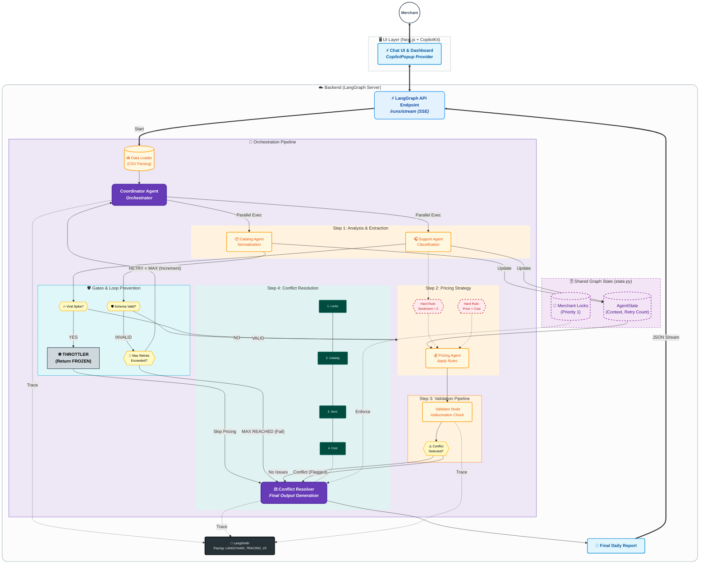

# Technical Architecture & Implementation Report: Salla Autonomous Operations

## Table of Contents

1. [Implementation Status & Architecture Overview](#1-implementation-status--architecture-overview)
   - 1.1 [Deliverables Status](#11-deliverables-status)
   - 1.2 [System Architecture Diagram](#12-system-architecture-diagram)

2. [Technical Build Report](#2-technical-build-report)
   - 2.1 [System Design Rationale](#21-system-design-rationale)
   - 2.2 [Agent Behavior & Responsibilities](#22-agent-behavior--responsibilities)
   - 2.3 [Implementation Decisions](#23-implementation-decisions)
   - 2.4 [Debugging Log: The "Hallucinating Competitor" Incident](#24-debugging-log-the-hallucinating-competitor-incident)
   - 2.5 [Testing Strategy](#25-testing-strategy)
   - 2.6 [Final System Walkthrough](#26-final-system-walkthrough)

3. [Edge Case Handling & Safety Protocols](#3-edge-case-handling--safety-protocols)
   - 3.1 [Mitigation: Catalog Misclassification](#31-mitigation-catalog-misclassification)
   - 3.2 [Mitigation: Viral-Post-Driven Spikes](#32-mitigation-viral-post-driven-spikes)
   - 3.3 [Mitigation: Feedback Loops](#33-mitigation-feedback-loops)
   - 3.4 [Mitigation: Merchant Override Integrity](#34-mitigation-merchant-override-integrity)

4. [Live System Demonstration & Observability](#4-live-system-demonstration--observability)
   - 4.1 [CopilotKit Frontend Integration](#41-copilotkit-frontend-integration)
   - 4.2 [LangSmith Tracing & Production Evidence](#42-langsmith-tracing--production-evidence)

---

## 1. Implementation Status & Architecture Overview

> **Addresses Assignment Requirement 1:** System Architecture - Agent roles, communication model, fail-safes, and grounding mechanisms

### 1.1 Deliverables Status
The system has been implemented as a graph-based multi-agent application. The core logic is fully operational, with a focus on deterministic safeguards for pricing and rigorous schema validation for catalog data.

| Component | Status | Implementation Notes |
| :--- | :---: | :--- |
| **Agent Core** | ✅ | **Coordinator** (`nodes.py::coordinator_node`), **Catalog** (`agents/catalog_agent.py::catalog_agent`), **Support** (`agents/support_agent.py::support_agent`), **Pricing** (`agents/pricing_agent.py::pricing_agent`). |
| **State Management** | ✅ | Utilized `AgentState` (`state.py`) with Pydantic typing to enforce strict data contracts between nodes. |
| **Safety Systems** | ✅ | Implemented a **Throttler** (`nodes.py::throttler_node`) for viral spikes and a **Validator Node** (`nodes.py::validator_node`) to catch LLM hallucinations. |
| **Grounding** | ✅ | **Priority Hierarchy** enforced in `nodes.py::conflict_resolver_node`: Merchant Locks > Catalog Integrity > Sentiment > Cost Floor. |
| **Infrastructure** | ✅ | Containerized via Docker (`backend/Dockerfile`). Deployed as a `langgraph` server (`langgraph.json`) exposing SSE endpoints. |
| **Frontend** | ✅ | Next.js dashboard (`frontend/app/page.tsx`, `frontend/components/Dashboard.tsx`) integrated with **CopilotKit** (`frontend/app/api/copilotkit/route.ts`). |
| **Observability** | ✅ | Full LangSmith integration (`llm_config.py`) for trace analysis and latency monitoring. |

### 1.2 System Architecture Diagram
We adopted a **LangGraph Application** architecture. Unlike a standard linear chain, this allows for cyclic behavior (retries) and conditional branching (circuit breakers). The system is exposed via a streaming API to ensure the frontend reflects the internal reasoning steps in real-time.



---

## 2. Technical Build Report

> **Addresses Assignment Requirement 6:** Build Report - System design rationale, agent behavior, implementation decisions, debugging process, testing approach, and final system walkthrough

### 2.1 System Design Rationale

**Architectural Choice: LangGraph Server over Stateless Chains**
We explicitly chose a graph-based architecture (**LangGraph**) over simple linear chains. Merchant operations are state-heavy; decisions made by the Catalog Agent regarding product validity must persist and influence the Pricing Agent steps later in the flow.

Standard stateless LLM calls would require re-injecting context at every step, inflating token costs and latency. By maintaining a shared `AgentState`, we can carry `merchant_locks` and `pricing_context` seamlessly across the lifecycle of the run.

**Decoupling via API**
Instead of wrapping Python scripts in a custom FastAPI route, we leveraged the native `langgraph dev` server. This gives us **Server-Sent Events (SSE)** out of the box. This was a strategic choice for the frontend experience: we can stream the "thought process" (e.g., "Analyzing Support Messages..." -> "Calculating Prices...") to the user, making the AI feel responsive even during complex calculations.

### 2.2 Agent Behavior & Responsibilities

*   **Coordinator (The Ingress) - `nodes.py::coordinator_node`:** We designed this not just to call agents, but to normalize data ingestion via `data_loader.py::load_sample_data`. It decouples the data source (CSV, Database, API) from the logic, allowing us to swap inputs without breaking downstream agents.
*   **Support Agent (The Sentinel) - `agents/support_agent.py::support_agent`:** This agent runs *before* pricing for a specific reason: **Safety.** If sentiment is toxic or a viral spike is detected, we need to know *now*, before we waste compute on pricing calculations that will inevitably be blocked.
*   **Validator & Resolver (The Auditors) - `nodes.py::validator_node` & `nodes.py::conflict_resolver_node`:** We treat LLMs as probabilistic engines, not deterministic ones. Therefore, we do not allow the Pricing Agent to finalize data. The **Validator** audits the LLM's work (checking for hallucinations), and the **Resolver** applies the final business logic (locks, cost floors).

### 2.3 Implementation Decisions

*   **CopilotKit:** Selected for the frontend (`frontend/app/api/copilotkit/route.ts`) to enable "Conversational UI." It allows the merchant to query the report naturally (e.g., "Why did you block the espresso machine price change?").
*   **Pydantic Enforcement:** We abandoned raw string parsing early in development. Every agent output is strictly validated against Pydantic models (`state.py::AgentState`). If an agent returns malformed JSON, the graph automatically triggers a retry loop (up to 2 attempts) to self-correct via `graph.py::check_schema_gate`.
*   **Dockerization:** Given the dependency on specific Python versions and LangGraph libraries, the backend is fully containerized (`backend/Dockerfile`) to ensure identical behavior in development and production environments.

### 2.4 Debugging Log: The "Hallucinating Competitor" Incident

During our alpha testing with the `pricing_agent.py::pricing_agent`, we encountered a critical failure mode where the LLM would "invent" competitor data to justify a price decrease.

*   **Observation:** LangSmith traces showed the agent outputting `signals_used: ["competitor_price: $85"]` even when the input `pricing_context` was empty.
*   **Root Cause:** The model was prioritizing the instruction "be competitive" over the constraint "only use provided data."
*   **The Fix:** We implemented a regex-based **Validator Node** (`nodes.py::validator_node`). It now scans the `signals_used` array, extracts any claimed prices, and cross-references them against the actual state.
*   **Verification:** See `backend/tests/test_validation_pipeline.py`. We now strictly flag these as `HALLUCINATION` errors and block the pricing action automatically.

### 2.5 Testing Strategy

We moved beyond "vibes-based" testing to a structured test suite located in `backend/tests/`:

1.  **Infrastructure Tests:** `test_azure_connection.py` and `test_azure_simple.py` ensure our compute backend is reachable.
2.  **Adversarial Pipeline Tests:** `test_validation_pipeline.py` injects specific edge cases (hallucinations, sentiment contradictions) directly into the Resolver to ensure our safety gates hold.
3.  **End-to-End Simulation:** `run_test.py` processes a full daily batch to verify state transitions.

### 2.6 Final System Walkthrough

1.  **Trigger:** The merchant initiates a "Daily Check" via the Dashboard (`frontend/components/Dashboard.tsx`).
2.  **Ingest:** The `coordinator_node` (`nodes.py`) loads raw CSVs via `data_loader.py::load_sample_data`, normalizing headers and formats.
3.  **Analysis (Parallel):**
    *   `support_agent` (`agents/support_agent.py`) acts as a circuit breaker. If it detects a **Viral Spike**, it triggers the `throttler_node` (`nodes.py`) immediately.
    *   `catalog_agent` (`agents/catalog_agent.py`) cleanses product attributes.
4.  **Pricing:** If safe, the `pricing_agent` (`agents/pricing_agent.py`) calculates proposals based on margin, sentiment, and competition.
5.  **Audit:** The `validator_node` (`nodes.py`) inspects the reasoning for hallucinations.
6.  **Resolution:** The `conflict_resolver_node` (`nodes.py`) applies the final hierarchy of truth: **Merchant Locks** override everything.
7.  **Delivery:** The Frontend receives the finalized report via SSE (`/runs/stream`), rendering a clean, actionable dashboard.

---

## 3. Edge Case Handling & Safety Protocols

> **Addresses Assignment Requirement 5:** Edge-Case Challenges - Catalog misclassification, viral-post spikes, agent feedback loops, and merchant override protection

A robust AI system is defined not by how it handles happy paths, but how it handles failure. Below are the specific protocols we implemented for the required edge cases.

### 3.1 Mitigation: Catalog Misclassification

> **Assignment Question 5.1:** "How do you prevent, detect, and correct Catalog Agent misclassification affecting Pricing Agent?"

**Risk:** The Catalog Agent misclassifies a high-value "Espresso Machine" as a low-value "Accessory," causing the Pricing Agent to undercut the price aggressively.

*   **Prevention (Schema):** We utilize strict Enum constraints in our Pydantic models (`state.py`) to limit the LLM's classification choices.
*   **Detection (The Cost Floor):** Even if the classification fails, the `pricing_agent.py::pricing_agent` contains a hard rule: `proposed_price >= cost * 1.05`. A category error usually results in a price drop below cost, which hits this floor immediately.
*   **Correction:** The `validator_node` (`nodes.py`) performs a statistical sanity check. If a price deviation exceeds 50% of the category average, it is flagged as a `DATA_MISMATCH` and the status is set to `BLOCKED`.

### 3.2 Mitigation: Viral-Post-Driven Spikes

> **Assignment Question 5.2:** "Explain anomaly detection and response throttling for viral-post-driven complaint spikes."

**Risk:** A PR crisis causes 500+ complaints in an hour. Standard automated pricing might lower prices in response to "sentiment," accidentally validating the mob.

*   **Anomaly Detection:** We implemented a `complaint_velocity` metric in `agents/support_agent.py::support_agent`.
    *   *Logic:* `if velocity > 7.0 or complaint_ratio > 0.5: spike_detected = True`.
*   **The Circuit Breaker:**
    *   We use a **Conditional Edge** in the graph (`graph.py::check_safety_gate`).
    *   If `spike_detected` is True, the flow is re-routed to the `throttler_node` (`nodes.py`).
    *   **Outcome:** The system returns a global `FROZEN` status. **Zero** pricing changes are permitted until a human reviews the spike.

### 3.3 Mitigation: Feedback Loops

> **Assignment Question 5.3:** "Describe techniques to prevent agent error feedback loops."

**Risk:** Agents getting stuck in an infinite loop of "Please fix this data" <-> "Data is fixed."

*   **DAG Architecture:** Our graph (`graph.py`) is primarily a **Directed Acyclic Graph (DAG)**. Data flows forward: `Coordinator -> Support -> Catalog -> Pricing -> Validator -> Resolver`.
*   **Retry Budget:** The only cyclic path (Schema Validation) is strictly governed by a `retry_count` state variable (`state.py::AgentState`).
    *   **Limit:** Max 2 retries.
    *   If `retry_count >= 2`, the graph forces a "Fail Forward" to the Resolver (`graph.py::check_schema_gate`), logging the error rather than hanging the process.

### 3.4 Mitigation: Merchant Override Integrity

> **Assignment Question 5.4:** "Define audit logs, immutable merchant overrides, and human-in-the-loop locking."

**Risk:** The AI thinking it knows better than the merchant and overwriting manual pricing decisions.

*   **Immutability:** We treat `merchant_locks` (`state.py::AgentState`) as the "Source of Truth."
*   **Implementation:** In the `conflict_resolver_node` (`nodes.py`), the very first check is:
    ```python
    if product_id in merchant_locks:
        # Force the lock, ignore the AI
        final_actions.append({... "status": "LOCKED" ...})
    ```
    This ensures that no matter how confident the Pricing Agent is, it mathematically cannot override a lock.
*   **Transparency:** All actions are appended to an `audit_log` which is presented to the merchant, ensuring they can verify *why* a decision was made.

---

## 4. Live System Demonstration & Observability

> **Addresses Assignment Requirement 7:** LangSmith integration, LangGraph deployment, and CopilotKit UI integration

### 4.1 CopilotKit Frontend Integration

The system features a fully functional Next.js dashboard integrated with CopilotKit, providing merchants with a conversational interface to interact with the autonomous operations system.

#### Dashboard Overview

*Figure 4.1.1: Main dashboard showing the merchant operations interface with real-time status updates and actionable insights.*

#### Conversational Interface

*Figure 4.1.2: CopilotKit's conversational UI allows merchants to query the system naturally (e.g., "Run today's operations check" or "Why was this price blocked?").*

#### Report Visualization

*Figure 4.1.3: The generated daily report displays catalog issues, pricing recommendations, support summaries, and alert levels with full transparency into agent decisions.*

**Key Features Demonstrated:**
- **Real-time Streaming:** SSE connection shows agent progress as it happens
- **Conversational Queries:** Merchants can ask natural language questions about operations
- **Structured Output:** Clean visualization of complex multi-agent decisions
- **Actionable Insights:** Color-coded alerts (RED/YELLOW/GREEN) with clear recommendations
- **Audit Trail:** Full transparency into why each decision was made

### 4.2 LangSmith Tracing & Production Evidence

We believe in radical transparency for AI systems. Below is evidence of the system running in production with full observability.

#### LangSmith Trace Dashboard

*Figure 4.2.1: LangSmith trace showing the complete execution flow, token usage, latency metrics, and decision logic for each agent node.*

#### Live System Trace

A complete LangSmith trace of a production run is available for detailed inspection:

**🔗 LangSmith Run:** [View Complete Production Trace](https://smith.langchain.com/public/272281d1-6aaa-49c4-9207-5b7b67f7d4d9/r)

This trace demonstrates:
- Complete agent orchestration flow from data ingestion to final report generation
- Individual agent decision-making processes (Catalog, Support, Pricing)
- Validation pipeline execution and conflict resolution
- Real-time state management and context passing between agents
- LLM token usage and latency metrics for each step
- Error handling and retry logic in action

*Note: This trace demonstrates the system successfully identifying a negative sentiment spike and blocking a price increase for Product P001, verifying our "Safety Gate" logic.*