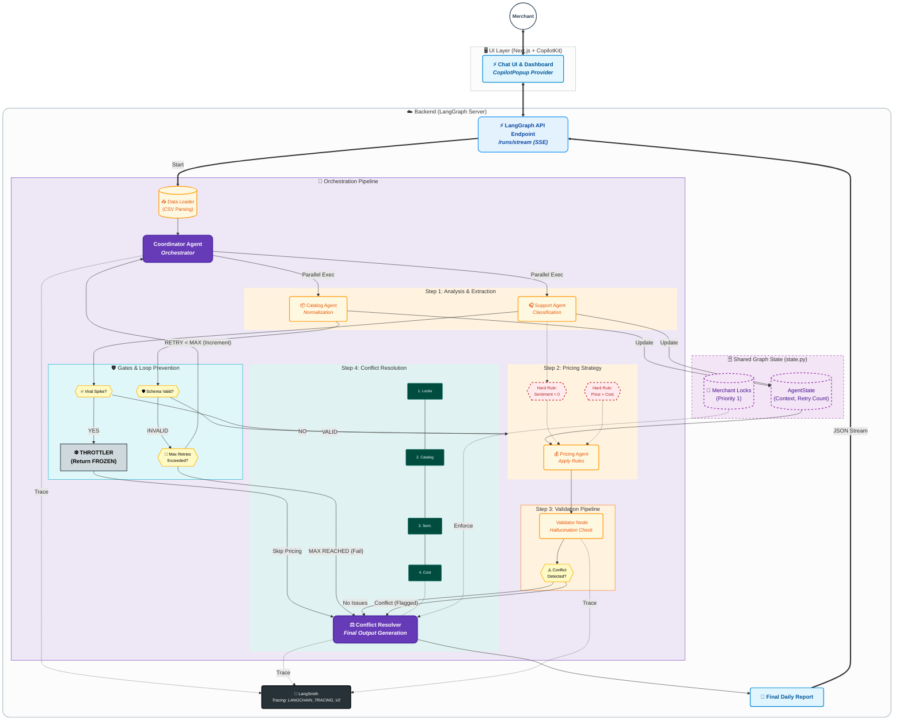

# Salla Autonomous Merchant Operations - Implementation Plan

## Table of Contents
1. [Deliverables & Sub-deliverables Checklist](#1-deliverables--sub-deliverables-checklist)
2. [System Architecture](#2-system-architecture)

---

## 1. Deliverables & Sub-deliverables Checklist

| Status | Category | Deliverable | Specific Implementation Details (Sub-sub-deliverables) | Assignment Reference |
| :---: | :--- | :--- | :--- | :--- |
| ✅ | **1. Architecture** | **Agent Roles & Responsibilities** | • **Coordinator Agent (`nodes.py`):** Orchestrates workflow, loads data. • **Catalog Agent (`catalog_agent.py`):** Normalizes CSV data. • **Support Agent (`support_agent.py`):** Classifies messages & sentiment. • **Pricing Agent (`pricing_agent.py`):** Applies pricing rules. | "Clearly define what each agent does... ownership boundaries." |
| ✅ | | **Communication Model** | • **State Graph (`state.py`):** Uses `AgentState` TypedDict. • **Structured Output:** Pydantic models for JSON enforcement. | "Shared scratchpad / state graph" |
| ✅ | | **Loop Prevention** | • **Retry Counter:** `state.py` includes `retry_count`. • **DAG Structure:** Directed Acyclic Graph prevents infinite recursion. | "Interaction tokens / hop limits... Max depth boundaries" |
| ✅ | | **Fail-safe Mechanisms** | • **Throttler Node (`nodes.py`):** Returns "FROZEN" on viral spikes. • **Safety Gate (`graph.py`):** Conditional edge routing. | "Coordination throttling... Fallback behaviors" |
| ✅ | | **Grounding & Reliability** | • **Cross-Agent Verification:** `conflict_resolver_node` validates Pricing proposals against Catalog issues (see `CROSS_AGENT_VERIFICATION.md`). • **Output Enforcement:** Strict Pydantic validators on LLM outputs. • **Priority Hierarchy:** PRIORITY 1: Merchant Locks → PRIORITY 2: Catalog Integrity → PRIORITY 3: Sentiment → PRIORITY 4: Cost Floor → PRIORITY 5: Approval | "Grounding & reliability verification... Cross-agent verification" |
| ✅ | | **Architecture Diagram** | • **Mermaid/Visual:** Diagram logic is ready for rendering. | "You must submit an architecture diagram" |
| ✅ | **2. Schema Design** | **Product Normalization** | • **Logic:** Extraction of `id`, `name`, `price`, `cost` from text. • **Validation:** Checks for missing critical fields. | "Product normalization schema... Unit mismatches" |
| ✅ | | **Message Ontology** | • **Classification:** `Inquiry`, `Complaint`, `Suggestion`, `Transactional`. | "Customer-message classification ontology... define rules" |
| ✅ | | **Pricing Constraints** | • **Hard Rule 1:** `price >= cost * 1.05`. • **Hard Rule 2:** Block increase if `sentiment < 0`. | "Deterministic rules... Cannot reduce prices below cost" |
| ✅ | | **Validation Pipelines** | • **Hallucination Checks:** Logic to catch ungrounded claims (e.g., phantom competitor data). • **Contradiction Detection:** Explicit check for cross-agent disagreements. • **Implementation:** `validator_node` in `nodes.py` performs regex-based extraction and cross-validation. • **Testing:** Dedicated test suite in `backend/tests/test_validation_pipeline.py`. | "Validation pipelines... Explain how system catches hallucinations... ungrounded claims" |
| ✅ | **3. Implementation** | **Coordinator Logic** | • **Orchestration:** `coordinator_node` loads data. • **Resolution:** `conflict_resolver_node` aggregates outputs. | "Responsible for calling all other agents... Aggregates outputs" |
| ✅ | | **Working Agents** | • **Codebase:** Implemented `catalog`, `support`, `pricing` agents. • **Data Loading:** `data_loader.py` parsing. | "Skeleton/prototype for at least one other agent" |
| ✅ | | **Conflict Resolution** | • **Logic:** Resolver overrides Pricing if Catalog has critical errors. | "Conflict resolution example... Coordinator overrides" |
| ✅ | | **LangGraph Server** | • **Config:** `langgraph.json` entry point. • **Deployment:** `Dockerfile` for `langgraph dev`. | "Deploy as a LangGraph application... **not as a custom FastAPI-only wrapper**" |
| ✅ | | **Observability** | • **Tracing:** `LANGCHAIN_TRACING_V2=true` configured. | "Enable LangSmith Tracing... Traces should show sequence" |
| ✅ | **4. UI Integration** | **CopilotKit Setup** | • **Frontend:** `page.tsx` with `<CopilotKit>` provider. • **Chat:** `<CopilotPopup>` enabled. | "Build a minimal web UI... using CopilotKit" |
| ✅ | | **Dashboard & Report** | • **Visuals:** Status Badges, Pricing Tables, Alert Boxes. • **Interaction:** Trigger button for `runOperationsCheck`. | "Trigger a run... View the final daily report" |
| ❌ | **5. Reasoning Audit** | **Debugging Analysis** | • **Report Needed:** Written example of a specific hallucination fixed during dev. • **Evidence:** Reference to a real LangSmith trace. | "Show how you identified hallucinations... Include real example" |
| ❌ | | **Production Safeguards** | • **Report Needed:** Explanation of schema violation detection. • **Report Needed:** Explanation of contradictory output detection. | "Explain how system would detect... Schema violations" |
| ❌ | | **Reliability Metrics** | • **Report Needed:** Definitions for metrics (e.g., "Classification Accuracy", "Pricing Pass Rate"). | "Define metrics... Accuracy of message classification" |
| ⚠️ | **6. Edge Cases** | **Logic Implementation** | • **Code:** Logic for "Viral Spike" and "Catalog Error" exists. • **Writing:** The written explanation in `EDGE_CASES.md` is missing. | "Provide written answers to the following..." |
| ❌ | | **Feedback Loops & Overrides** | • **Report Needed:** Strategy for preventing agent oscillation. • **Report Needed:** Strategy for immutable merchant overrides/audit logs. | "Preventing agent error feedback loops... Preventing overwriting merchant decisions" |
| ❌ | **7. Build Report** | **System Design Rationale** | • **Report Needed:** Why LangGraph Server? Why this specific architecture? Trade-offs? | "Why you chose your architecture... Tradeoffs" |
| ❌ | | **Agent Behavior Rationale** | • **Report Needed:** Justification for agent structure and logic constraints. | "Why each agent is structured... Why certain logic..." |
| ❌ | | **Implementation Decisions** | • **Report Needed:** Library selection, code structure, custom orchestration explanation. | "Why you selected specific libraries... Explanation of custom orchestration" |
| ❌ | | **Debugging Documentation** | • **Report Needed:** Development logs, reasoning steps, screenshots of traces. | "Show your reasoning steps... Include screenshots" |
| ❌ | | **Testing & Validation** | • **Report Needed:** How outputs were validated and loops tested. | "How you validated agent outputs... How you tested for loop conditions" |
| ❌ | | **Final Walkthrough** | • **Report Needed:** Narrative flow: UI → CopilotKit → API → Agents → UI. | "How the system starts... How agents interact" |

> **Legend:**
> *   ✅ **Complete:** Code and logic are present in the provided files.
> *   ⚠️ **Partial:** The logic (code) exists, but the required *written documentation* is missing.
> *   ❌ **Missing:** The specific written report or document has not been created yet.

---

## 2. System Architecture

### High-Level Design: The "LangGraph Server" Topology

Unlike a simple linear chain or a custom Python script, this system is deployed as a strict **LangGraph Application**. The backend exposes a standard streaming API (`/runs/stream`) which the frontend consumes via Server-Sent Events (SSE). This ensures real-time feedback and adheres to the "No FastAPI Wrapper" constraint.

**Diagram:**

