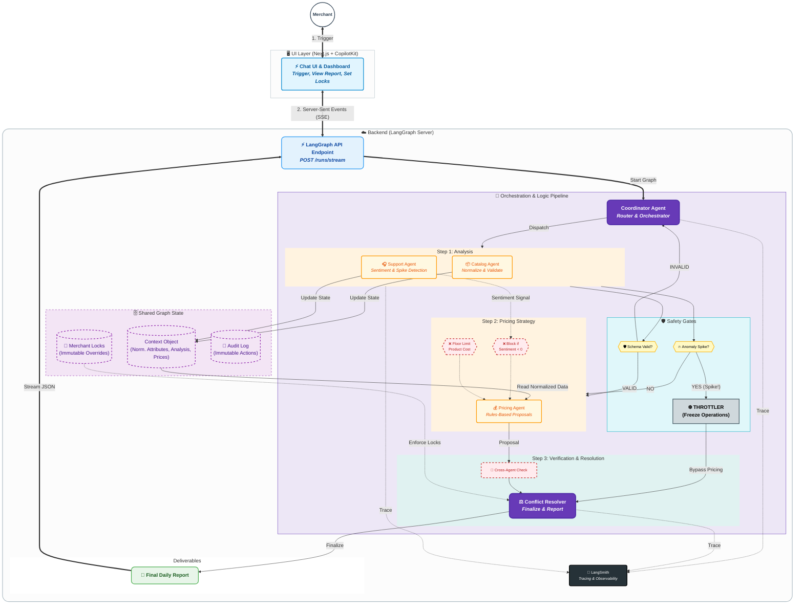

# Salla Autonomous Merchant Operations - Implementation Plan

## Table of Contents
1. [Deliverables & Sub-deliverables Checklist](#1-deliverables--sub-deliverables-checklist)
2. [System Architecture](#2-system-architecture)

---

## 1. Deliverables & Sub-deliverables Checklist

| Status | Category | Deliverable | Specific Implementation Details (Sub-sub-deliverables) | Assignment Reference |
| :---: | :--- | :--- | :--- | :--- |
| ✅ | **1. Architecture** | **Agent Roles & Responsibilities** | • **Coordinator Agent (`nodes.py`):** Orchestrates workflow, loads data. • **Catalog Agent (`catalog_agent.py`):** Normalizes CSV data. • **Support Agent (`support_agent.py`):** Classifies messages & sentiment. • **Pricing Agent (`pricing_agent.py`):** Applies pricing rules. | "Clearly define what each agent does... ownership boundaries." |
| ✅ | | **Communication Model** | • **State Graph (`state.py`):** Uses `AgentState` TypedDict. • **Structured Output:** Pydantic models for JSON enforcement. | "Shared scratchpad / state graph" |
| ✅ | | **Loop Prevention** | • **Retry Counter:** `state.py` includes `retry_count`. • **DAG Structure:** Directed Acyclic Graph prevents infinite recursion. | "Interaction tokens / hop limits... Max depth boundaries" |
| ✅ | | **Fail-safe Mechanisms** | • **Throttler Node (`nodes.py`):** Returns "FROZEN" on viral spikes. • **Safety Gate (`graph.py`):** Conditional edge routing. | "Coordination throttling... Fallback behaviors" |
| ✅ | | **Grounding & Reliability** | • **Cross-Agent Verification:** `conflict_resolver_node` validates Pricing proposals against Catalog issues (see `CROSS_AGENT_VERIFICATION.md`). • **Output Enforcement:** Strict Pydantic validators on LLM outputs. • **Priority Hierarchy:** PRIORITY 1: Merchant Locks → PRIORITY 2: Catalog Integrity → PRIORITY 3: Sentiment → PRIORITY 4: Cost Floor → PRIORITY 5: Approval | "Grounding & reliability verification... Cross-agent verification" |
| ✅ | | **Architecture Diagram** | • **Mermaid/Visual:** Diagram logic is ready for rendering. | "You must submit an architecture diagram" |
| ✅ | **2. Schema Design** | **Product Normalization** | • **Logic:** Extraction of `id`, `name`, `price`, `cost` from text. • **Validation:** Checks for missing critical fields. | "Product normalization schema... Unit mismatches" |
| ✅ | | **Message Ontology** | • **Classification:** `Inquiry`, `Complaint`, `Suggestion`, `Transactional`. | "Customer-message classification ontology... define rules" |
| ✅ | | **Pricing Constraints** | • **Hard Rule 1:** `price >= cost * 1.05`. • **Hard Rule 2:** Block increase if `sentiment < 0`. | "Deterministic rules... Cannot reduce prices below cost" |
| ❌ | | **Validation Pipelines** | • **Hallucination Checks:** Logic to catch ungrounded claims (e.g., phantom competitor data). • **Contradiction Detection:** Explicit check for cross-agent disagreements. | "Validation pipelines... Explain how system catches hallucinations... ungrounded claims" |
| ✅ | **3. Implementation** | **Coordinator Logic** | • **Orchestration:** `coordinator_node` loads data. • **Resolution:** `conflict_resolver_node` aggregates outputs. | "Responsible for calling all other agents... Aggregates outputs" |
| ✅ | | **Working Agents** | • **Codebase:** Implemented `catalog`, `support`, `pricing` agents. • **Data Loading:** `data_loader.py` parsing. | "Skeleton/prototype for at least one other agent" |
| ✅ | | **Conflict Resolution** | • **Logic:** Resolver overrides Pricing if Catalog has critical errors. | "Conflict resolution example... Coordinator overrides" |
| ✅ | | **LangGraph Server** | • **Config:** `langgraph.json` entry point. • **Deployment:** `Dockerfile` for `langgraph dev`. | "Deploy as a LangGraph application... **not as a custom FastAPI-only wrapper**" |
| ✅ | | **Observability** | • **Tracing:** `LANGCHAIN_TRACING_V2=true` configured. | "Enable LangSmith Tracing... Traces should show sequence" |
| ✅ | **4. UI Integration** | **CopilotKit Setup** | • **Frontend:** `page.tsx` with `<CopilotKit>` provider. • **Chat:** `<CopilotPopup>` enabled. | "Build a minimal web UI... using CopilotKit" |
| ✅ | | **Dashboard & Report** | • **Visuals:** Status Badges, Pricing Tables, Alert Boxes. • **Interaction:** Trigger button for `runOperationsCheck`. | "Trigger a run... View the final daily report" |
| ❌ | **5. Reasoning Audit** | **Debugging Analysis** | • **Report Needed:** Written example of a specific hallucination fixed during dev. • **Evidence:** Reference to a real LangSmith trace. | "Show how you identified hallucinations... Include real example" |
| ❌ | | **Production Safeguards** | • **Report Needed:** Explanation of schema violation detection. • **Report Needed:** Explanation of contradictory output detection. | "Explain how system would detect... Schema violations" |
| ❌ | | **Reliability Metrics** | • **Report Needed:** Definitions for metrics (e.g., "Classification Accuracy", "Pricing Pass Rate"). | "Define metrics... Accuracy of message classification" |
| ⚠️ | **6. Edge Cases** | **Logic Implementation** | • **Code:** Logic for "Viral Spike" and "Catalog Error" exists. • **Writing:** The written explanation in `EDGE_CASES.md` is missing. | "Provide written answers to the following..." |
| ❌ | | **Feedback Loops & Overrides** | • **Report Needed:** Strategy for preventing agent oscillation. • **Report Needed:** Strategy for immutable merchant overrides/audit logs. | "Preventing agent error feedback loops... Preventing overwriting merchant decisions" |
| ❌ | **7. Build Report** | **System Design Rationale** | • **Report Needed:** Why LangGraph Server? Why this specific architecture? Trade-offs? | "Why you chose your architecture... Tradeoffs" |
| ❌ | | **Agent Behavior Rationale** | • **Report Needed:** Justification for agent structure and logic constraints. | "Why each agent is structured... Why certain logic..." |
| ❌ | | **Implementation Decisions** | • **Report Needed:** Library selection, code structure, custom orchestration explanation. | "Why you selected specific libraries... Explanation of custom orchestration" |
| ❌ | | **Debugging Documentation** | • **Report Needed:** Development logs, reasoning steps, screenshots of traces. | "Show your reasoning steps... Include screenshots" |
| ❌ | | **Testing & Validation** | • **Report Needed:** How outputs were validated and loops tested. | "How you validated agent outputs... How you tested for loop conditions" |
| ❌ | | **Final Walkthrough** | • **Report Needed:** Narrative flow: UI → CopilotKit → API → Agents → UI. | "How the system starts... How agents interact" |

> **Legend:**
> *   ✅ **Complete:** Code and logic are present in the provided files.
> *   ⚠️ **Partial:** The logic (code) exists, but the required *written documentation* is missing.
> *   ❌ **Missing:** The specific written report or document has not been created yet.

---

## 2. System Architecture

### High-Level Design: The "LangGraph Server" Topology

Unlike a simple linear chain or a custom Python script, this system is deployed as a strict **LangGraph Application**. The backend exposes a standard streaming API (`/runs/stream`) which the frontend consumes via Server-Sent Events (SSE). This ensures real-time feedback and adheres to the "No FastAPI Wrapper" constraint.

**Diagram:**

```mermaid
flowchart TD
    %% --- STYLE DEFINITIONS ---
    classDef userNode fill:#ffffff,stroke:#2c3e50,stroke-width:2px,color:#2c3e50,font-size:14px,font-weight:bold,rx:20,ry:20;
    classDef uiNode fill:#e1f5fe,stroke:#0288d1,stroke-width:2px,color:#01579b,font-weight:bold,rx:5,ry:5;
    classDef apiNode fill:#e3f2fd,stroke:#2196f3,stroke-width:2px,color:#0d47a1,font-weight:bold,rx:10,ry:10;
    classDef brainNode fill:#673ab7,stroke:#512da8,stroke-width:3px,color:#ffffff,font-size:16px,font-weight:bold,rx:10,ry:10,shadow:5px;
    classDef workerNode fill:#fff8e1,stroke:#ff9800,stroke-width:2px,color:#e65100,font-size:14px,rx:5,ry:5;
    classDef ruleNode fill:#ffebee,stroke:#c62828,stroke-width:2px,color:#b71c1c,font-size:12px,rx:5,ry:5,stroke-dasharray: 5 5;
    classDef stateNode fill:#f3e5f5,stroke:#8e24aa,stroke-width:2px,stroke-dasharray: 5 5,color:#4a148c,shape:cyl;
    classDef dataNode fill:#eceff1,stroke:#607d8b,stroke-width:1px,stroke-dasharray: 2 2,color:#455a64,font-size:12px,shape:note;
    classDef reportNode fill:#e8f5e9,stroke:#4caf50,stroke-width:2px,color:#1b5e20,font-weight:bold,rx:10,ry:10;
    classDef failSafeNode fill:#cfd8dc,stroke:#455a64,stroke-width:2px,color:#000,font-weight:bold,shape:hexagon;
    classDef observeNode fill:#263238,stroke:#000,stroke-width:2px,color:#fff,font-size:12px,rx:5,ry:5;
    classDef gateNode fill:#fff9c4,stroke:#fbc02d,stroke-width:2px,color:#000,shape:diamond,font-size:12px;

    %% --- EXTERNAL LAYER ---
    User((Merchant)):::userNode

    subgraph Frontend ["🖥️ UI Layer (Next.js + CopilotKit)"]
        style Frontend fill:#fcfcfc,stroke:#b0bec5,stroke-width:1px
        Copilot[⚡ Chat UI & Dashboard<br/><i>Trigger, View Report, Set Locks</i>]:::uiNode
    end

    subgraph System ["☁️ Backend (LangGraph Server)"]
        style System fill:#fcfcfc,stroke:#b0bec5,stroke-width:2px,rx:20,ry:20

        API[⚡ LangGraph API Endpoint<br/><i>POST /runs/stream</i>]:::apiNode
        Smith[️🐞 LangSmith<br/><i>Tracing & Observability</i>]:::observeNode

        %% --- STATE MANAGEMENT (LANGGRAPH) ---
        subgraph StateStore ["🗄️ Shared Graph State"]
            style StateStore fill:#f3e5f5,stroke:#8e24aa,stroke-dasharray: 5 5
            StateData[("Context Object<br/>(Norm. Attributes, Analysis, Prices)")]:::stateNode
            Overrides[("🔐 Merchant Locks<br/>(Immutable Overrides)")]:::stateNode
            AuditLog[("📝 Audit Log<br/>(Immutable Actions)")]:::stateNode
        end

        %% --- ORCHESTRATION & LOGIC ---
        subgraph LogicFlow ["🧠 Orchestration & Logic Pipeline"]
            style LogicFlow fill:#ede7f6,stroke:#673ab7,stroke-width:1px

            Coord[Coordinator Agent<br/><i>Router & Orchestrator</i>]:::brainNode
            
            %% Step 1: Parallel Workers
            subgraph Workers ["Step 1: Analysis"]
                style Workers fill:#fff3e0,stroke:#ffe0b2,stroke-width:0px
                Cat["📦 Catalog Agent<br/><i>Normalize & Validate</i>"]:::workerNode
                Supp["🎧 Support Agent<br/><i>Sentiment & Spike Detection</i>"]:::workerNode
            end

            %% Safety Gating Layer
            subgraph Gating ["🛡️ Safety Gates"]
                style Gating fill:#e0f7fa,stroke:#00acc1,stroke-width:1px
                SpikeCheck{{"🔥 Anomaly Spike?"}}:::gateNode
                Throttler["❄️ THROTTLER<br/>(Freeze Operations)"]:::failSafeNode
                SchemaCheck{{"🛡️ Schema Valid?"}}:::gateNode
            end

            %% Step 2: Pricing with Constraints
            subgraph PricingLogic ["Step 2: Pricing Strategy"]
                style PricingLogic fill:#fff3e0,stroke:#ffe0b2,stroke-width:0px
                Price["💰 Pricing Agent<br/><i>Rules-Based Proposals</i>"]:::workerNode
                NegSent{{"❌ Block if<br/>Sentiment < 0"}}:::ruleNode
                CostFloor{{"❌ Floor Limit<br/>Product Cost"}}:::ruleNode
            end

            %% Step 3: Resolution
            subgraph Resolution ["Step 3: Verification & Resolution"]
                style Resolution fill:#e0f2f1,stroke:#00897b,stroke-width:0px
                CrossCheck["🔄 Cross-Agent Check"]:::ruleNode
                Resolver[⚖️ Conflict Resolver<br/><i>Finalize & Report</i>]:::brainNode
            end
        end

        %% --- OUTPUTS ---
        subgraph Outputs ["Deliverables"]
            style Outputs fill:#fff,stroke-width:0px
            Report[📜 Final Daily Report]:::reportNode
        end

    end

    %% --- CONNECTIONS ---

    %% User Flow (SSE)
    User <== "1. Trigger" ==> Copilot
    Copilot <== "2. Server-Sent Events (SSE)" ==> API
    API ==>|Start Graph| Coord

    %% Step 1: Analysis
    Coord -->|Dispatch| Workers
    Cat & Supp -->|Update State| StateData

    %% Flow through Safety Gates
    Workers --> SpikeCheck
    Workers --> SchemaCheck

    %% Logic: Viral Spike Handling
    SpikeCheck -- "YES (Spike!)" --> Throttler
    Throttler -->|Bypass Pricing| Resolver
    SpikeCheck -- "NO" --> PricingLogic

    %% Logic: Catalog Integrity Check
    SchemaCheck -- "INVALID" --> Coord
    SchemaCheck -- "VALID" --> PricingLogic

    %% Step 2: Pricing
    StateData -->|Read Normalized Data| Price
    Supp -.->|Sentiment Signal| NegSent
    NegSent & CostFloor -.-> Price
    Price -->|Proposal| CrossCheck

    %% Step 3: Resolution
    CrossCheck --> Resolver
    Overrides -.->|Enforce Locks| Resolver
    Resolver -->|Finalize| Report

    %% Observability & Reporting
    Report ==>|Stream JSON| API
    Coord & Workers & Resolver -.->|Trace| Smith
```