# Salla Autonomous Merchant Operations - System Workflow

Complete workflow documentation with real data examples from the Salla dataset showing how the multi-agent system processes messy merchant data using Azure OpenAI GPT-5.

## System Architecture Diagram

```mermaid
graph TD
    %% --- STYLES ---
    classDef pythonNode fill:#2d3436,stroke:#dfe6e9,stroke-width:2px,color:#fff,rx:5,ry:5;
    classDef aiNode fill:#6c5ce7,stroke:#a29bfe,stroke-width:4px,color:#fff,rx:10,ry:10,shadow:5px;
    classDef decisionNode fill:#e17055,stroke:#fab1a0,stroke-width:2px,color:#fff,shape:diamond;
    classDef stateNode fill:#00b894,stroke:#55efc4,stroke-width:2px,color:#fff,shape:cyl;
    classDef endNode fill:#000,stroke:#fff,stroke-width:4px,color:#fff,shape:circle;

    %% --- START ---
    Start((START)) --> Coordinator

    %% --- PHASE 1: INGESTION ---
    subgraph Phase1 ["Phase 1: Data Ingestion"]
        direction TB
        Coordinator["coordinator_node<br/>nodes.py<br/>Initialize workflow"]:::pythonNode
        
        DataLoader["load_sample_data<br/>data_loader.py<br/>Load CSV files"]:::pythonNode
        
        DataExample["� Real Salla Data:<br/>Product: {id: 1001, title: 'Coffee Press', price: 'ninety', cost: 40}<br/>Message: {id: 5, message: 'Refund me. The blender stopped working after 3 uses.'}<br/>Context: {product_id: 2000, baseline_price: 128.98, recent_complaints: 10}"]:::stateNode
        
        Coordinator --> DataLoader
        DataLoader -.-> DataExample
        DataExample -.-> Coordinator
    end

    Coordinator --> SupportAgent

    %% --- PHASE 2: ANALYSIS ---
    subgraph Phase2 ["Phase 2: AI Analysis - Azure OpenAI GPT-5"]
        direction TB
        
        %% Support Agent
        SupportAgent["support_agent<br/>agents/support_agent.py<br/>Azure GPT-5<br/>Classify & analyze sentiment"]:::aiNode
        
        SupportEx["📄 GPT-5 Output:<br/>message_classifications: [<br/>  {id: 5, type: 'Complaint', sentiment: 'negative'},<br/>  {id: 3, type: 'Complaint', sentiment: 'negative'}<br/>]<br/>overall_sentiment: -0.7<br/>complaint_velocity: 8.5/10<br/>spike_detected: True<br/>trending_topics: ['refund', 'delivery delay', 'quality issues']"]:::stateNode
        
        SupportAgent --> SupportEx
        SupportEx --> CatalogAgent

        %% Catalog Agent
        CatalogAgent["catalog_agent<br/>agents/catalog_agent.py<br/>Azure GPT-5<br/>Normalize messy data"]:::aiNode
        
        CatalogEx["� GPT-5 Output:<br/>normalized_products: [<br/>  {id: 1001, name: 'Coffee Press', price: 90.00, cost: 40.00}<br/>]<br/>issues: [<br/>  {type: 'warning', product_id: 1001, message: 'Price was text ninety, converted to 90.00'},<br/>  {type: 'warning', product_id: 1001, message: 'Uncertain material borosilcate'}<br/>]<br/>confidence_score: 0.75<br/>schema_validation_passed: True"]:::stateNode
        
        CatalogAgent --> CatalogEx
    end

    CatalogEx --> SafetyGate

    %% --- PHASE 3: SAFETY GATING ---
    subgraph Phase3 ["Phase 3: Circuit Breaker"]
        direction TB
        SafetyGate{"check_safety_gate<br/>graph.py<br/>if spike_detected?"}:::decisionNode
        
        Throttler["throttler_node<br/>nodes.py<br/>FREEZE operations"]:::pythonNode
        
        ThrottlerEx["📄 Throttler Output:<br/>status: 'FROZEN'<br/>alert_level: 'RED'<br/>alert_message: 'Viral complaint spike detected<br/>Complaint Velocity: 8.5/10<br/>Sentiment: -0.7'<br/>actions_taken: []<br/>recommendations: [<br/>  'Review customer complaints immediately',<br/>  'Investigate root cause of spike',<br/>  'Do not make pricing changes until resolved'<br/>]"]:::stateNode
    end

    SafetyGate -->|YES Spike| Throttler
    Throttler --> ThrottlerEx
    ThrottlerEx --> EndNode((END))
    
    SafetyGate -->|NO Safe| PricingAgent

    %% --- PHASE 4: PRICING ---
    subgraph Phase4 ["Phase 4: Pricing Strategy"]
        direction TB
        
        PricingAgent["pricing_agent<br/>agents/pricing_agent.py<br/>Rule-based logic"]:::pythonNode
        
        PricingEx["📄 Pricing Output:<br/>product_id: 2000<br/>product_name: 'Product 2000'<br/>current_price: 128.98<br/>proposed_price: 120.00<br/>status: 'DECREASE'<br/>reasoning: 'Adjusted to match competitor pricing'<br/>signals_used: [<br/>  'competitor_price: $109-140',<br/>  'sentiment: -0.7',<br/>  'recent_complaints: 10'<br/>]<br/>cost: 75.00"]:::stateNode
        
        PricingAgent --> PricingEx
        PricingEx --> ResolverNode
    end

    %% --- PHASE 5: RESOLUTION ---
    subgraph Phase5 ["Phase 5: Conflict Resolution"]
        direction TB
        ResolverNode["conflict_resolver_node<br/>nodes.py<br/>Cross-validate & finalize"]:::pythonNode
        
        ResolutionLogic["🏆 Resolution Logic:<br/>1. Check merchant locks? → None<br/>2. Check sentiment gate? → -0.7 (negative)<br/>3. Block price increase? → N/A (decrease proposed)<br/>4. Check cost floor? → 120.00 > 75.00 ✓<br/>5. Cross-check catalog issues? → Warnings only<br/>6. Final decision: APPROVED"]:::stateNode
        
        FinalReport["📄 Final Report:<br/>status: 'COMPLETED'<br/>alert_level: 'YELLOW'<br/>summary: {<br/>  total_products: 5,<br/>  approved_changes: 3,<br/>  blocked_changes: 1,<br/>  locked_products: 0<br/>}<br/>catalog_issues: [<br/>  {type: 'warning', message: 'Price normalization needed'}<br/>]<br/>support_summary: {<br/>  sentiment: -0.7,<br/>  velocity: 8.5,<br/>  complaint_count: 15<br/>}<br/>pricing_actions: [<br/>  {product_id: 2000, final_price: 120.00, status: 'APPROVED'}<br/>]<br/>warnings: ['Negative sentiment detected']<br/>recommendations: [<br/>  'Address negative customer sentiment',<br/>  'Review 2 catalog data quality issues'<br/>]"]:::stateNode
        
        ResolverNode --> ResolutionLogic
        ResolutionLogic --> FinalReport
    end

    FinalReport --> EndNode((END))
    
    %% --- LEGEND ---
    subgraph Legend ["Legend"]
        direction LR
        L1["Python Logic"]:::pythonNode
        L2["AI Agent GPT-5"]:::aiNode
        L3["Decision Point"]:::decisionNode
        L4["Data/State"]:::stateNode
    end
```



---

## Real Data Examples from Salla Dataset

The system processes real merchant data from `data/salla_data/` directory containing three CSV files with intentionally messy, real-world data patterns.

### Input Data (CSV Files)

#### 1. products_raw.csv (Messy Product Catalog)
Real examples showing data quality issues the system must handle:

```csv
product_id,title,category,price,cost,attributes,description
1001,Coffee Press,Kitchen & Dining,ninety,40,capacity=1L??,1-liter French press. Maybe borosilcate?
1004,3pc Cook Set – Steel,Kitchen,250,??,material=stl; weight=2.5kg,ชุดหม้อสแตนเลส 3 ชิ้น
1007,Slim Fti T-shirt,Clothes > Mens,49.99,unknown,color=blk; size=L,A popular mens shirt made of cottn.
1011,Wireless EarBud Pro,,129,75,bt=5; battery_life=5-6 hrs?,Premium earbuds. Noise canselling.
```

**Data Quality Issues:**
- ❌ Price as text: "ninety" → needs conversion to 90.00
- ❌ Missing cost: "??" and "unknown" → needs handling
- ❌ Spelling errors: "cottn", "borosilcate", "Fti", "canselling"
- ❌ Mixed languages: Thai characters (ชุดหม้อสแตนเลส)
- ❌ Inconsistent categories: Some empty, some with ">"
- ❌ Uncertain attributes: "??" markers indicate data quality issues

#### 2. customer_messages.csv (Real Customer Complaints)
Actual customer messages with varying sentiment and urgency:

```csv
message_id,channel,message
3,in-app,"Where's my order???? It said delivery 2 days ago. This is ridiculous."
5,in-app,"Refund me. The blender stopped working after 3 uses."
6,email,"Where's my order?? It said delivery 2 days ago. This is ridiculous."
9,email,"Your prices increasing every week?? What's going on?"
14,chat,"My t-shirt arrived but the material feels cheap… kinda itchy."
20,chat,"How do I pair the earbuds with Samsung S22? The manual isn't clear."
```

**Message Patterns:**
- 🔴 High emotion: Multiple "!!!!" and "????" indicate frustration
- 🔴 Repeated complaints: Delivery delays mentioned multiple times
- 🔴 Quality issues: Product defects (blender broke, itchy material)
- 🟡 Pricing concerns: Customers noticing frequent price changes
- 🟢 Support requests: Technical help needed (pairing instructions)

#### 3. pricing_context.csv (Market Intelligence)
Market data with complaint counts and competitor pricing:

```csv
product_id,baseline_price,cost,avg_rating_last_30d,recent_complaints,competitor_avg_price,trend
2000,128.98,75.0,3.63,10,109–140,negative
2006,159.34,95.0,3.37,15,130–180,negative?
2004,49.61,27.0,4.7,2,44–52,stable
2032,248.88,110.0,4.77,0,unknown,rising?
```

**Market Signals:**
- 📉 Product 2000: 10 complaints, rating 3.63, negative trend → needs attention
- 📉 Product 2006: 15 complaints, rating 3.37, possibly negative → high risk
- 📊 Product 2004: Only 2 complaints, rating 4.7, stable → healthy
- 📈 Product 2032: 0 complaints, rating 4.77, rising → opportunity

---

## Processing Flow with Real Data

### Step 1: Data Ingestion (Coordinator Node)

The **Coordinator** (`backend/nodes.py`) loads data from CSV files:

```python
# Loads from data/salla_data/ directory
product_data, customer_messages, pricing_context = load_sample_data()

# Limits data for efficiency:
# - First 10 products
# - First 20 customer messages  
# - First 5 pricing contexts
```

**Output:**
- Products with messy data (text prices, missing values)
- Customer messages with high emotion
- Market context with complaint counts

---

### Step 2: AI Analysis (Azure GPT-5)

#### Support Agent Analysis

**Input:** Raw customer messages from CSV
```python
messages = [
  {"id": 3, "message": "Where's my order???? It said delivery 2 days ago. This is ridiculous."},
  {"id": 5, "message": "Refund me. The blender stopped working after 3 uses."},
  {"id": 9, "message": "Your prices increasing every week?? What's going on?"}
]
```

**Azure GPT-5 Processing:**
- Classifies each message type (Complaint, Inquiry, Suggestion)
- Analyzes sentiment (-1 to +1 scale)
- Calculates complaint velocity (0-10 scale)
- Detects trending topics
- Identifies viral spikes

**GPT-5 Output:**
```json
{
  "message_classifications": [
    {"id": 3, "type": "Complaint", "sentiment": "negative"},
    {"id": 5, "type": "Complaint", "sentiment": "negative"},
    {"id": 9, "type": "Complaint", "sentiment": "negative"}
  ],
  "overall_sentiment": -0.7,
  "complaint_velocity": 8.5,
  "spike_detected": true,
  "trending_topics": ["delivery delay", "quality issues", "pricing concerns"]
}
```

**Key Metrics:**
- Sentiment: -0.7 (negative)
- Velocity: 8.5/10 (very high!)
- Spike: TRUE → Will trigger circuit breaker

---

#### Catalog Agent Normalization

**Input:** Messy product data
```python
product = {
  "product_id": 1001,
  "title": "Coffee Press",
  "price": "ninety",  # ❌ Text instead of number!
  "cost": 40,
  "attributes": "capacity=1L??",  # ❌ Uncertain
  "description": "Maybe borosilcate?"  # ❌ Uncertain material
}
```

**Azure GPT-5 Processing:**
- Converts text prices to numbers
- Normalizes spelling errors
- Standardizes categories
- Flags data quality issues
- Validates schema compliance

**GPT-5 Output:**
```json
{
  "normalized_products": [{
    "id": 1001,
    "name": "Coffee Press",
    "price": 90.00,  # ✅ Converted from "ninety"
    "cost": 40.00,
    "category": "Kitchen & Dining"
  }],
  "issues": [
    {
      "type": "warning",
      "product_id": 1001,
      "message": "Price was text 'ninety', converted to 90.00"
    },
    {
      "type": "warning", 
      "product_id": 1001,
      "message": "Uncertain material specification: 'borosilcate'"
    }
  ],
  "confidence_score": 0.75,
  "schema_validation_passed": true
}
```

**Data Transformations:**
- "ninety" → 90.00
- "cottn" → "cotton"
- "Fti" → "Fit"
- "??" → flagged as missing data

---

### Step 3: Safety Gate Decision (Circuit Breaker)

**Logic:** (`backend/graph.py`)
```python
def check_safety_gate(state):
    spike_detected = state["complaint_spike_detected"]
    
    if spike_detected:
        return "unsafe"  # → Route to Throttler
    return "safe"      # → Route to Pricing
```

**Decision:**
- Complaint velocity: 8.5/10 (threshold: 7.0)
- Spike detected: TRUE
- **Result: UNSAFE → THROTTLER ACTIVATED**

---

### Step 4A: Throttler Response (Crisis Mode)

When spike is detected, the system freezes all operations:

**Throttler Output:**
```json
{
  "status": "FROZEN",
  "alert_level": "RED",
  "alert_message": "🔴 VIRAL COMPLAINT SPIKE DETECTED\nComplaint Velocity: 8.5/10\nSentiment: -0.7\nAll automated pricing updates suspended.",
  "actions_taken": [],  # ❌ No pricing changes!
  "recommendations": [
    "Review customer complaints immediately",
    "Investigate delivery delays",
    "Address quality issues with blender",
    "Do not make pricing changes until resolved"
  ]
}
```

**System Behavior:**
- ❄️ All pricing operations frozen
- 🚨 Merchant alerted immediately
- 📊 Detailed complaint analysis provided
- ⏸️ Workflow ends here (no pricing changes)

---

### Step 4B: Pricing Agent (Normal Mode)

If no spike detected (velocity < 7), pricing logic runs:

**Input:**
```python
product = {
  "id": 2000,
  "current_price": 128.98,
  "cost": 75.00
}
pricing_context = {
  "competitor_price": "109-140",
  "recent_complaints": 10,
  "trend": "negative"
}
sentiment = -0.7
```

**Rule-Based Logic:**
1. Check competitor pricing → $109-140 range
2. Check sentiment → -0.7 (negative)
3. Check cost floor → $75.00
4. Apply rules:
   - Competitor underpricing → adjust down
   - Negative sentiment → block increases
   - Cost floor → minimum $78.75 (cost × 1.05)

**Pricing Output:**
```json
{
  "product_id": 2000,
  "product_name": "Product 2000",
  "current_price": 128.98,
  "proposed_price": 120.00,  # Matched competitor range
  "status": "DECREASE",
  "reasoning": "Adjusted to match competitor pricing | Negative sentiment prevents increase",
  "signals_used": [
    "competitor_price: $109-140",
    "sentiment: -0.7",
    "recent_complaints: 10"
  ],
  "cost": 75.00
}
```

---

### Step 5: Validator (Hallucination Check)

**Validator Node** (`backend/nodes.py`) performs cross-agent verification:

**Check 1: Hallucination Detection**
```python
# Verify pricing agent didn't cite fake data
claimed_price = extract_from_signals("competitor_price: $115.00")
actual_price = pricing_context_map[product_id]

if claimed_price != actual_price:
    flag = {
        "type": "HALLUCINATION",
        "severity": "HIGH",
        "message": "Agent cited competitor price that doesn't exist"
    }
```

**Check 2: Contradiction Detection**
```python
# Verify pricing doesn't contradict sentiment
if proposal["status"] == "INCREASE" and sentiment < -0.3:
    flag = {
        "type": "CONTRADICTION",
        "severity": "MEDIUM",
        "message": "Price increase contradicts negative sentiment"
    }
```

**Validator Output:**
```json
{
  "validation_flags": [
    {
      "product_id": 2000,
      "type": "CONTRADICTION",
      "severity": "MEDIUM",
      "message": "Proposed price increase contradicts negative market sentiment (-0.7)"
    }
  ]
}
```

---

### Step 6: Conflict Resolver (Final Decision)

**Resolver Node** (`backend/nodes.py`) applies business rules:

**Priority Order:**
1. ✅ Merchant locks (immutable)
2. ✅ Catalog integrity (critical errors block pricing)
3. ✅ Validation flags (hallucinations block)
4. ✅ Sentiment gates (negative blocks increases)
5. ✅ Cost floor enforcement

**Resolution Logic:**
```python
# Check validation flags
if product_id in hallucination_flags:
    return BLOCKED  # Security: Don't trust hallucinated data

# Check catalog integrity
if product_id in critical_catalog_errors:
    return BLOCKED  # Can't price corrupted data

# Check sentiment
if sentiment < -0.3 and proposed_price > current_price:
    return BLOCKED  # Don't raise prices during crisis

# Check cost floor
if proposed_price < cost * 1.05:
    return ADJUSTED  # Enforce minimum margin

# Otherwise approve
return APPROVED
```

**Final Report:**
```json
{
  "status": "COMPLETED",
  "alert_level": "YELLOW",
  "metrics": {
    "pricing_pass_rate": 75.0,
    "automated_block_rate": 20.0,
    "hallucination_rate": 5.0,
    "sentiment_score": -0.7
  },
  "summary": {
    "total_products": 5,
    "approved_changes": 3,
    "blocked_changes": 1,
    "locked_products": 0
  },
  "catalog_issues": [
    {"type": "warning", "message": "Price normalization needed for 2 products"}
  ],
  "support_summary": {
    "sentiment": -0.7,
    "velocity": 8.5,
    "complaint_count": 15
  },
  "pricing_actions": [
    {
      "product_id": 2000,
      "final_price": 120.00,
      "status": "APPROVED",
      "note": "Matched competitor pricing"
    }
  ],
  "warnings": ["Negative sentiment detected"],
  "recommendations": [
    "⚠️ Address negative customer sentiment before making price increases",
    "📦 Review 2 catalog data quality issues",
    "✅ 3 pricing changes ready to apply"
  ]
}
```

---

## Key System Features

### 1. Handles Real-World Messy Data
The Catalog Agent (Azure GPT-5) normalizes problematic data:

✅ **Text Prices:** "ninety" → 90.00  
✅ **Missing Values:** "??" and "unknown" → Flagged with warnings  
✅ **Spelling Errors:** "cottn" → "cotton", "Fti" → "Fit"  
✅ **Mixed Languages:** Thai characters → Preserved and handled  
✅ **Inconsistent Categories:** Standardized to common format  
✅ **Uncertain Data:** "Maybe borosilcate?" → Flagged for review  

**Implementation:** `backend/agents/catalog_agent.py`

---

### 2. Detects Customer Sentiment Patterns
The Support Agent (Azure GPT-5) analyzes message patterns:

✅ **Emotion Detection:** Identifies frustration from "!!!!" and "????"  
✅ **Trending Topics:** Groups complaints by theme (delivery, quality, pricing)  
✅ **Complaint Velocity:** Calculates rate of complaints (0-10 scale)  
✅ **Spike Detection:** Identifies viral complaint patterns  
✅ **Sentiment Scoring:** Quantifies overall mood (-1 to +1)  

**Spike Triggers:**
- Velocity > 7.0/10
- Complaint ratio > 50%
- Explicit spike flag from GPT-5

**Implementation:** `backend/agents/support_agent.py`

---

### 3. Circuit Breaker Safety System
Automatic freeze when crisis detected:

✅ **Immediate Freeze:** All pricing operations suspended  
✅ **Merchant Alert:** RED alert with detailed analysis  
✅ **Root Cause:** Identifies trending complaint topics  
✅ **Recommendations:** Actionable steps to resolve crisis  
✅ **No Automation:** Requires manual review before resuming  

**Trigger Conditions:**
- Complaint spike detected
- Velocity exceeds threshold
- Sentiment extremely negative

**Implementation:** `backend/nodes.py` (throttler_node)

---

### 4. Multi-Layer Validation
Three-stage verification prevents errors:

#### Stage 1: Validator Node (Hallucination Check)
✅ **Data Verification:** Confirms agents cite real data sources  
✅ **Contradiction Detection:** Flags logical inconsistencies  
✅ **Cross-Reference:** Validates claims against source data  

#### Stage 2: Conflict Resolver (Business Rules)
✅ **Merchant Locks:** Respects manual price overrides  
✅ **Catalog Integrity:** Blocks pricing for corrupted data  
✅ **Sentiment Gates:** Prevents increases during negative sentiment  
✅ **Cost Floor:** Enforces minimum 5% profit margin  

#### Stage 3: Audit Trail
✅ **Full Transparency:** Every decision logged  
✅ **Validation Flags:** All issues documented  
✅ **Metrics Tracking:** Pass rates, block rates, hallucination rates  

**Implementation:** `backend/nodes.py` (validator_node, conflict_resolver_node)

---

### 5. Rule-Based Pricing Logic
Transparent, explainable pricing decisions:

✅ **Competitor Matching:** Adjusts to market pricing  
✅ **Sentiment-Aware:** Blocks increases during negative periods  
✅ **Cost Protection:** Never prices below cost + margin  
✅ **Signal Tracking:** Documents all factors in decision  
✅ **Explainable:** Every price change has clear reasoning  

**Pricing Rules:**
1. Match competitor pricing (within range)
2. Block increases if sentiment < -0.3
3. Allow increases if sentiment > 0 (max +10%)
4. Enforce cost floor (cost × 1.05)
5. Document all signals used

**Implementation:** `backend/agents/pricing_agent.py`

---

### 6. Production-Ready Architecture

✅ **Azure OpenAI GPT-5:** Latest model with automatic temperature adjustment  
✅ **LangSmith Tracing:** Full observability of agent decisions  
✅ **Structured Outputs:** JSON schema validation with Pydantic  
✅ **Error Handling:** Graceful fallbacks for API failures  
✅ **Docker Deployment:** Containerized backend and frontend  
✅ **Environment Flexibility:** Supports both OpenAI and Azure providers  

**Technology Stack:**
- Backend: Python 3.11, FastAPI, LangGraph
- AI: Azure OpenAI GPT-5 (gpt-5 deployment)
- Observability: LangSmith with LANGCHAIN_TRACING_V2
- Frontend: Next.js 15, CopilotKit, TypeScript
- Data: Pandas for CSV processing

**Configuration:** `backend/llm_config.py`, `.env`

---

## How SSE (Server-Sent Events) Endpoints Work

The frontend communicates with the AI backend using Server-Sent Events (SSE), a protocol that enables real-time streaming of AI responses from server to client.

### What is SSE?

SSE is a one-way communication protocol where:
- Client opens a persistent HTTP connection to the server
- Server pushes data to the client as events occur
- Connection stays open, allowing continuous streaming
- Perfect for AI chat where responses are generated token-by-token

### SSE Flow in This Project

```
Frontend (Browser)                    Backend (Next.js API)                   AI (OpenAI/Azure)
     |                                         |                                      |
     |------ POST /api/copilotkit ----------->|                                      |
     |       (user message)                    |                                      |
     |                                         |                                      |
     |                                         |------ Stream Request --------------->|
     |                                         |       (with user message)            |
     |                                         |                                      |
     |<====== SSE Stream Opens ===============|                                      |
     |                                         |                                      |
     |<------ event: token -------------------|<----- Token: "The" -----------------|
     |        data: "The"                      |                                      |
     |                                         |                                      |
     |<------ event: token -------------------|<----- Token: " answer" -------------|
     |        data: " answer"                  |                                      |
     |                                         |                                      |
     |<------ event: token -------------------|<----- Token: " is" -----------------|
     |        data: " is"                      |                                      |
     |                                         |                                      |
     |<------ event: done --------------------|<----- Stream Complete --------------|
     |                                         |                                      |
     |====== Connection Closes ===============|                                      |
```

### Implementation Details

#### 1. Frontend Request (`frontend/app/api/copilotkit/route.ts`)

```typescript
export const POST = async (req: NextRequest) => {
  // Initialize OpenAI client
  const openai = new OpenAI({ apiKey: process.env.OPENAI_API_KEY });
  
  // Create adapter that handles streaming
  const serviceAdapter = new OpenAIAdapter({ openai });
  
  // CopilotKit runtime manages SSE connection
  const runtime = new CopilotRuntime();
  
  // This returns a Response with SSE headers
  const { handleRequest } = copilotRuntimeNextJSAppRouterEndpoint({
    runtime,
    serviceAdapter,
    endpoint: "/api/copilotkit",
  });
  
  // Returns SSE stream to client
  return handleRequest(req);
};
```

#### 2. SSE Response Headers

The endpoint returns a special Response with SSE headers:

```http
HTTP/1.1 200 OK
Content-Type: text/event-stream
Cache-Control: no-cache
Connection: keep-alive
```

These headers tell the browser:
- Expect a stream of events (not a single JSON response)
- Don't cache the response
- Keep the connection open

#### 3. Event Stream Format

Data flows as text events in this format:

```
event: token
data: {"content": "The"}

event: token
data: {"content": " answer"}

event: token
data: {"content": " is"}

event: done
data: {"status": "complete"}
```

Each event has:
- `event:` type (token, done, error, etc.)
- `data:` JSON payload
- Empty line separator

#### 4. Frontend Consumption

CopilotKit's React components automatically:
- Open the SSE connection when user sends a message
- Listen for incoming events
- Update the UI as tokens arrive
- Close connection when stream completes

```typescript
// In Dashboard.tsx, CopilotKit handles this automatically
<CopilotKit runtimeUrl="/api/copilotkit">
  <CopilotChat />  {/* Manages SSE connection internally */}
</CopilotKit>
```

### Why SSE Instead of WebSockets?

SSE is simpler for AI streaming because:

✅ **One-way communication:** AI responses flow server → client (no need for bidirectional)  
✅ **HTTP-based:** Works through firewalls and proxies  
✅ **Auto-reconnect:** Browser automatically reconnects if connection drops  
✅ **Simple protocol:** Just text events, no complex handshake  
✅ **Built-in browser support:** Native `EventSource` API  

WebSockets would be overkill since we only need server → client streaming.

### SSE vs Traditional REST

**Traditional REST (without SSE):**
```
Client: "What's 2+2?"
[Wait 5 seconds...]
Server: "The answer is 4."
```
User sees nothing until complete response arrives.

**SSE Streaming:**
```
Client: "What's 2+2?"
Server: "The"
Server: " answer"
Server: " is"
Server: " 4"
Server: "."
```
User sees response build in real-time, token by token.

### Error Handling

If the SSE connection fails:

```typescript
try {
  return handleRequest(req);
} catch (error) {
  console.error("❌ Error initializing CopilotKit:", error);
  return new Response(
    JSON.stringify({ error: "Internal Server Error" }), 
    { status: 500, headers: { "Content-Type": "application/json" } }
  );
}
```

The frontend will:
1. Display error message to user
2. Automatically retry connection (built into CopilotKit)
3. Fall back to error state if retries fail

### Debugging SSE

To see SSE events in action:

```bash
# Watch network tab in browser DevTools
# Filter by "copilotkit"
# Look for request with Type: "eventsource"
# Click to see event stream in real-time
```

Or test directly with curl:

```bash
curl -N -X POST http://localhost:3001/api/copilotkit \
  -H "Content-Type: application/json" \
  -d '{"messages": [{"role": "user", "content": "Hello"}]}'
```

The `-N` flag disables buffering so you see events as they arrive.

### Key Takeaways

- SSE enables real-time AI response streaming
- CopilotKit abstracts the complexity (you don't write SSE code directly)
- The `/api/copilotkit` endpoint returns an SSE stream, not JSON
- Frontend automatically consumes the stream and updates UI
- Perfect for AI chat where responses are generated incrementally

---

## System Architecture

### Backend (Python/LangGraph)
- **Framework:** FastAPI for REST API
- **Orchestration:** LangGraph for multi-agent workflow
- **AI Provider:** Azure OpenAI GPT-5 (with OpenAI fallback)
- **Data Processing:** Pandas for CSV handling
- **Observability:** LangSmith for tracing

### Frontend (Next.js/CopilotKit)
- **Framework:** Next.js 15 with App Router
- **UI:** React with TypeScript
- **AI Integration:** CopilotKit for chat interface (SSE-based streaming)
- **Styling:** CSS Modules

### Data Layer
- **Storage:** CSV files in `data/salla_data/`
- **Format:** UTF-8 with mixed language support
- **Volume:** 750+ products, 360+ messages, 750+ pricing contexts

### Deployment
- **Containerization:** Docker Compose
- **Backend Port:** 8000
- **Frontend Port:** 3001
- **Environment:** `.env` configuration

---

## File Structure

### Core Workflow Files
```
backend/
├── graph.py              # LangGraph workflow definition
├── nodes.py              # Orchestration nodes (coordinator, throttler, validator, resolver)
├── state.py              # Shared state schema
├── llm_config.py         # Provider abstraction (OpenAI/Azure)
└── agents/
    ├── support_agent.py  # Customer sentiment analysis (GPT-5)
    ├── catalog_agent.py  # Product normalization (GPT-5)
    └── pricing_agent.py  # Rule-based pricing logic
```

### Data Files
```
data/salla_data/
├── products_raw.csv         # Messy product catalog (750+ products)
├── customer_messages.csv    # Real complaints (360+ messages)
└── pricing_context.csv      # Market intelligence (750+ contexts)
```

### Configuration
```
.env                         # Root environment variables
backend/.env                 # Backend-specific config
docker-compose.local.yml     # Container orchestration
```

### Frontend
```
frontend/
├── app/
│   ├── page.tsx                        # Main dashboard
│   └── api/copilotkit/route.ts        # CopilotKit integration
└── components/
    └── Dashboard.tsx                   # UI components
```

### Documentation
```
docs/
├── workflow.md                         # This file
├── Salla_AI_Agents_Project_Report.md  # Project overview
└── images/                             # Screenshots
```

---

## Running the System

### 1. Environment Setup
```bash
# Copy environment template
cp .env.example .env

# Configure Azure OpenAI
AZURE_OPENAI_API_KEY=your_key_here
AZURE_OPENAI_ENDPOINT=https://your-endpoint.openai.azure.com
AZURE_OPENAI_CHAT_DEPLOYMENT=gpt-5
AZURE_OPENAI_API_VERSION=2025-04-01-preview

# Configure LangSmith (optional)
LANGCHAIN_TRACING_V2=true
LANGCHAIN_API_KEY=your_langsmith_key
```

### 2. Start with Docker
```bash
# Build and start containers
docker-compose -f docker-compose.local.yml up --build

# Backend: http://localhost:8000
# Frontend: http://localhost:3001
# API Docs: http://localhost:8000/docs
```

### 3. Test the System
```bash
# Via API
curl -X POST http://localhost:8000/api/run \
  -H "Content-Type: application/json" \
  -d '{"merchant_id": "merchant_001"}'

# Via Frontend
# Open http://localhost:3001 and use the chat interface
```

### 4. View Traces
```bash
# LangSmith Dashboard
# https://smith.langchain.com/
# Project: salla-ops-system
```

---

## Example Output

### Successful Run (No Spike)
```json
{
  "status": "COMPLETED",
  "alert_level": "GREEN",
  "metrics": {
    "pricing_pass_rate": 100.0,
    "automated_block_rate": 0.0,
    "hallucination_rate": 0.0,
    "sentiment_score": 0.3
  },
  "summary": {
    "total_products": 5,
    "approved_changes": 5,
    "blocked_changes": 0
  },
  "recommendations": [
    "✅ 5 pricing changes ready to apply"
  ]
}
```

### Crisis Mode (Spike Detected)
```json
{
  "status": "FROZEN",
  "alert_level": "RED",
  "alert_message": "🔴 VIRAL COMPLAINT SPIKE DETECTED\nComplaint Velocity: 8.5/10\nSentiment: -0.7",
  "actions_taken": [],
  "recommendations": [
    "Review customer complaints immediately",
    "Investigate root cause of spike",
    "Do not make pricing changes until resolved"
  ]
}
```

---

## Monitoring & Debugging

### LangSmith Traces
Every workflow run is traced in LangSmith:
- Agent inputs and outputs
- Token usage per call
- Latency metrics
- Error stack traces

### Logs
```bash
# View backend logs
docker logs salla-ops-backend -f

# View frontend logs
docker logs salla-ops-frontend -f
```

### Diagnostics
```bash
# Check API health
curl http://localhost:8000/

# View OpenAPI docs
open http://localhost:8000/docs

# Test Azure connection
python backend/tests/test_azure_connection.py
```

---

**This system processes real Salla merchant data with Azure OpenAI GPT-5, providing autonomous operations with safety guarantees!** 🚀
